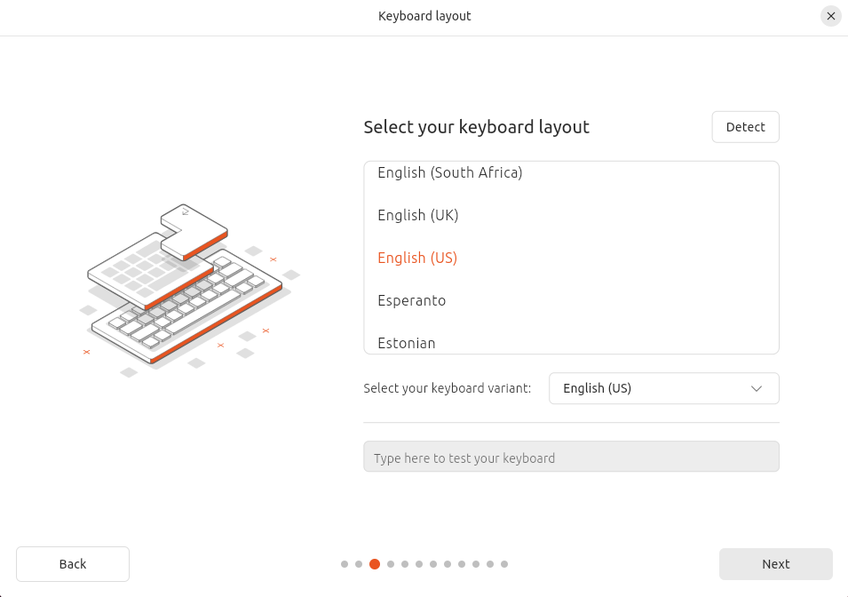

# Setup môi trường
Khi bắt đầu học về hệ điều hành Linux, việc thiết lập một môi trường thực hành là bước quan trọng đầu tiên. Sử dụng máy ảo là phương pháp phổ biến và tiện lợi, cho phép bạn dễ dàng thay đổi cấu hình mà không ảnh hưởng đến hệ thống chính. Trong bài viết này, chúng ta sẽ cùng nhau thiết lập môi trường `Linux` trên máy ảo sử dụng `VMware` và hệ điều hành `Ubuntu`.

- **VMware Pro**:

Khá là đơn giản và không còn tốn kém tiền bạc như lúc trước nữa vì giờ đây ta có thể tải VMware Pro một cách miễn phí. Ta có thể xem chi tiết hướng dẫn tải tại [đây](https://blogs.vmware.com/workstation/2024/05/vmware-workstation-pro-now-available-free-for-personal-use.html)

- **Ubuntu**:

Tiếp đến sẽ là `Ubuntu`, mình khuyến khích sử dụng `Ubuntu 22.04` hơn vì đối với mình phiên bản `Ubuntu` ấy là phiên bản hoàn hảo nhất rồi, vì lúc này các tuỳ chỉnh về cấu hình hay là phiên bản `Python` còn là `3.9` nên sẽ dễ dàng trong việc tải tài nguyên hơn. Nhưng nếu chỉ với mục đích là tìm hiểu về Linux thì ta hoàn toàn có thể tải phiên bản mới nhất luôn. Và ta có thể tải chúng tại [đây](https://ubuntu.com/download/desktop)

Sau khi tải hai thứ ở trên xong thì ta sẽ mở `VMware` ra. Ở màn hình chính ta chọn `Create a new Virtual Machine`:

Bấm `next` cho đến khi gặp phần như trong ảnh và chỉnh như trong ảnh:

Tiếp đến các bước sau là các bước tuỳ chỉnh cấu hình cho máy ảo nên nó sẽ phụ thuộc vào mục đích của người dùng, nên mình sẽ skip qua bước này.

Ở giao diện của máy ảo ta vừa `create` xong ta sẽ tiếp tục vào cài đặt và tuỳ chỉnh một số thứ

Ở phần `CD/DVD(Data)` ta sẽ chọn file `.iso` mà ta vừa mới tải xong

Tiếp đến là ở phần `Network` ta sẽ chọn `Bridged` hoặc ta cũng có thể để `VMnet0` (vì ở đây mình đã có config lại một số cấu hình mạng trên máy mình rồi nên mình sẽ để `VMNet0`)

Sau khi `setting` xong mọi thứ thì ta mở nó lên và bắt đầu bước `setup` hệ điều hành `Ubuntu`

- Chọn `Try or Install Ubuntu`

- Chọn `English` và `Next`

- `Next`

- Chọn `Install Buntu`

- Chọn `Interactive installation`

- `Default selection`

- Ở phần này thì ta có thể tuỳ chỉnh và không chọn cũng được

- `Earse disk`

- Tạo tài khoản và `Install`

- Sau khi đợi nó cài đặt xong hết rồi và `boot` lên rồi thì ta bấm vào phần `I Finished Installing` ở dưới

- Sau đó là mở `Terminal` và làm theo cách hành sau:

Nếu như đến đây ta sử dụng `ping 8.8.8.8` được thì tức là ta đã thành công một phần, tiếp đến là sử dụng SSH vào máy ảo của ta bằng `Terminal` của máy chính

Và như vậy là ta đã `setup` môi trường thành công

# Lời kết

Việc thiết lập môi trường Linux trên máy ảo là bước đầu tiên và vô cùng quan trọng trong hành trình học tập và làm việc với hệ điều hành mã nguồn mở này. Bằng cách sử dụng VMware và Ubuntu, bạn đã tạo ra một không gian thực hành linh hoạt, an toàn và dễ dàng tùy chỉnh. Đây là nền tảng để khám phá sâu hơn về Linux, từ những lệnh cơ bản đến các cấu hình hệ thống phức tạp.
