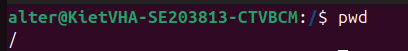
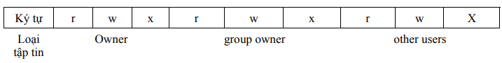

# Tản mạn

Cũng đã lâu rồi không được chạm vào lý thuyết về `Linux` quá nhiều nên có vẻ hơi cứng tay và quên một chút. Cảm ơn các anh chị EHC đã ra cái task vô cùng tuyệt vời này để thúc em ôn lại `Linux` (mặc dù em đã plan rất lâu nhưng do lười 🐧)

Trong bài viết này chúng ta sẽ tìm hiểu về 4 phần sau:

- File và cấu trúc của nó trong Linux
- Process trong Linux
- User và groups trong Linux
- Phân quyền trong Linux

# File và cấu trúc của nó trong Linux

Như chúng ta đã biết `Linux` là một hệ điều hành mã  nguồn mở và nó  cũng phổ biến không kém cạnh gì với `Windows` của `Microsoft` . Không giống như `Windows`  , `Linux` xem mọi thứ là `file` (tất cả những tệp config cho các mục đích khác nhau đều được `Linux` lưu vào một hoặc nhiều `file` ). Và `linux` sẽ cung cấp cho chúng ta những `tools` hay công cụ để tương tác với những file đó, nó không còn đơn giản như việc mở `Explorer` như trên `Windows` và tương tác `xoá, đổi tên, hay copy` nữa, mà giờ đây phải thông  qua `Terminal` .

Nhưng trước khi tìm hiểu về các công cụ để tương tác với file, ta sẽ tìm hiểu về `Hệ thống phân cấp tệp` (hay còn được gọi là `File System Hierarchy` ). `Linux` sẽ cơ cấu các tệp theo dạng cây và gồm các thư mục sau:

| **Path** | **Description** |
| --- | --- |
| `/` | Được ví như thư mục gốc là nơi khởi nguồn của tất cả các thư mục khác. Thư mục này chứa các tệp cần thiết để khởi động cùng hệ điều hành |
| `/bin`  | Thư mục này chứa các chương trình thực thi (các lệnh mà ta sử dụng) |
| `/sbin` | Cũng như `/bin` thư mục  này cũng chứa các chương trình thực thi nhưng thường được sử dụng bởi `admin` |
| `/boot` | Chứa  các file yêu cầu cho việc khởi động hệ điều hành  `Linux` |
| `/dev`  | Là nơi lưu trữ các file của thiết bị (các phân vùng ổ cứng, ổ đĩa …) |
| `/etc` | Nơi lưu trữ các tệp cấu hình của `Linux` |
| `/home` | Thư mục dành cho người dùng |
| `/lib` | Là nơi lưu trữ các thư viện được chia sẻ để sử dụng cho các ngôn ngữ lập trình, … (Ví  dụ:  libc.so.6) |
| `/media` | Các thiết bị lưu trữ ngoài như ổ USB được gắn ở đây. |
| `/mnt` | Là thư mục có công dụng để liên kết tạm thời các thư mục hệ thống |
| `/opt` | Là nơi thường dùng để lưu trữ các công cụ ở bên thứ 3 (tức là không cài đặt mặc định khi vừa cài xong `Linux` ) |
| `/root` | Là thư mục của `/home` nhưng của người dùng `root` |
| `/tmp` | Được dùng để lưu trữ tạm thời các file khi chạy chương trình và thường sẽ bị xoá khi khởi động lại hệ thống |
| `/usr` | Chứa các thư viện, file thực thi, tài liệu hướng dẫn  …. (ví dụ: `/usr/bin` , `/usr/share` ) |
| `/var` | Thông tin về các biến của hệ thống được lưu trong thư mục này (`/var/hmtl` , `/var/log` ) |

## Tương tác với file

Sau khi đã nắm thông tin sơ bộ về các file thì ta sẽ tiếp đến phần giao tiếp và tương tác với file trên `Linux` . Ở đây ta sẽ tìm hiểu một số lệnh cơ bản và thường dùng để tương tác với file/directory như là :

- `pwd` : in ra `path` mà ta đang làm việc
- `ls` : List nhưng thứ có trong thư mục chỉ định
- `mkdir` : Tạo một thư mục mới
- `cat` : In ra màn hình nội dung của một file
- `touch` : Tạo một file mới
- `tree` : Xem cấu trúc của một thư  mục dưới dạng cây
- `cd` : Di chuyển giữa các thư mục với nhau
- `cp` : Copy file hoặc thư mục
- `mv` : Di chuyển file hoặc thư mục

### Thực hành mẫu:

**Mục tiêu: Ta sẽ tạo một file chứ nội dung `TRAINING BCM EHC` vào trong file có tên là `EHC.txt` và trong thư mục `EHC`**

Dùng `pwd` để xem ta đang ở đâu:



Tiếp đến ta thấy ta đang ở `/` và mục tiêu của ta là  tạo file trong thư mục  `/home/alter` , ta sẽ sử dụng các lệnh `cd`  , `mkdir` và `touch` để làm điều này:


Và cuối cùng là thêm nội dung vào đó và in nó ra màn hình với lệnh `cat` và `echo` :


## **File Descriptors**

Ở ví dụ thực hành mẫu trên ta đã thấy được rằng cách tương tác và thao tác với một tệp trong `Linux` . Một điều thú vị là những lần ta `echo` dữ liệu vào file `EHC.txt` hay dùng `cat` để in dữ liệu của file đó ra màn hình gọi là gì? Thì chúng được gọi là `File Descriptors` hay còn được gọi tắt là `fd` . Nói dễ hiểu `fd` là thứ mà hệ điều hành dùng để theo dõi các `Input/Output` của người dùng, và `Linux` hiện có 3 `fd` sau:

- `STDIN - 0` : Biểu thị cho luồng  dữ liệu đầu vào
- `STDOUT - 1` : Biểu thị cho luồng dữ liệu đầu ra
- `STDERR - 2` : Luồng dữ liệu đầu ra nhưng liên quan đến lỗi

Và để dễ hình dung hơn ở đây mình đã  viết sẵn một chương trình C đơn giản có chức năng đọc dữ liệu đầu vào của người dùng và in ra nó:

```c
#include <stdio.h>

int main() {
    char str[100];

    printf("Nhập chuỗi: ");
    fgets(str, sizeof(str), stdin); // Đọc chuỗi từ đầu vào

    printf("Chuỗi bạn vừa nhập là: %s", str); // In chuỗi ra màn hình

    return 0;
}
```


Ví dụ trên là về `STDIN và STDOUT` và đây là ví dụ về `STDOUT và STDERR` :


Như ta thấy nó hiện thông báo lỗi `Permission denied` ra màn hình khi ta copy file `example` vào thư mục `/` khi chưa có quyền `root`

## File Permissions

Từ ví dụ về `STDIERR` trên ta biết được rằng ta chỉ được phép thao tác với file hay thư mục khi ta có quyền nhất định nào đó. Ví dụ như bạn không thể đọc nội dung của một file được tạo bởi người dùng `root` và cần phải được cấp quyền để đọc được nó. File sẽ chia ra các quyền cơ bản như ảnh sau:

- Read (`r` ) - Tương ứng với số 4
- Write (`w` ) - Tương ứng với số 2
- Execute (`x` ) - Tương ứng với số 1
- Và không có quyền  gì tương ứng với số 0

Ở đây ta tương tác với chùng thông qua các lệnh `chmod` , `chown`

```bash
chmod [OPTIONS] [ugoa…][-+=]perms…[,…] FILE...
```

Như ở đây mình ví dụ ở thư mục `EHC` :


Ta thấy khi thực  hiện lệnh `ls -l` ta sẽ biết được thông tin  về một số quyền của bản của file đó, lấy `example` làm ví dụ:

```bash
-rwxrwxr-x 1 alter alter 16168 Jan 30 21:52 example
```

Ta thấy rằng phần `-` đầu tiên biểu thị **loại** của đối tượng. Trong trường hợp này, dấu `-` cho biết đây là một **tệp tin thông thường**. Nếu là thư mục, ký tự này sẽ là `d`.

Tiếp theo là **3 ký tự `rwx`**, đại diện cho quyền của **chủ sở hữu** (owner). Ở đây, chủ sở hữu là `alter`, và họ có toàn quyền với tệp này:

- `r` (read): Quyền đọc.
- `w` (write): Quyền ghi.
- `x` (execute): Quyền thực thi.

Kế tiếp là **3 ký tự `rwx`**, đại diện cho quyền của **nhóm sở hữu** (group). Nhóm sở hữu cũng có toàn quyền với tệp này, tương tự như chủ sở hữu.

Cuối cùng là **3 ký tự `r-x`**, đại diện cho quyền của **những người dùng khác** (others). Những người dùng khác chỉ có hai quyền:

- `r` (read): Quyền đọc.
- `-` không có quyền ghi
- `x` (execute): Quyền thực thi.

**Lưu ý: các quyền phải theo thứ tự từ Owner → Group → Other và phải đi theo thứ tự `Read -> Write -> Execute`**

Và tiếp theo là mình sẽ can thiệp vào các quyền của file này thông qua `chmod` và `chown`. Ví dụ ta muốn cấp quyền ghi cho người dùng ở phần `Other` thì mình có thể thực hiện như sau:

```bash
chmod o+w example
```


Như vậy ta có thể thấy ở phần của `Other` đã có quyền `w` , và nếu ở trường hợp ta muốn chuyển quyền sở hữu của file đó cho `root` thì ta sử dụng `chown` :

```bash
sudo chown root:alter example
```


Như vậy ta đã thấy bây giờ file `example` đã là của root và ta cần quyền `root`để chạy nó

### Tóm  tắt cú pháp:

```bash
chown <user>:<group> <file/directory>
```

```bash
chmod [OPTIONS] [ugoa…][-+=]perms…[,…] FILE...
```

### Mở rộng:

Ngoài các quyền thông thường, `Linux` còn cơ cấu cho ta thêm các quyền đặc biệt ví dụ như `Set User ID` (SUID) và `Set Group ID` (SGID):

- **SUID :** Khi một tệp có bit SUID được thiết lập, bất kỳ người dùng nào chạy tệp đó sẽ thực thi nó với quyền của chủ sở hữu tệp, thay vì quyền của chính họ.
- **SGID :** Tương tự, khi một tệp có bit SGID được thiết lập, người dùng chạy tệp đó sẽ thực thi nó với quyền của nhóm sở hữu tệp.

Và để nhận biết sự hiện diện của các quyền này được biểu thị bằng chữ **`s`** thay cho chữ **`x`** thông thường trong bộ quyền của tệp. Ví dụ:

```bash
-rwsr-xr-x  (SUID được thiết lập)
-rwxr-sr-x  (SGID được thiết lập)
```

**→ Mặc dù rất tiện nhưng những quyền này lại mang đến một rủi ro về bảo mật vô cùng lớn, vì thế ta nên hạn chế sử dụng chúng**

# Process trong Linux

Trong  `Linux` những lệnh ta thực hiện hay những việc ta  làm đều được chia theo tiến trình. Và một tiến trình sẽ có các thông tin sau:

- **PID (Process ID):** Một số duy nhất để định danh process.
- **PPID (Parent Process ID):** PID của process cha, tức là process đã tạo ra process hiện tại.
- **UID (User ID):** ID của người dùng sở hữu process.
- **GID (Group ID):** ID của nhóm sở hữu process.
- **Trạng thái (State):** Trạng thái hiện tại của process (ví dụ: running, sleeping, stopped, zombie).
- **CPU và Memory usage:** Lượng tài nguyên hệ thống mà process đang sử dụng.

Và ta có thể kiểm tra chúng thông qua lệnh `ps aux` :

```bash
alter@KietVHA-SE203813-CTVBCM:~/EHC$ ps aux
USER         PID %CPU %MEM    VSZ   RSS TTY      STAT START   TIME COMMAND
root           1  0.2  0.5  23536 15088 ?        Ss   21:13   0:11 /sbin/init splash
root           2  0.0  0.0      0     0 ?        S    21:13   0:00 [kthreadd]
root           3  0.0  0.0      0     0 ?        S    21:13   0:00 [pool_workqueue_release]
root           4  0.0  0.0      0     0 ?        I<   21:13   0:00 [kworker/R-rcu_gp]
root           5  0.0  0.0      0     0 ?        I<   21:13   0:00 [kworker/R-sync_wq]
root           6  0.0  0.0      0     0 ?        I<   21:13   0:00 [kworker/R-slub_flushwq]
root           7  0.0  0.0      0     0 ?        I<   21:13   0:00 [kworker/R-netns]
root           9  0.0  0.0      0     0 ?        I<   21:13   0:00 [kworker/0:0H-events_highpri]
root          10  0.0  0.0      0     0 ?        I    21:13   0:00 [kworker/u512:0-ipv6_addrconf]
root          11  0.0  0.0      0     0 ?        I<   21:13   0:00 [kworker/R-mm_percpu_wq]
root          12  0.0  0.0      0     0 ?        I    21:13   0:00 [rcu_tasks_kthread]
root          13  0.0  0.0      0     0 ?        I    21:13   0:00 [rcu_tasks_rude_kthread]
root          15  0.0  0.0      0     0 ?        I    21:13   0:00 [rcu_tasks_trace_kthread]
root          16  0.0  0.0      0     0 ?        S    21:13   0:00 [ksoftirqd/0]
root          17  0.0  0.0      0     0 ?        I    21:13   0:01 [rcu_preempt]
root          18  0.0  0.0      0     0 ?        S    21:13   0:00 [rcu_exp_par_gp_kthread_worker/1]
root          19  0.0  0.0      0     0 ?        S    21:13   0:00 [rcu_exp_gp_kthread_worker]
root          20  0.0  0.0      0     0 ?        S    21:13   0:00 [migration/0]
root          21  0.0  0.0      0     0 ?        S    21:13   0:00 [idle_inject/0]
root          22  0.0  0.0      0     0 ?        S    21:13   0:00 [cpuhp/0]
```

Và kết thúc một tiến trình bằng cách sử dụng `kill <PID>`

## Các loại Process

Process chia ra 3 loại:

- **Foreground process (tiến trình tiền cảnh): Là các process chạy trực tiếp từ terminal và yêu cầu tương tác từ người dùng (Ví dụ như lệnh `ls` )**
- **Background process (tiến trình ngầm):  Là tiến trình chạy ngầm và không hiện ra màn hình, ta có thể set cho một lệnh nào đó chạy tiếng  trình ngầm bằng cách sử dụng `&` vào cuối mỗi lệnh**
- **Daemon process (tiến trình daemon):  Là một loại background process đặc biệt, thường được khởi động cùng hệ thống và chạy liên tục để thực hiện các tác vụ cụ thể.**

# User và groups trong linux

Hệ điều hành `Linux` là một hệ điều hành đa người dùng, do đó những khái niệm về user và groups sẽ không còn mấy xa lạ với những người dùng `Linux` .

## User

- Khi ta tạo một hệ điều hành linux và đăng kí với `username` thì ta là một người dùng
- Mỗi `user` là một cá thế độc lập cho  hệ điều hành đó
- Có các loại User cơ bản như sau:
    - Root user: Người dùng với quyền cao nhất vào toàn quyền kiểm soát hệ thống linux (người dùng này sẽ có UID là 0)
    - Regular User: Là các tài khoản được tạo cho người dùng thông thường, UID thường bắt đầu từ 1000 trở lên (bị giới hạn một số quyền nhất định)
    - **System user:  Là các tài khoản được tạo để chạy cách dịch vụ (UID thường nằm trong khoảng 1 → 999). Ví dụ như `www-data` để chạy máy chủ web**

Và những thông tin người dùng này sẽ được lưu trữ trong `/etc/passwd` :

```bash
alter@KietVHA-SE203813-CTVBCM:~/EHC$ sudo cat /etc/passwd
[sudo] password for alter:
root:x:0:0:root:/root:/bin/bash
daemon:x:1:1:daemon:/usr/sbin:/usr/sbin/nologin
bin:x:2:2:bin:/bin:/usr/sbin/nologin
sys:x:3:3:sys:/dev:/usr/sbin/nologin
sync:x:4:65534:sync:/bin:/bin/sync
games:x:5:60:games:/usr/games:/usr/sbin/nologin
man:x:6:12:man:/var/cache/man:/usr/sbin/nologin
lp:x:7:7:lp:/var/spool/lpd:/usr/sbin/nologin
mail:x:8:8:mail:/var/mail:/usr/sbin/nologin
news:x:9:9:news:/var/spool/news:/usr/sbin/nologin
<...>
```

Và chúng có định dạng là:

```bash
username:x:UID:GID:description:home_directory:shell
```

## Group

- Một nhóm là một tập hợp các người dùng, giúp quản lý quyền truy cập dễ dàng hơn.
- Các loại nhóm:
    - **Primary group:  Mỗi người dùng thuộc về một nhóm chính, được chỉ định khi tạo người dùng.**
    - **Secondary group**: Một người dùng có thể thuộc về nhiều nhóm phụ, giúp họ có quyền truy cập vào các tài nguyên được chia sẻ bởi các nhóm đó.

Và những thông tin trên được xem ở `/etc/group` :

```bash
alter@KietVHA-SE203813-CTVBCM:~/EHC$ sudo cat /etc/group
root:x:0:
daemon:x:1:
bin:x:2:
sys:x:3:
adm:x:4:syslog,alter
tty:x:5:
disk:x:6:
lp:x:7:
mail:x:8:
news:x:9:
uucp:x:10:
man:x:12:
proxy:x:13:
kmem:x:15:
dialout:x:20:
fax:x:21:
voice:x:22:
cdrom:x:24:alter
floppy:x:25:
tape:x:26:
sudo:x:27:alter
<...>
```

Với định dạng là:

```bash
group_name:x:GID:user_list
```

## Cách quản lý User và Groups

### Quản lý người dùng

- Tạo người dùng mới:

```bash
sudo useradd username
```

- Đặt mật khẩu cho người dùng đó:

```bash
sudo passwd username
```

- Xoá người dùng:

```bash
sudo userdel username
```

- Thay đổi thông tin người dùng:

```bash
sudo usermod -aG groupname username  # Thêm người dùng vào nhóm
```

### Quản lý nhóm

- Tạo nhóm mới:

```bash
sudo groupadd groupname
```

- Xoá nhóm:

```bash
sudo groupdel groupname
```

- Thêm vào nhóm:

```bash
sudo usermod -aG groupname username
```

- Xem nhóm:

```bash
groups username
```

# Phân quyền trong Linux

Như những phần trên mình đã có đi qua về các phân quyền trong `Linux` , ở phần này ta chỉ tóm tắt ngắn gọn lại

- Linux có 3 nhóm sỡ hữu chính đó là
    - **Root**
    - **Group**
    - **Others**
- Với các quyền hiện có trong `Linux` là:
    - Read (`r` ): Quyền đọc
    - Write (`w`): Quyền viết
    - Execute (`x`): Quyền thực thi

    Cách kiểm tra các quyền của `file` hay `directory`ta sử dụng `ls -l` :

    

    Và nó được thể hiện dưới định dạng sau:

    

- Phân quyền dựa trên số:
    - Read - 4
    - Write - 2
    - Execute - 1

    Và cách tính sẽ như sau:

    - read và excute thì số của quyền là : 4+1 =5.
    - read , write và excute : 4+2+1=7.
    - Tổ hợp của 3 quyền trên có giá trị từ 0 đến 7.

### **Bảng giá trị phân quyền truy cập file trong linux**

| Number | Character | Permission |
| --- | --- | --- |
| 0 | - | No permission |
| 1 | -x | Execute |
| 2 | -w- | Write-only |
| 3 | -wx | Write & Execute |
| 4 | r— | Read-only |
| 5 | r-x | Read & execute |
| 6 | rw- | Read & Write |
| 7 | rwx | Full permissions |

### Các lệnh phân quyền

- Cấp quyền cho một file:

```bash
chmod [OPTIONS] [ugoa…][-+=]perms…[,…] FILE...
```

- Chuyển chủ sở hữu:

```bash
chown <user>:<group> <file/directory>
```

# Reference:

- https://ttnguyen.net/phan-quyen-trong-linux/
- [Linux File Permissions and Ownership Explained with Examples](https://linuxhandbook.com/linux-file-permissions/)
- [Linux Fundamentals](https://academy.hackthebox.com/module/details/18)
- [Linux Permissions: The Ultimate Cheat Sheet - Sling Academy](https://www.slingacademy.com/article/linux-permissions-the-ultimate-cheat-sheet/)
