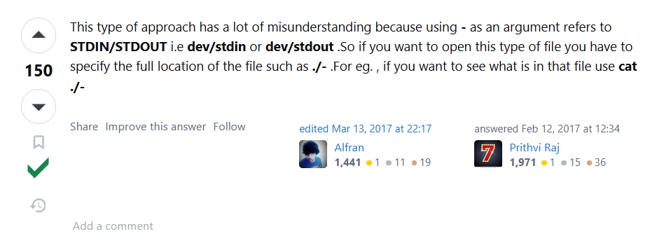

# Level 0

## Goal

The goal of this level is for you to log into the game using SSH. The host to which you need to connect is `bandit.labs.overthewire.org`, on port `2220`. The username is `bandit0` and the password is `bandit0`. Once logged in, go to the Level 1 page to find out how to beat Level 1.

## Solution

Ở level này thì ta được yêu cầu là sử dụng `ssh` để connect vào server của `bandit`. Thì rất cơ bản ta sẽ sẽ dụng lệnh như sau:

```sh
$ ssh bandit0@bandit.labs.overthewire.org -p 2220
The authenticity of host '[bandit.labs.overthewire.org]:2220 ([16.16.163.126]:2220)' can't be established.
ED25519 key fingerprint is SHA256:C2ihUBV7ihnV1wUXRb4RrEcLfXC5CXlhmAAM/urerLY.
This key is not known by any other names
Are you sure you want to continue connecting (yes/no/[fingerprint])? yes
Please type 'yes', 'no' or the fingerprint: yes
Warning: Permanently added '[bandit.labs.overthewire.org]:2220' (ED25519) to the list of known hosts.
                         _                     _ _ _
                        | |__   __ _ _ __   __| (_) |_
                        | '_ \ / _` | '_ \ / _` | | __|
                        | |_) | (_| | | | | (_| | | |_
                        |_.__/ \__,_|_| |_|\__,_|_|\__|


                      This is an OverTheWire game server.
            More information on http://www.overthewire.org/wargames

bandit0@bandit.labs.overthewire.org's password:

      ,----..            ,----,          .---.
     /   /   \         ,/   .`|         /. ./|
    /   .     :      ,`   .'  :     .--'.  ' ;
   .   /   ;.  \   ;    ;     /    /__./ \ : |
  .   ;   /  ` ; .'___,/    ,' .--'.  '   \' .
  ;   |  ; \ ; | |    :     | /___/ \ |    ' '
  |   :  | ; | ' ;    |.';  ; ;   \  \;      :
  .   |  ' ' ' : `----'  |  |  \   ;  `      |
  '   ;  \; /  |     '   :  ;   .   \    .\  ;
   \   \  ',  /      |   |  '    \   \   ' \ |
    ;   :    /       '   :  |     :   '  |--"
     \   \ .'        ;   |.'       \   \ ;
  www. `---` ver     '---' he       '---" ire.org


Welcome to OverTheWire!

If you find any problems, please report them to the #wargames channel on
discord or IRC.

--[ Playing the games ]--

  This machine might hold several wargames.
  If you are playing "somegame", then:

    * USERNAMES are somegame0, somegame1, ...
    * Most LEVELS are stored in /somegame/.
    * PASSWORDS for each level are stored in /etc/somegame_pass/.

  Write-access to homedirectories is disabled. It is advised to create a
  working directory with a hard-to-guess name in /tmp/.  You can use the
  command "mktemp -d" in order to generate a random and hard to guess
  directory in /tmp/.  Read-access to both /tmp/ is disabled and to /proc
  restricted so that users cannot snoop on eachother. Files and directories
  with easily guessable or short names will be periodically deleted! The /tmp
  directory is regularly wiped.
  Please play nice:

    * don't leave orphan processes running
    * don't leave exploit-files laying around
    * don't annoy other players
    * don't post passwords or spoilers
    * again, DONT POST SPOILERS!
      This includes writeups of your solution on your blog or website!

--[ Tips ]--

  This machine has a 64bit processor and many security-features enabled
  by default, although ASLR has been switched off.  The following
  compiler flags might be interesting:

    -m32                    compile for 32bit
    -fno-stack-protector    disable ProPolice
    -Wl,-z,norelro          disable relro

  In addition, the execstack tool can be used to flag the stack as
  executable on ELF binaries.

  Finally, network-access is limited for most levels by a local
  firewall.

--[ Tools ]--

 For your convenience we have installed a few useful tools which you can find
 in the following locations:

    * gef (https://github.com/hugsy/gef) in /opt/gef/
    * pwndbg (https://github.com/pwndbg/pwndbg) in /opt/pwndbg/
    * gdbinit (https://github.com/gdbinit/Gdbinit) in /opt/gdbinit/
    * pwntools (https://github.com/Gallopsled/pwntools)
    * radare2 (http://www.radare.org/)

--[ More information ]--

  For more information regarding individual wargames, visit
  http://www.overthewire.org/wargames/

  For support, questions or comments, contact us on discord or IRC.

  Enjoy your stay!

bandit0@bandit:~$ whoami
bandit0
```

Và thế là ta đã connect thành công

# Level 0 → Level 1

## Goal

The password for the next level is stored in a file called readme located in the home directory. Use this password to log into bandit1 using SSH. Whenever you find a password for a level, use SSH (on port 2220) to log into that level and continue the game.

## Solution

Theo như yêu cầu thì ta sẽ cần phải đọc một file `readme` để có được password, nhưng trước tiên để xác định được file đó ở đâu ta sẽ sẽ dụng `ls` để list ra những thứ có trong thư mục ta đang làm việc và kiểm tra xem có file `readme` ở đó không:

```sh
bandit0@bandit:~$ ls
readme
```

Sau khi đã kiểm tra rồi thì ta sẽ dụng `cat` để đọc nội dung bên trong file đó:

```sh
bandit0@bandit:~$ cat readme
Congratulations on your first steps into the bandit game!!
Please make sure you have read the rules at https://overthewire.org/rules/
If you are following a course, workshop, walkthrough or other educational activity,
please inform the instructor about the rules as well and encourage them to
contribute to the OverTheWire community so we can keep these games free!

The password you are looking for is: ZjLjTmM6FvvyRnrb2rfNWOZOTa6ip5If
```

# Level 1 → Level 2

## Goal

The password for the next level is stored in a file called - located in the home directory

## Solution

Điều đặc biệt ở level này là khi ta sử dụng `cat -` thì sẽ không được nên ta sẽ chuyển sang dùng `cat ./-`:

```sh
bandit1@bandit:~$ ls
-
bandit1@bandit:~$ ls -la
total 24
-rw-r-----  1 bandit2 bandit1   33 Sep 19 07:08 -
drwxr-xr-x  2 root    root    4096 Sep 19 07:08 .
drwxr-xr-x 70 root    root    4096 Sep 19 07:09 ..
-rw-r--r--  1 root    root     220 Mar 31  2024 .bash_logout
-rw-r--r--  1 root    root    3771 Mar 31  2024 .bashrc
-rw-r--r--  1 root    root     807 Mar 31  2024 .profile
bandit1@bandit:~$ cat -
^C
bandit1@bandit:~$ cat ./-
263JGJPfgU6LtdEvgfWU1XP5yac29mFx
```

Và khi research sâu hơn thì mình thấy được một phần `reply` này khác là hay:



Và giải thích bằng tiếng việt ngắn gọn lại là:

- Khi sử dụng dấu `-` trên dòng lệnh Unix, hầu hết các tiện ích (như cat, grep, …) đều quy ước rằng `-` không phải là tên của một file thông thường mà là một kí hiệu đặc biệt chỉ định cho luồng chuẩn (STDIN cho đầu vào hoặc STDOUT cho đầu ra)

- Do đó khi ta sử dụng `cat -` thì cat sẽ không mở file có tên `-` mà sẽ đọc dữ liệu từ đầu vào chuẩn (ví dụ, từ bàn phím hoặc từ kết quả của một pipeline).

- Nên để khắc phục điều này ta sử dụng `cat < -` hoặc `cat ./-`. Kí hiệu `./` giúp chỉ rõ ra `-` là một file mà ta cần đọc

# Level 2 → Level 3

## Goal

The password for the next level is stored in a file called spaces in this filename located in the home directory

## Solution

Ở level này ta sẽ cần phải đọc một file với tên có dính `space` trong đó, và điều này làm ta không thể đọc file bằng cách `cat <filename>` như trước  được  vì lúc này `cat` sẽ hiểu giữa các khoảng cách là một file riêng biệt và chúng sẽ báo lỗi:

```sh
bandit2@bandit:~$ ls
spaces in this filename
bandit2@bandit:~$ cat spaces in this filename
cat: spaces: No such file or directory
cat: in: No such file or directory
cat: this: No such file or directory
cat: filename: No such file or directory
```

Vì thế để đọc được file này ta cần để file name đó vào `" "`:

```sh
bandit2@bandit:~$ ls
spaces in this filename
bandit2@bandit:~$ cat "spaces in this filename"
MNk8KNH3Usiio41PRUEoDFPqfxLPlSmx
```

Hoặc sử dụng `\`:

```sh
bandit2@bandit:~$ ls
spaces in this filename
bandit2@bandit:~$ cat spaces\ in\ this\ filename
MNk8KNH3Usiio41PRUEoDFPqfxLPlSmx
```

# Level 3 → Level 4

## Goal

The password for the next level is stored in a hidden file in the inhere directory.

## Solution

Ở level này khá đơn giản, ta chỉ cần xử dụng `ls -la` để check xem trong thư mục `inhere` có gì (bao gồm cả các file/dir bị ẩn) và rồi xử dụng `cat` để đọc file đó mà thôi:

```sh
bandit3@bandit:~$ cd inhere/
bandit3@bandit:~/inhere$ ls -la
total 12
drwxr-xr-x 2 root    root    4096 Sep 19 07:08 .
drwxr-xr-x 3 root    root    4096 Sep 19 07:08 ..
-rw-r----- 1 bandit4 bandit3   33 Sep 19 07:08 ...Hiding-From-You
bandit3@bandit:~/inhere$ cat ...Hiding-From-You
2WmrDFRmJIq3IPxneAaMGhap0pFhF3NJ
```

# Level 4 → Level 5

## Goal

The password for the next level is stored in the only human-readable file in the inhere directory. Tip: if your terminal is messed up, try the “reset” command.

## Solution

Ở level này ta sẽ được giới thiệu với một lệnh mới đó là `file`, lệnh này sẽ cho chúng ta biết được thông tin của một file đó có gì, và ở đây khi ta sử dụng `ls -la` thì nó sẽ hiện ra rất nhiều file, và chỉ có một file chứa password, việc check từng file sẽ khá lâu nên ta sẽ xử dụng `file` để xem xem file nào là file `ASCII text` tức là trong nó chứa những thứ mà ta có thể đọc được...:

```sh
bandit4@bandit:~/inhere$ ls -la
total 48
drwxr-xr-x 2 root    root    4096 Sep 19 07:08 .
drwxr-xr-x 3 root    root    4096 Sep 19 07:08 ..
-rw-r----- 1 bandit5 bandit4   33 Sep 19 07:08 -file00
-rw-r----- 1 bandit5 bandit4   33 Sep 19 07:08 -file01
-rw-r----- 1 bandit5 bandit4   33 Sep 19 07:08 -file02
-rw-r----- 1 bandit5 bandit4   33 Sep 19 07:08 -file03
-rw-r----- 1 bandit5 bandit4   33 Sep 19 07:08 -file04
-rw-r----- 1 bandit5 bandit4   33 Sep 19 07:08 -file05
-rw-r----- 1 bandit5 bandit4   33 Sep 19 07:08 -file06
-rw-r----- 1 bandit5 bandit4   33 Sep 19 07:08 -file07
-rw-r----- 1 bandit5 bandit4   33 Sep 19 07:08 -file08
-rw-r----- 1 bandit5 bandit4   33 Sep 19 07:08 -file09
bandit4@bandit:~/inhere$ file ./*
./-file00: data
./-file01: data
./-file02: data
./-file03: data
./-file04: data
./-file05: data
./-file06: data
./-file07: ASCII text
./-file08: data
./-file09: data
```

Và sau khi xác định được file đó rồi thì ta sử dụng `cat` để đọc file đó mà thôi:

```sh
bandit4@bandit:~/inhere$ cat ./-file07
4oQYVPkxZOOEOO5pTW81FB8j8lxXGUQw
```

# Level 5 → Level 6

## Goal

The password for the next level is stored in a file somewhere under the inhere directory and has all of the following properties:

- human-readable
- 1033 bytes in size
- not executable

## Solution

Ở đây ta sẽ phải tìm file thoả mãn các yêu cầu:

- human-readable
- 1033 bytes in size
- not executable

Và khi sử dụng `ls -la` thì xuất hiện rất hiện thư mục trong đó:

```sh
bandit5@bandit:~/inhere$ ls
maybehere00  maybehere02  maybehere04  maybehere06  maybehere08  maybehere10  maybehere12  maybehere14  maybehere16  maybehere18
maybehere01  maybehere03  maybehere05  maybehere07  maybehere09  maybehere11  maybehere13  maybehere15  maybehere17  maybehere19
bandit5@bandit:~/inhere$ ls -la maybehere00
total 72
drwxr-x---  2 root bandit5 4096 Sep 19 07:08 .
drwxr-x--- 22 root bandit5 4096 Sep 19 07:08 ..
-rwxr-x---  1 root bandit5 1039 Sep 19 07:08 -file1
-rwxr-x---  1 root bandit5  551 Sep 19 07:08 .file1
-rw-r-----  1 root bandit5 9388 Sep 19 07:08 -file2
-rw-r-----  1 root bandit5 7836 Sep 19 07:08 .file2
-rwxr-x---  1 root bandit5 7378 Sep 19 07:08 -file3
-rwxr-x---  1 root bandit5 4802 Sep 19 07:08 .file3
-rwxr-x---  1 root bandit5 6118 Sep 19 07:08 spaces file1
-rw-r-----  1 root bandit5 6850 Sep 19 07:08 spaces file2
-rwxr-x---  1 root bandit5 1915 Sep 19 07:08 spaces file3
```

Việc xử dụng file để check từng dir như vậy là điều rất mất thời gian. Nên ở đây ta sẽ dùng thêm lệnh `grep` với pipe (`|`). Pipe như một được ống và nó sẽ chuyển `output` của lệnh này sang cho lệnh khác, và ở đây ta sẽ xử dụng output của lệnh `file` và chuyển sang cho lệnh `grep` với cú pháp: `<command> | grep <something>`.  Như ở trên ta thấy nó chứa rất nhiều thư mục và ta không thể nào mà xử lý từng cái được nên ta sẽ xử dụng lệnh `file */{.,}*` để cho ta tất cả thông tin của file nằm trong `inhere`. Trong đó `*/*` sẽ in ra hết toàn bộ thông tin của file, nhưng nó sẽ không in những file bị ẩn, nên ta cần phải sử dụng thêm `{.,}` để bao gồm các file bắt đầu với `.` và `,`. Để biết thêm thông tin ta có thể đọc ở [đây](https://unix.stackexchange.com/a/186219). Cứ như thế ta sử dụng nó kèm với `ASCII` như theo yêu cầu:

```sh
bandit5@bandit:~/inhere$ file */{.,}* | grep ASCII
maybehere00/.file1:       ASCII text, with very long lines (550)
maybehere00/.file2:       ASCII text, with very long lines (7835)
maybehere01/.file2:       ASCII text, with very long lines (3069)
maybehere02/.file1:       ASCII text, with very long lines (6350)
maybehere02/.file2:       ASCII text, with very long lines (2576)
maybehere03/.file1:       ASCII text, with very long lines (9768)
maybehere03/.file2:       ASCII text, with very long lines (8879)
maybehere04/.file1:       ASCII text, with very long lines (2439)
maybehere04/.file2:       ASCII text, with very long lines (6143)
maybehere05/.file1:       ASCII text, with very long lines (3200)
maybehere05/.file2:       ASCII text, with very long lines (5916)
maybehere06/.file1:       ASCII text, with very long lines (1270)
maybehere06/.file2:       ASCII text, with very long lines (8975)
maybehere07/.file1:       ASCII text, with very long lines (3064)
maybehere07/.file2:       ASCII text, with very long lines (1000)
maybehere08/.file1:       ASCII text, with very long lines (8168)
maybehere08/.file2:       ASCII text, with very long lines (746)
maybehere09/.file1:       ASCII text, with very long lines (6762)
maybehere09/.file2:       ASCII text, with very long lines (8516)
maybehere10/.file1:       ASCII text, with very long lines (7091)
maybehere10/.file2:       ASCII text
maybehere11/.file1:       ASCII text, with very long lines (451)
maybehere11/.file2:       ASCII text, with very long lines (2500)
maybehere12/.file1:       ASCII text, with very long lines (5814)
maybehere12/.file2:       ASCII text, with very long lines (8243)
maybehere13/.file1:       ASCII text, with very long lines (5257)
maybehere13/.file2:       ASCII text, with very long lines (8951)
maybehere14/.file1:       ASCII text, with very long lines (3426)
maybehere14/.file2:       ASCII text, with very long lines (1502)
maybehere15/.file1:       ASCII text, with very long lines (2158)
maybehere15/.file2:       ASCII text
maybehere16/.file1:       ASCII text, with very long lines (5425)
maybehere16/.file2:       ASCII text, with very long lines (8471)
maybehere17/.file1:       ASCII text, with very long lines (894)
maybehere17/.file2:       ASCII text, with very long lines (8340)
maybehere18/.file1:       ASCII text, with very long lines (5701)
maybehere18/.file2:       ASCII text, with very long lines (2083)
maybehere19/.file1:       ASCII text, with very long lines (7208)
maybehere19/.file2:       ASCII text, with very long lines (4739)
maybehere00/-file1:       ASCII text, with very long lines (1038)
maybehere00/-file2:       ASCII text, with very long lines (9387)
maybehere00/spaces file1: ASCII text, with very long lines (6117)
maybehere00/spaces file2: ASCII text, with very long lines (6849)
maybehere01/-file1:       ASCII text, with very long lines (6027)
maybehere01/-file2:       ASCII text
maybehere01/spaces file1: ASCII text, with very long lines (4138)
maybehere01/spaces file2: ASCII text, with very long lines (4542)
maybehere02/-file1:       ASCII text, with very long lines (3800)
maybehere02/spaces file1: ASCII text, with very long lines (6745)
maybehere02/spaces file2: ASCII text, with very long lines (8487)
maybehere03/-file1:       ASCII text, with very long lines (314)
maybehere03/-file2:       ASCII text, with very long lines (6594)
maybehere03/spaces file1: ASCII text, with very long lines (2189)
maybehere03/spaces file2: ASCII text, with very long lines (3384)
maybehere04/-file1:       ASCII text, with very long lines (4409)
maybehere04/-file2:       ASCII text, with very long lines (2618)
maybehere04/spaces file1: ASCII text, with very long lines (5531)
maybehere04/spaces file2: ASCII text, with very long lines (2490)
maybehere05/-file1:       ASCII text, with very long lines (2345)
maybehere05/-file2:       ASCII text, with very long lines (5958)
maybehere05/spaces file1: ASCII text, with very long lines (879)
maybehere05/spaces file2: ASCII text, with very long lines (2419)
maybehere06/-file1:       ASCII text, with very long lines (5730)
maybehere06/-file2:       ASCII text, with very long lines (1075)
maybehere06/spaces file1: ASCII text, with very long lines (4072)
maybehere06/spaces file2: ASCII text, with very long lines (4250)
maybehere07/-file1:       ASCII text, with very long lines (3662)
maybehere07/-file2:       ASCII text, with very long lines (2487)
maybehere07/spaces file1: ASCII text, with very long lines (4129)
maybehere07/spaces file2: ASCII text, with very long lines (9063)
maybehere08/-file1:       ASCII text, with very long lines (1076)
maybehere08/-file2:       ASCII text, with very long lines (3824)
maybehere08/spaces file1: ASCII text
maybehere08/spaces file2: ASCII text, with very long lines (3692)
maybehere09/-file1:       ASCII text, with very long lines (3627)
maybehere09/-file2:       ASCII text, with very long lines (773)
maybehere09/spaces file1: ASCII text, with very long lines (5300)
maybehere09/spaces file2: ASCII text, with very long lines (8715)
maybehere10/-file1:       ASCII text, with very long lines (1051)
maybehere10/-file2:       ASCII text, with very long lines (1990)
maybehere10/spaces file1: ASCII text, with very long lines (8268)
maybehere10/spaces file2: ASCII text, with very long lines (3569)
maybehere11/-file1:       ASCII text, with very long lines (1210)
maybehere11/-file2:       ASCII text, with very long lines (4558)
maybehere11/spaces file1: ASCII text, with very long lines (3146)
maybehere11/spaces file2: ASCII text, with very long lines (502)
maybehere12/-file1:       ASCII text, with very long lines (9677)
maybehere12/-file2:       ASCII text
maybehere12/spaces file1: ASCII text, with very long lines (2156)
maybehere12/spaces file2: ASCII text, with very long lines (2459)
maybehere13/-file1:       ASCII text, with very long lines (1358)
maybehere13/-file2:       ASCII text, with very long lines (1422)
maybehere13/spaces file1: ASCII text, with very long lines (3951)
maybehere13/spaces file2: ASCII text, with very long lines (951)
maybehere14/-file1:       ASCII text, with very long lines (4281)
maybehere14/-file2:       ASCII text, with very long lines (8350)
maybehere14/spaces file1: ASCII text, with very long lines (1381)
maybehere14/spaces file2: ASCII text, with very long lines (870)
maybehere15/-file1:       ASCII text, with very long lines (8793)
maybehere15/-file2:       ASCII text, with very long lines (9498)
maybehere15/spaces file1: ASCII text, with very long lines (1622)
maybehere15/spaces file2: ASCII text
maybehere16/-file1:       ASCII text, with very long lines (4276)
maybehere16/-file2:       ASCII text, with very long lines (5300)
maybehere16/spaces file1: ASCII text, with very long lines (9772)
maybehere16/spaces file2: ASCII text, with very long lines (3145)
maybehere17/-file1:       ASCII text, with very long lines (1132)
maybehere17/-file2:       ASCII text, with very long lines (1790)
maybehere17/spaces file1: ASCII text, with very long lines (8360)
maybehere17/spaces file2: ASCII text, with very long lines (3386)
maybehere18/-file1:       ASCII text, with very long lines (9696)
maybehere18/-file2:       ASCII text
maybehere18/spaces file1: ASCII text, with very long lines (7333)
maybehere18/spaces file2: ASCII text, with very long lines (6347)
maybehere19/-file1:       ASCII text, with very long lines (6301)
maybehere19/-file2:       ASCII text, with very long lines (5593)
maybehere19/spaces file1: ASCII text, with very long lines (7185)
maybehere19/spaces file2: ASCII text, with very long lines (8784)
```

Và với số lượng file nhiều như thế này ta sẽ khó có thể check từng file một để có được mật khẩu. Vì thế ta còn một yếu tố cuối cùng là xác định file có size là `1033 bytes`, và ta sẽ có thể lấy được file size bằng cách sử dụng `du` với flag `-a` và `-b` (dùng `du --help` để biết rõ về 2 flags này):

```sh
bandit5@bandit:~/inhere$ du -b -a | grep 1033
1033    ./maybehere07/.file2
bandit5@bandit:~/inhere$ du -b -a | grep 1033
1033    ./maybehere07/.file2
bandit5@bandit:~/inhere$ file ./maybehere07/.file2
./maybehere07/.file2: ASCII text, with very long lines (1000)
bandit5@bandit:~/inhere$ cat ./maybehere07/.file2
HWasnPhtq9AVKe0dmk45nxy20cvUa6EG
```

### Bonus

Mình có tham khảo thêm một số cách làm ở ngoài nữa thì thấy họ sử dụng một lệnh duy nhất là tìm được file luôn:

```sh
bandit5@bandit:~/inhere$ find . -type f -size 1033c ! -executable -exec file '{}' \; | grep ASCII
./maybehere07/.file2: ASCII text, with very long lines (1000)
bandit5@bandit:~/inhere$ cat ./maybehere07/.file2
HWasnPhtq9AVKe0dmk45nxy20cvUa6EG
```

Trong đó:

- `-size` được  sử dụng để xác định số bytes ta cần tìm (`c` đại diện cho byte)
- `-type f` là chỉ tìm `file`
- `-exec file '{}' \;` để thực thi lệnh `file` để đọc tất cả các file mà `find` tìm được `{}` được ví như `placeholder` cho các filename mà `find` tìm được và `\;` đánh dấu cho sự kết thúc của lệnh được thực thi bởi `-exec`. Ta có thể dụng dấu `+` thay vì `\;`


# Level 6 -> Level 7

## Goal

The password for the next level is stored somewhere on the server and has all of the following properties:

- owned by user bandit7
- owned by group bandit6
- 33 bytes in size

## Solution

Giống như ở level trước ở đây ta sẽ xử dụng lệnh `find` cho nhanh.

```sh
bandit6@bandit:~$ find / -type f -user bandit7 -group bandit6 -size 33c
bandit6@bandit:~$ find / -type f -user bandit7 -group bandit6 -size 33c
find: ‘/drifter/drifter14_src/axTLS’: Permission denied
find: ‘/root’: Permission denied
find: ‘/snap’: Permission denied
find: ‘/tmp’: Permission denied
find: ‘/proc/tty/driver’: Permission denied
find: ‘/proc/3944599/task/3944599/fdinfo/6’: No such file or directory
find: ‘/proc/3944599/fdinfo/5’: No such file or directory
find: ‘/home/bandit31-git’: Permission denied
find: ‘/home/ubuntu’: Permission denied
find: ‘/home/bandit5/inhere’: Permission denied
find: ‘/home/bandit30-git’: Permission denied
find: ‘/home/drifter8/chroot’: Permission denied
find: ‘/home/drifter6/data’: Permission denied
find: ‘/home/bandit29-git’: Permission denied
find: ‘/home/bandit28-git’: Permission denied
find: ‘/home/bandit27-git’: Permission denied
find: ‘/lost+found’: Permission denied
find: ‘/etc/polkit-1/rules.d’: Permission denied
find: ‘/etc/multipath’: Permission denied
find: ‘/etc/stunnel’: Permission denied
find: ‘/etc/xinetd.d’: Permission denied
find: ‘/etc/credstore.encrypted’: Permission denied
find: ‘/etc/ssl/private’: Permission denied
find: ‘/etc/sudoers.d’: Permission denied
find: ‘/etc/credstore’: Permission denied
find: ‘/dev/shm’: Permission denied
find: ‘/dev/mqueue’: Permission denied
find: ‘/var/log/amazon’: Permission denied
find: ‘/var/log/unattended-upgrades’: Permission denied
find: ‘/var/log/chrony’: Permission denied
find: ‘/var/log/private’: Permission denied
find: ‘/var/tmp’: Permission denied
find: ‘/var/spool/cron/crontabs’: Permission denied
find: ‘/var/spool/bandit24’: Permission denied
find: ‘/var/spool/rsyslog’: Permission denied
find: ‘/var/cache/ldconfig’: Permission denied
find: ‘/var/cache/apt/archives/partial’: Permission denied
find: ‘/var/cache/pollinate’: Permission denied
find: ‘/var/cache/private’: Permission denied
find: ‘/var/cache/apparmor/2425d902.0’: Permission denied
find: ‘/var/cache/apparmor/baad73a1.0’: Permission denied
find: ‘/var/lib/polkit-1’: Permission denied
find: ‘/var/lib/amazon’: Permission denied
/var/lib/dpkg/info/bandit7.password
find: ‘/var/lib/apt/lists/partial’: Permission denied
<...>
```

Nó cho ta rất nhiều output và đa số toàn là bị `permission denied`, ở đây khi mình lướt một vòng thì đã tìm ra ngay file ta cần read, nhưng để mở rộng thêm thì ta có thể sử dụng thêm `2>/dev/null` để ẩn hết các dòng thông báo lỗi `Permission denied`:

```sh
bandit6@bandit:~$ find / -type f -user bandit7 -group bandit6 -size 33c 2>/dev/null
/var/lib/dpkg/info/bandit7.password
bandit6@bandit:~$ cat /var/lib/dpkg/info/bandit7.password
morbNTDkSW6jIlUc0ymOdMaLnOlFVAaj
```

# Level 7 → Level 8

## Goal

The password for the next level is stored in the file data.txt next to the word millionth

## Solution

Ở level này khá đơn giản nên mình sẽ làm nhanh luôn:

```sh
bandit7@bandit:~$ cat data.txt | grep millionth
millionth       dfwvzFQi4mU0wfNbFOe9RoWskMLg7eEc
```

# Level 8 -> Level 9

## Goal

The password for the next level is stored in the file data.txt and is the only line of text that occurs only once

## Solution

Ở level này ta sẽ xử dụng lệnh `uniq` - lệnh này sẽ filter các dòng liền kề từ input và ghi vào output. Với flag `-u` nó sẽ filter các line chỉ xuất hiện duy nhất một lần. Và điều kiện để sử dụng `uniq` là input phải được `sort` trước:

```sh
bandit8@bandit:~$ sort data.txt | uniq -u
4CKMh1JI91bUIZZPXDqGanal4xvAg0JM
```

# Level 9 → Level 10

## Goal

The password for the next level is stored in the file data.txt in one of the few human-readable strings, preceded by several ‘=’ characters.

## Solution

Level này ta sẽ cần sử dụng đến lệnh `strings`, lệnh này sẽ giúp ta xem được các chuỗi có thể đọc được trong một file là gì:

```sh
bandit9@bandit:~$ strings data.txt | grep "="
}========== the
p\l=
;c<Q=.dEXU!
3JprD========== passwordi
qC(=
~fDV3========== is
7=oc
zP=
~de=
3k=fQ
~o=0
69}=
%"=Y
=tZ~07
D9========== FGUW5ilLVJrxX9kMYMmlN4MgbpfMiqey
N=~[!N
zA=?0j
```

# Level 10 → Level 11

## Goal

The password for the next level is stored in the file data.txt, which contains base64 encoded data

## Solution

```sh
bandit10@bandit:~$ cat data.txt
VGhlIHBhc3N3b3JkIGlzIGR0UjE3M2ZaS2IwUlJzREZTR3NnMlJXbnBOVmozcVJyCg==
```

Như ta đã thấy, dữ liệu đã bị mã hoá `base64` và việc ta cần làm là giải mã ngược lại. Ta sẽ xử dụng lệnh `base64` với flag `-d` được viết tắt là `--decode`:

```sh
bandit10@bandit:~$ cat data.txt
VGhlIHBhc3N3b3JkIGlzIGR0UjE3M2ZaS2IwUlJzREZTR3NnMlJXbnBOVmozcVJyCg==
bandit10@bandit:~$ cat data.txt | base64 --decode
The password is dtR173fZKb0RRsDFSGsg2RWnpNVj3qRr
```

# Level 11 → Level 12

## Goal

The password for the next level is stored in the file data.txt, where all lowercase (a-z) and uppercase (A-Z) letters have been rotated by 13 positions

## Solution

Ở level này ta sẽ cần làm việc với lệnh `tr` - translate. Lệnh này sẽ giúp ta chuyển kí tự này thành kí tự khác dựa trên syntax:
`tr <old_chars> <new_chars>`:

```sh
bandit11@bandit:~$ cat data.txt
Gur cnffjbeq vf 7k16JArUVv5LxVuJfsSVdbbtaHGlw9D4
bandit11@bandit:~$ cat data.txt | tr 'A-Za-z' 'N-ZA-Mn-za-m'
The password is 7x16WNeHIi5YkIhWsfFIqoognUTyj9Q4
```

Ta có thể đọc thêm ở [đây](https://en.wikipedia.org/wiki/ROT13) để biết thêm về ROT13

# Level 12 → Level 13

## Goal

The password for the next level is stored in the file data.txt, which is a hexdump of a file that has been repeatedly compressed. For this level it may be useful to create a directory under /tmp in which you can work. Use mkdir with a hard to guess directory name. Or better, use the command “mktemp -d”. Then copy the datafile using cp, and rename it using mv (read the manpages!)
