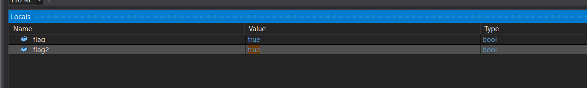

## Analysis

```
➜  Bypass file Bypass.exe
Bypass.exe: PE32 executable (console) Intel 80386 Mono/.Net assembly, for MS Windows, 3 sections
```

The file is a .NET assembly, and after researching, I discovered that .NET assemblies can be `decompiled` using `dnSpy`. Since our file is a 32-bit assembly, we will need to use the 32-bit version of `dnSpy`.

### DnSpy

`dnSpy` is a tool designed for decompiling `.NET` assemblies. It allows users to view, edit, and debug the source code of an assembly. After opening the `Bypass.exe` file in `dnSpy`, the assembly's source code is disassembled. I began by inspecting class 0, the main class, which contains the following code:

```c
using System;

// Token: 0x02000002 RID: 2
public class 0
{
	// Token: 0x06000002 RID: 2 RVA: 0x00002058 File Offset: 0x00000258
	public static void 0()
	{
		bool flag = global::0.1();
		bool flag2 = flag;
		if (flag2)
		{
			global::0.2();
		}
		else
		{
			Console.WriteLine(5.0);
			global::0.0();
		}
	}

	// Token: 0x06000003 RID: 3 RVA: 0x00002090 File Offset: 0x00000290
	public static bool 1()
	{
		Console.Write(5.1);
		string text = Console.ReadLine();
		Console.Write(5.2);
		string text2 = Console.ReadLine();
		return false;
	}

	// Token: 0x06000004 RID: 4 RVA: 0x000020C8 File Offset: 0x000002C8
	public static void 2()
	{
		string <<EMPTY_NAME>> = 5.3;
		Console.Write(5.4);
		string b = Console.ReadLine();
		bool flag = <<EMPTY_NAME>> == b;
		if (flag)
		{
			Console.Write(5.5 + global::0.2 + 5.6);
		}
		else
		{
			Console.WriteLine(5.7);
			global::0.2();
		}
	}

	// Token: 0x04000001 RID: 1
	public static string 0;

	// Token: 0x04000002 RID: 2
	public static string 1;

	// Token: 0x04000003 RID: 3
	public static string 2 = 5.8;
}

```

### Debugging

Now let set a breakpoint at 2 if conditions:

```c
if (flag2)
```

and

```c
if (flag)
```

Then start the program and see what happen:

```
Enter a username: username
Enter a password: password
```

The program prompts us for a `username` and `password`, and we can use random strings for both. The program halts at the first breakpoint, and at the bottom of the screen, we can see that the values of the variables `flag` and `flag2` are both set to false. To proceed, we need to change the value of flags to true, allowing the program to move to the second breakpoint. By pressing `F10`, `dnSpy` will step over to the next instruction.




The program prompts us to input the `secret key`, and we can again use a random string. After entering the `secret key`, the program halts at the second breakpoint. At the bottom of the screen, we can see that the value of the flag variable is still `false`, while b is equal to `1234` (the string we entered). To proceed, we need to change the flag variable to true, allowing the program to move to the next instruction. By pressing F10, `dnSpy` will step over to the next


```
Enter a username: username
Enter a password: password
Please Enter the secret Key: 1234
Nice here is the Flag:HTB{SuP3rC00lFL4g}
```
